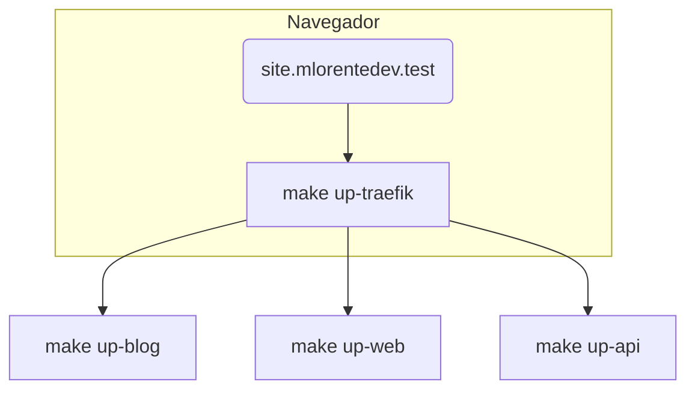

# mlorente.dev

<div align="center">


</div>

Este *monorepo* concentra **todo** lo necesario para levantar y mantener el ecosistema de [mlorente.dev](https://mlorente.dev):

* Front‑end moderno en **Astro** (`apps/web`)
* Blog estático en **Jekyll** (`apps/blog`)
* API REST en **Go 21** (`apps/api`)
* Automatización low‑code con **n8n**
* Observabilidad (**Vector**, **Prometheus**, **Grafana**, etc.)
* Gestión Docker con **Portainer**
* **Traefik** & **Nginx** como *reverse proxies*
* Orquestación de despliegues con **Ansible**
* **GitHub Actions** para CI (build + push imágenes)
* **Makefile** como interfaz de mando única (dev, build, deploy)

> **CD *manual*** → Las imágenes se construyen y publican automáticamente, **pero el despliegue se hace a mano** ejecutando `make deploy` sobre el servidor remoto.

---

## Tabla de contenidos

1. [Estructura del repositorio](#estructura-del-repositorio)
2. [Requisitos](#requisitos)
3. [Puesta en marcha rápida](#puesta-en-marcha-rápida)
4. [Workflow de desarrollo local](#workflow-de-desarrollo-local)
5. [CI en GitHub Actions](#ci-en-github-actions)
6. [Despliegue manual](#despliegue-manual)
7. [Referencia de comandos Makefile](#referencia-de-comandos-makefile)
8. [Preguntas frecuentes](#preguntas-frecuentes)
9. [Licencia](#licencia)

---

## Estructura del repositorio

```text
.
├── apps/                  # Micro‑servicios y apps de usuario
│   ├── api/               # API Go (Dockerised)
│   ├── blog/              # Jekyll site
│   ├── web/               # Astro front‑end
│   ├── n8n/               # n8n + flows
│   ├── monitoring/        # Vector, Prometheus, Grafana
│   └── portainer/         # Portainer stack
├── infra/                 # Infra as Code
│   ├── ansible/           # Playbooks, roles, inventories
│   ├── traefik/           # Dyn. & static config
│   └── nginx/             # Error pages, fallback
├── scripts/               # Bash utilidades (generar configs, secrets…)
├── .github/workflows/     # CI (build/push) — *no* despliegue
├── Makefile               # Punto de entrada (dev / build / deploy)
├── .env.example           # Variables globales
└── docs/                  # Contribución, CubeLab, etc.
```

---

## Requisitos

| Herramienta                | Versión mínima         | Uso                     |
| -------------------------- | ---------------------- | ----------------------- |
| **Docker Engine**          | 24 +                   | Contenedores local/prod |
| **Docker Compose v2**      | 2.20 +                 | Orquestación dev/prod   |
| **Make**                   | 4.2 +                  | DSL de automatización   |
| **Git**                    | —                      | SCM                     |
| **Node 20** & **npm 10**   | (solo para *frontend*) |                         |
| **Ruby 3.2** & **Bundler** | (solo para *blog*)     |                         |
| **Go 21**                  | (solo para *API*)      |                         |
| **Ansible**                | 9 +                    | *Playbooks* remotos     |

> Opcional: **gh CLI** para gestionar *secrets* y **jq** para utilidades.

---

## Puesta en marcha rápida

```bash
# 1. Clona el repo
$ git clone git@github.com:mlorente/mlorente.dev.git && cd mlorente.dev

# 2. Crea tus variables (globales)
$ cp .env.example .env && ${EDITOR} .env

# 3. Prepara dependencias locales (node, ruby, etc.)
$ make env-setup  # instala toolchain necesaria

# 4. Levanta todo en modo dev
$ make up         # Traefik + todas las apps

# 5. Accede ↴
#   http://site.mlorentedev.test (web)
#   http://blog.mlorentedev.test (blog)
#   http://api.mlorentedev.test/api (API)
#   http://traefik.mlorentedev.test:8080 (dashboard)
```

**Tips:**

1. Añade las entradas `*.mlorentedev.test` a `/etc/hosts` si no usas DNS local.
2. Cada app tiene su `.env.example`; cópialo si necesitas variables adicionales.
3. ¿Solo quieres una app? `make up-web` / `make up-blog` / …

---

## Workflow de desarrollo local



1. **Traefik** se levanta primero y expone los nombres de host locales.
2. Cada servicio se reconstruye en caliente (`docker compose ...dev.yml`).
3. Hot‑reload: Astro (port **4321**), Jekyll (**4000**), Go (**air** auto‑reload).
4. Logs en vivo: `make logs`.
5. Para parar todo: `make down` o `docker compose down -v` por carpeta.

---

## CI en GitHub Actions

| Fase             | Workflow                                   | Descripción                                                                                                                                                   |
| ---------------- | ------------------------------------------ | ------------------------------------------------------------------------------------------------------------------------------------------------------------- |
| **Dispatcher**   | `ci-01-dispatch.yml`                       | Detecta **apps** cambiadas y llama a *build* por matriz                                                                                                       |
| **Build + Push** | `ci-02-pipeline.yml` → `ci-03-publish.yml` | Linter + tests → `docker buildx` **multi‑arch** → push a Docker Hub con etiquetas:<br> `latest`, semver (`vX.Y.Z`), rama (`develop`, `feature/…`) & short‑SHA |
| **Release**      | `ci-04-release.yml`                        | Versión oficial manual (`gh release`) → retag imágenes → bundle `global-release-vX.Y.Z.zip`                                                                                |

**Resultado:** imágenes listas en el registry *no se despliegan solas*.

---

## Despliegue manual

> Recomendación: usa un usuario dedicado (`mlorente-deployer`) con acceso *passwordless sudo* y **Docker** ya instalado.

1. **Pre‑bootstrap** (solo primera vez)

   ```bash
   make setup ENV=production SSH_HOST=mlorente-deployer@my.vps.ip
   ```

   *Instala paquetes, crea red docker, copia configs base…*

2. **Desplegar / actualizar**

   ```bash
   make deploy ENV=production
   ```

   Internamente ejecuta: `ansible-playbook infra/ansible/playbooks/deploy.yml -e env=production`.

3. **Comprobar**

   ```bash
   make status ENV=production   # docker ps remoto
   make logs   ENV=production   # tail -f de contenedores
   ```

4. **Rollback**: todo está versionado con *tags* → basta con cambiar variables y relanzar `make deploy`.

---

## Referencia de comandos Makefile

| Categoría    | Comando                              | Acción                                |
| ------------ | ------------------------------------ | ------------------------------------- |
| Setup        | `make check`                         | Verifica prerequisitos locales        |
|              | `make env-setup`                     | Instala toolchain Node, Ruby, Go      |
|              | `make create-network`                | Crea red `mlorente_net` si falta      |
| Desarrollo   | `make up`                            | Levanta Traefik + todas las apps      |
|              | `make up-web` / `up-api` / `up-blog` | Solo un servicio                      |
|              | `make down`                          | Derriba todo                          |
| Build / Push | `make push-app APP=web`              | Construye + *push* multi‑arch         |
|              | `make push-all`                      | Todas las apps                        |
| Deploy       | `make setup ENV=staging`             | Bootstrap servidor remoto             |
|              | `make deploy ENV=staging`            | Despliega imágenes ya publicadas      |
| Utilidades   | `make generate-config`               | Renderiza templates Traefik + Ansible |
|              | `make setup-secrets`                 | Sincroniza `.env` → *GitHub Secrets*  |

> Ejecuta `make help` para ver la lista completa y descripciones coloreadas.

---

## 📚 Documentación Adicional

- **[⚡ How-To - Referencia Rápida](docs/HOW-TO.md)** - **Punto de entrada principal** - Comandos, tareas comunes, automation y navegación rápida
- **[🏗️ ADRs - Decisiones Arquitectónicas](docs/ADR.md)** - 10 Architecture Decision Records explicando el "por qué" del diseño
- **[🏷️ Estrategia de Versionado](docs/VERSIONING.md)** - Cómo funcionan las imágenes Docker y releases por rama  
- **[🚀 Despliegue Avanzado](docs/DEPLOYMENT.md)** - Configuración avanzada de servidores y despliegues
- **[🔧 Resolución de Problemas](docs/TROUBLESHOOTING.md)** - Solución a problemas comunes y debugging  
- **[⚙️ Internals CI/CD](docs/CI-CD.md)** - Funcionamiento interno de los workflows (1,388 líneas)
- **[👥 Guía de Contribución](docs/CONTRIBUTING.md)** - Convenciones de código, flujo de desarrollo y mejores prácticas

---

## Preguntas frecuentes

**¿Necesito Ansible para desarrollo local?** No. Solo para despliegues remotos.

**¿Se podría automatizar el CD?** Sí; bastaría con añadir un job que, tras `ci-02-pipeline`, ejecute `make deploy` con `ansible-playbook` en el runner o self‑hosted.

**¿Cómo gestiono certificados en *staging*?** Usa `make copy-certificates ENV=staging` y añádelos a tu almacén de confianza local.

**¿Puedo usar otra URL local?** Sí, cambia `DOMAIN_LOCAL` en `.env` y actualiza `/etc/hosts`.

---

## Licencia

[MIT](LICENSE)

---

> *“Works on my machine”* no es suficiente. Con este Makefile y Ansible el despliegue es **reproducible** y **predecible**.
