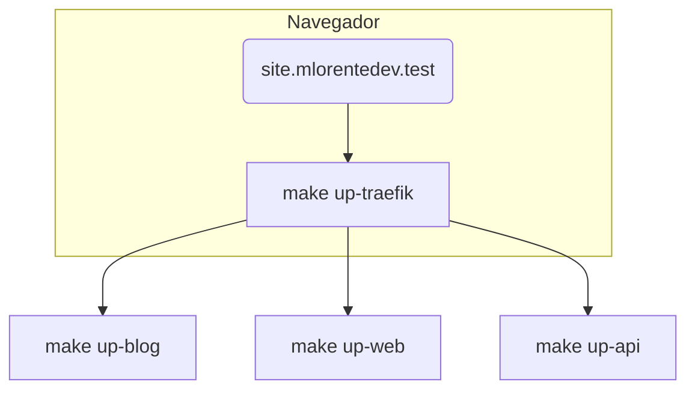

# Mi Ecosistema Personal - mlorente.dev

<div align="center">


</div>

¡Hola! Este es mi proyecto personal donde tengo todo lo que necesito para mantener [mlorente.dev](https://mlorente.dev) funcionando. Es un monorepo que incluye desde el front-end hasta la infraestructura, pasando por el blog y la API. Lo he organizado así para tener todo bajo control y poder desplegar fácilmente.

**¿Qué incluye?**

* **Mi web personal** hecha con **Astro** (`apps/web`) - aquí tienes mi portafolio y toda la info sobre mí
* **Mi blog** en **Jekyll** (`apps/blog`) - donde escribo sobre tecnología y desarrollo  
* **La API** en **Go** (`apps/api`) - maneja suscripciones del newsletter y otras cositas
* **n8n** para automatizar tareas repetitivas sin código
* **Monitorización completa** con **Prometheus**, **Grafana** y **Vector** - porque me gusta saber qué está pasando
* **Portainer** para gestionar contenedores de forma visual
* **Traefik** y **Nginx** como proxies reversos
* **Ansible** para desplegar todo automáticamente
* **GitHub Actions** para CI/CD - se construyen las imágenes solas
* **Un Makefile** que me simplifica la vida con comandos como `make up`, `make deploy`, etc.

> **Nota importante:** Las imágenes se construyen y publican automáticamente cuando hago push, pero **prefiero desplegar a mano** ejecutando `make deploy` en el servidor. Me da más control.

---

## Índice de contenidos

1. [Cómo está organizado todo](#cómo-está-organizado-todo)
2. [Lo que necesitas](#lo-que-necesitas)
3. [Empezar rápido](#empezar-rápido)
4. [Desarrollo en local](#desarrollo-en-local)
5. [CI con GitHub Actions](#ci-con-github-actions)
6. [Despliegues](#despliegues)
7. [Comandos útiles del Makefile](#comandos-útiles-del-makefile)
8. [Preguntas frecuentes](#preguntas-frecuentes)
9. [Licencia](#licencia)

---

## Cómo está organizado todo

```text
.
├── apps/                  # Las aplicaciones que uso
│   ├── api/               # API en Go (contenedorizada)
│   ├── blog/              # Blog estático en Jekyll
│   ├── web/               # Mi web principal en Astro
│   ├── n8n/               # Automatizaciones con n8n
│   ├── monitoring/        # Vector, Prometheus, Grafana
│   └── portainer/         # Gestión visual de Docker
├── infra/                 # La infraestructura
│   ├── ansible/           # Playbooks para desplegar
│   ├── traefik/           # Configuración del proxy
│   └── nginx/             # Páginas de error, fallback
├── scripts/               # Scripts útiles para generar configs
├── .github/workflows/     # CI (construye y publica) — no despliega
├── Makefile               # Mi navaja suiza (dev / build / deploy)
├── .env.example           # Variables de ejemplo
└── docs/                  # Documentación extra
```

---

## Lo que necesitas

| Herramienta                | Versión           | Para qué lo uso                 |
| -------------------------- | ----------------- | ------------------------------- |
| **Docker Engine**          | 24 o superior     | Contenedores en local y prod    |
| **Docker Compose v2**      | 2.20 o superior   | Orquestar los servicios        |
| **Make**                   | 4.2 o superior    | Simplificar comandos            |
| **Git**                    | La que tengas     | Control de versiones            |
| **Node 20** y **npm 10**   | (si tocas el web) | Para el frontend                |
| **Ruby 3.2** y **Bundler** | (si tocas el blog)| Para Jekyll                     |
| **Go 21**                  | (si tocas la API) | Para el backend                 |
| **Ansible**                | 9 o superior      | Despliegues automáticos         |

> **Opcional:** **gh CLI** para gestionar secretos de GitHub y **jq** para procesar JSON.

---

## Empezar rápido

```bash
# 1. Clona el repositorio
$ git clone git@github.com:mlorente/mlorente.dev.git && cd mlorente.dev

# 2. Configura tus variables (copia y edita)
$ cp .env.example .env && $EDITOR .env

# 3. Instala lo que necesitas
$ make env-setup  # instala las herramientas necesarias

# 4. ¡A funcionar!
$ make up         # Levanta Traefik + todas las apps

# 5. Ya puedes acceder:
#   http://site.mlorentedev.test (web principal)
#   http://blog.mlorentedev.test (blog)
#   http://api.mlorentedev.test/api (API)
#   http://traefik.mlorentedev.test:8080 (dashboard de Traefik)
```

**Algunos tips:**

1. Añade `*.mlorentedev.test` a tu `/etc/hosts` si no tienes DNS local configurado.
2. Cada app tiene su `.env.example` - cópialo si necesitas variables específicas.
3. ¿Solo quieres levantar una cosa? Usa `make up-web`, `make up-blog`, etc.

---

## Desarrollo en local



Mi flujo habitual:

1. **Traefik** se levanta primero y me gestiona todos los dominios locales.
2. Cada servicio se reconstruye automáticamente cuando cambio código (`docker compose ...dev.yml`).
3. Hot-reload activado: Astro en el puerto **4321**, Jekyll en **4000**, Go con **air** para recarga automática.
4. Para ver los logs: `make logs`.
5. Para parar todo: `make down` (o `docker compose down -v` en cada carpeta).

---

## CI con GitHub Actions

| Fase             | Workflow                                   | Qué hace                                                                                                                                                      |
| ---------------- | ------------------------------------------ | ------------------------------------------------------------------------------------------------------------------------------------------------------------- |
| **Dispatcher**   | `ci-01-dispatch.yml`                       | Detecta qué **apps** han cambiado y lanza builds en paralelo                                                                                                  |
| **Build + Push** | `ci-02-pipeline.yml` → `ci-03-publish.yml` | Linters + tests → `docker buildx` **multi-arquitectura** → push a Docker Hub con etiquetas:<br> `latest`, semver (`vX.Y.Z`), rama (`develop`, `feature/…`) |
| **Release**      | `ci-04-release.yml`                        | Versión oficial manual (`gh release`) → re-etiqueta imágenes → genera bundle `global-release-vX.Y.Z.zip`                                                     |

**El resultado:** tengo todas las imágenes listas en el registry, pero *no se despliegan automáticamente*.

---

## Despliegues

> **Recomendación:** usa un usuario dedicado (como `mlorente-deployer`) con acceso *passwordless sudo* y **Docker** ya instalado en el servidor.

1. **Preparar el servidor** (solo la primera vez)

   ```bash
   make setup ENV=production SSH_HOST=mlorente-deployer@mi.servidor.com
   ```

   Esto instala paquetes, crea la red de Docker, copia configuraciones base...

2. **Desplegar o actualizar**

   ```bash
   make deploy ENV=production
   ```

   Por detrás ejecuta: `ansible-playbook infra/ansible/playbooks/deploy.yml -e env=production`.

3. **Verificar que todo va bien**

   ```bash
   make status ENV=production   # docker ps en remoto
   make logs   ENV=production   # ver logs en tiempo real
   ```

4. **Rollback**: todo está versionado con *tags* → solo necesitas cambiar variables y volver a ejecutar `make deploy`.

---

## Comandos útiles del Makefile

| Categoría    | Comando                              | Qué hace                          |
| ------------ | ------------------------------------ | --------------------------------- |
| Setup        | `make check`                         | Comprueba que tienes todo         |
|              | `make env-setup`                     | Instala Node, Ruby, Go            |
|              | `make create-network`                | Crea red `mlorente_net`           |
| Desarrollo   | `make up`                            | Levanta Traefik + todas las apps  |
|              | `make up-web` / `up-api` / `up-blog` | Solo un servicio                  |
|              | `make down`                          | Para todo                         |
| Build / Push | `make push-app APP=web`              | Construye + push multi-arch       |
|              | `make push-all`                      | Todas las apps de golpe           |
| Deploy       | `make setup ENV=staging`             | Prepara servidor remoto           |
|              | `make deploy ENV=staging`            | Despliega imágenes                |
| Utilidades   | `make generate-config`               | Genera configuraciones            |
|              | `make setup-secrets`                 | Sincroniza `.env` → GitHub        |

> Ejecuta `make help` para ver la lista completa con colores bonitos.

---

## 📚 Documentación adicional

Si quieres profundizar más, tengo toda esta documentación:

- **[⚡ How-To - Referencia Rápida](docs/HOW-TO.md)** - **Punto de entrada principal** - Comandos, tareas comunes y navegación rápida
- **[🏗️ ADRs - Decisiones Arquitectónicas](docs/ADR.md)** - 10 Architecture Decision Records donde explico el "por qué" de cada decisión
- **[🏷️ Estrategia de Versionado](docs/VERSIONING.md)** - Cómo funcionan las imágenes Docker y releases por rama  
- **[🚀 Despliegue Avanzado](docs/DEPLOYMENT.md)** - Configuración avanzada de servidores y despliegues
- **[🔧 Resolución de Problemas](docs/TROUBLESHOOTING.md)** - Solución a problemas comunes y debugging  
- **[⚙️ Internals CI/CD](docs/CI-CD.md)** - Funcionamiento interno de los workflows
- **[👥 Guía de Contribución](docs/CONTRIBUTING.md)** - Convenciones de código y flujo de desarrollo

---

## Preguntas frecuentes

**¿Necesito Ansible para desarrollo local?** 
No para nada. Solo para despliegues remotos.

**¿Se podría automatizar el despliegue también?** 
Claro, bastaría con añadir un job que, tras el `ci-02-pipeline`, ejecute `make deploy` con `ansible-playbook` en el runner.

**¿Cómo gestiono certificados en staging?** 
Usa `make copy-certificates ENV=staging` y añádelos a tu almacén de confianza local.

**¿Puedo cambiar la URL local?** 
Sí, cambia `DOMAIN_LOCAL` en `.env` y actualiza tu `/etc/hosts`.

---

## Licencia

[MIT](LICENSE)

---

> *"Works on my machine"* no me vale. Con este Makefile y Ansible, los despliegues son **reproducibles** y **predecibles** en cualquier sitio.