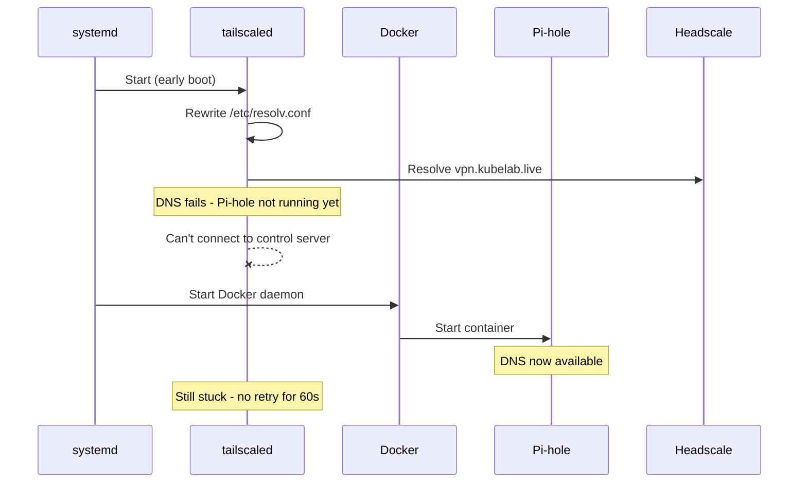

I rebooted the RPi4 on a Sunday afternoon. Routine maintenance. `sudo reboot`, wait 60 seconds, SSH back in. I've done it dozens of times.

Except this time, SSH didn't come back. Not on the LAN IP, not on the Tailscale IP. I checked the other nodes. None of them were reachable over the mesh either. Nine machines, all disconnected from each other. The VPN was down.

The RPi4 is the DNS gateway for my entire homelab. Pi-hole on port 53, CoreDNS on port 5353, Tailscale subnet router advertising 172.16.1.0/24 through Headscale. If the RPi4 is unhealthy, nothing resolves, and if nothing resolves, the VPN can't reconnect, and if the VPN can't reconnect, I'm walking to the other room to plug in a monitor.

## The boot sequence from hell

Here's what happens when the RPi4 boots:



`tailscaled` starts before Docker. That's the default systemd ordering. Tailscale tries to connect to `vpn.kubelab.live` (my Headscale control server). To resolve that hostname, it needs DNS. DNS means Pi-hole. Pi-hole runs in Docker. Docker isn't up yet.

Tailscale can't resolve the control server. It enters a backoff loop. By the time Pi-hole is ready, Tailscale has already given up its first attempt and is waiting to retry. Meanwhile, every other node in the mesh is trying to reach the RPi4's subnet router, which is offline because Tailscale never connected.

Two hours of debugging. The fix took four lines of configuration.

## Pi-hole v6 made it worse

The reboot exposed the problem, but Pi-hole v6 piled on complications that turned a simple boot-order issue into a multi-layered failure.

First: Tailscale, by default, rewrites `/etc/resolv.conf` to point at its own MagicDNS resolver. On a machine that IS the DNS server, this creates a loop. The RPi4 was trying to resolve DNS through itself, through a VPN tunnel that depended on the DNS it was trying to resolve.

Second: Pi-hole v6's `etc_dnsmasq_d` defaults to `false`. My CoreDNS forwarding rule in `/etc/dnsmasq.d/` was being silently ignored. Even after Pi-hole came up, `*.kubelab.live` queries went nowhere.

Third: `pihole reloaddns` does not reload dnsmasq configs in v6. I ran it five times, checked the config file, confirmed the syntax, ran it again. Nothing changed. Because `reloaddns` only reloads blocklists now. You need `docker restart pihole` to pick up forwarding rules. The command succeeds silently and does nothing useful.

Fourth: `listeningMode` in `pihole.toml` defaults to `"LOCAL"`. My K3s nodes on 172.16.1.0/24 were sending DNS queries to the RPi4, and Pi-hole was rejecting them as non-local traffic. The nodes are on the same physical LAN, behind the same switch, and Pi-hole considered them outsiders. The old `pihole -a interface all` command doesn't exist in v6.

## The Docker volume gotcha

During my troubleshooting, I recreated the Pi-hole container from a `docker-compose.yml` file. Pi-hole came up completely fresh. No blocklists, no config, no forwarding rules. A blank install.

Docker Compose prefixes volume names with the project directory name. My existing volume was `pihole_data`. Compose created `pihole_pihole_data`. All my configuration was sitting in the old volume, invisible.

```yaml
volumes:
  pihole_data:
    external: true
  dnsmasq_data:
    external: true
```

`external: true` tells Compose to use the existing volume without prefixing. I've hit this before and I'll hit it again.

## Four fixes, permanent resolution

The actual solution has four parts, and every single one is necessary:

**1. Stop Tailscale from touching DNS.** `--accept-dns=false` on the Tailscale client. This prevents it from rewriting `/etc/resolv.conf`. On the DNS server itself, Tailscale has no business managing DNS.

**2. Dual nameservers with a boot fallback.** `/etc/resolv.conf` gets two entries: `127.0.0.1` (Pi-hole, for normal operation) and `8.8.8.8` (Google, for when Docker hasn't started yet). The fallback means Tailscale can resolve `vpn.kubelab.live` even before Pi-hole is running.

**3. Lock the resolv.conf.** `chattr +i /etc/resolv.conf`. Immutable flag. Nothing rewrites it -- not Tailscale, not NetworkManager, not cloud-init (which has `manage_etc_hosts: True` on this box and will silently undo your changes on reboot).

**4. Fix the boot order.** A systemd drop-in for `tailscaled.service`:

```ini
# /etc/systemd/system/tailscaled.service.d/after-docker.conf
[Unit]
After=docker.service
Wants=docker.service
```

Now `tailscaled` waits for Docker. Docker starts Pi-hole. Pi-hole can resolve DNS. Tailscale connects to Headscale. The mesh comes up. Every time, in the right order.

## The lesson

On a DNS node, boot ordering IS your availability strategy. Self-healing software, health checks, pod rescheduling -- none of it matters if the machine can't resolve a hostname during the first 30 seconds of boot. The RPi4 costs 35 dollars and it's the single point of failure for nine machines, a Kubernetes cluster, and a VPN mesh. The fix isn't redundancy. The fix is making sure the boot sequence is deterministic.

I still reboot the RPi4 on Sunday afternoons. It comes back every time now. But I watch the Grafana dashboard until every node shows green, because DNS has taught me not to trust anything I can't verify.
