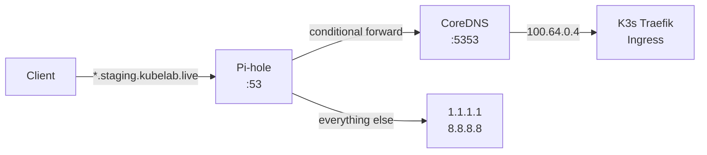

If it's broken, it's DNS. If it's not DNS, it's also DNS.

I knew this going in. I've heard it a hundred times. I still managed to spend an entire weekend debugging DNS problems on a Raspberry Pi that I thought would take an afternoon.

## The plan

The RPi4 (8GB) sits at 172.16.1.1 on my LAN. It runs two things: Pi-hole for ad blocking and local DNS, and CoreDNS for forwarding `*.staging.kubelab.live` queries into my K3s cluster. Both run in Docker Compose. The RPi4 is not part of the K3s cluster -- it's a standalone box that acts as the network gateway for the entire homelab.

The idea is simple. All devices on the LAN point their DNS at the RPi4. Pi-hole handles ad blocking and resolves normal internet queries. When something asks for `grafana.staging.kubelab.live`, Pi-hole forwards that to CoreDNS, which knows how to reach the K3s cluster's Traefik ingress at 100.64.0.4 (the k3s-server's Headscale IP).

Here's what the resolution chain looks like:



Simple. Three components, one direction. What could go wrong.

## Everything, apparently

### Problem 1: Pi-hole v6 ignores your dnsmasq configs

Pi-hole v5 used dnsmasq under the hood, so you could drop config files into `/etc/dnsmasq.d/` and they'd get picked up. I wrote a conditional forwarding rule:

```
# /etc/dnsmasq.d/pihole-forwarding.conf
server=/kubelab.live/172.17.0.1#5353
```

This tells dnsmasq: "Any query for `*.kubelab.live`, forward it to CoreDNS on port 5353." The IP `172.17.0.1` is the Docker bridge gateway -- because Pi-hole itself runs in Docker, you can't use `127.0.0.1`.

It worked perfectly on Pi-hole v5. Then I upgraded to v6.

Pi-hole v6 replaced dnsmasq with its own FTL resolver. There's a setting in `pihole.toml` called `etc_dnsmasq_d` and it defaults to `false`. My forwarding config was sitting right there in `/etc/dnsmasq.d/` doing absolutely nothing.

And here's the real kicker: `pihole restartdns` only reloads blocklists. It does not reload dnsmasq-style config files. You need `docker restart pihole` to pick up changes. I spent two hours wondering why my forwarding rule wasn't working before I figured out it wasn't even being read.

### Problem 2: Avahi squats on port 5353

CoreDNS needs to listen on port 5353. When I started it, bind failure. Something else had port 5353.

It was `avahi-daemon`. Ubuntu Server ships with it by default, and it listens on 5353 for mDNS. On a headless Raspberry Pi acting as a DNS gateway, mDNS is useless. But you can't just stop the service:

```bash
sudo systemctl stop avahi-daemon
sudo systemctl disable avahi-daemon
sudo systemctl stop avahi-daemon.socket
sudo systemctl disable avahi-daemon.socket
```

You have to disable both the service AND the socket unit. If you only disable the service, systemd's socket activation will restart it the next time something pokes port 5353. I learned this the hard way when CoreDNS worked fine until the next reboot.

### Problem 3: The Tailscale chicken-and-egg

The RPi4 is part of my Headscale VPN mesh. Tailscale connects it to the rest of the homelab. But Tailscale, by default, rewrites `/etc/resolv.conf` to point DNS at its own resolver. On a machine that IS the DNS server, this creates a circular dependency.

The boot sequence goes like this: `tailscaled` starts before Docker. It rewrites `/etc/resolv.conf`. Now the RPi4's DNS points at Tailscale's resolver. Docker starts. Pi-hole comes up. But Tailscale is trying to resolve `vpn.kubelab.live` (my Headscale server) using DNS that depends on Pi-hole... which depends on Docker... which is still starting.

The fix is `--accept-dns=false` on the Tailscale client. This tells Tailscale to not touch `/etc/resolv.conf`. Combined with a static `/etc/hosts` entry for the Headscale server:

```
162.55.57.175  vpn.kubelab.live
```

And `chattr +i /etc/resolv.conf` to prevent anything from overwriting it. I also added `After=docker.service` to the Tailscale systemd unit so it doesn't even try to start until Docker (and Pi-hole) are ready.

### Problem 4: Docker Compose volume naming

This one is just embarrassing. I migrated Pi-hole from a `docker run` command to a proper `docker-compose.yml`. When I brought it up, Pi-hole had no blocklists, no config, no history. Fresh install.

Docker Compose prefixes volume names with the project name. My old volume was `pihole_data`. Docker Compose created `pihole_pihole_data`. All my data was sitting in the old volume, invisible to the new container.

The fix:

```yaml
volumes:
  pihole_data:
    external: true
  dnsmasq_data:
    external: true
```

`external: true` tells Compose to use the existing volume as-is, no prefix. Thirty seconds to fix, two hours to diagnose.

## The result

After all of this, the RPi4 works exactly as intended. Every device on the LAN resolves through Pi-hole. K3s services are reachable by name. Ad blocking works. The Tailscale mesh stays connected across reboots. CoreDNS handles the split-horizon DNS without issues.

But I'm not going to pretend it was smooth. Every single component had at least one gotcha that wasn't in the documentation, or was buried in a GitHub issue from 2023 with three thumbs-up reactions and no official response.

The RPi4 is the single most critical node in my homelab. If it goes down, DNS goes down, and if DNS goes down, nothing works. Not the K3s cluster, not the VPN, not the monitoring. Everything depends on this 35-dollar computer sitting on a shelf behind my router.

DNS will always find a way to ruin your weekend. Budget accordingly.
