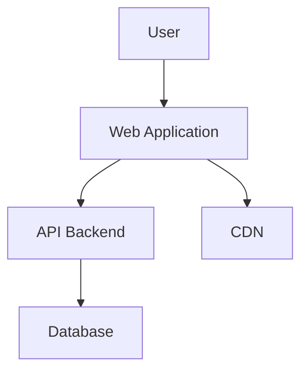

# 1.4 Wiki - Documentation Platform

Technical documentation service built with MkDocs to provide a centralized knowledge base, technical guides, and project documentation for the mlorente.dev ecosystem.

## What it is

This is the documentation hub for the entire mlorente.dev project. It collects and organizes all documentation from across the monorepo into a single, searchable knowledge base. I built it with MkDocs Material because it creates beautiful, fast documentation sites and handles markdown perfectly.

The wiki automatically syncs documentation from all apps and infrastructure components, making it easy to find guides, architectural decisions, troubleshooting steps, and API documentation in one place.

## Tech stack

- **Generator**: MkDocs with Material Design theme
- **Content**: Markdown with advanced extensions
- **Search**: Integrated search index
- **Deployment**: Docker with Nginx for static content serving
- **Synchronization**: Simple sync with current branch

## Project structure

```text
apps/wiki/
├── README.md              # This documentation
├── docker-compose.yml     # Service configuration
├── mkdocs.yml            # MkDocs configuration
├── mkdocs.yml.tmpl       # Configuration template
├── nginx.conf            # Nginx configuration
├── Dockerfile            # Custom MkDocs image
├── site/                 # Generated site (ignored in Git)
└── docs/                 # Documentation content
    ├── index.md          # Landing page
    ├── apps/             # Application documentation
    ├── infra/            # Infrastructure guides
    ├── scripts/          # Scripts documentation
    ├── guides/           # Technical guides
    └── assets/           # Images and resources
```

## Key features

### Documentation features
- **Advanced markdown** - Support for tables, diagrams, and extensions
- **Structured navigation** - Nested menus and breadcrumbs
- **Integrated search** - Real-time content search
- **Syntax highlighting** - Code highlighting for multiple languages
- **Diagrams** - Support for Mermaid and other diagram formats

### Technical features
- **Material theme** - Modern and responsive interface
- **Consistent theming** - Unified teal color scheme
- **SEO optimization** - Optimized meta tags and structure
- **Smart navigation** - Intelligent navigation links
- **Responsive design** - Optimized for mobile and tablets

## Configuration

### MkDocs configuration (`mkdocs.yml`)

```yaml
site_name: mlorente.dev
site_url: https://wiki.mlorente.dev
site_description: Technical knowledge base and project documentation

# Theme configuration
theme:
  name: material
  language: en
  palette:
    - scheme: default
      primary: teal
      accent: teal

  features:
    - navigation.tabs
    - navigation.tabs.sticky
    - navigation.sections
    - navigation.expand
    - navigation.top
    - search.suggest
    - search.highlight
    - content.code.annotate

# Navigation structure
nav:
  - Home: index.md
  - Applications:
    - apps/index.md
    - API: apps/api.md
    - Web: apps/web.md
    - Blog: apps/blog.md
    - Wiki: apps/wiki.md
  - Infrastructure:
    - infra/index.md
    - Traefik: infra/traefik.md
    - Monitoring: infra/monitoring.md
  - Scripts:
    - scripts/index.md
  - Guides:
    - guides/index.md
    - Architecture: guides/ARCHITECTURE-AND-DECISIONS.md
    - CI/CD: guides/CI-CD.md
    - Deployment: guides/DEPLOYMENT.md
    - Troubleshooting: guides/TROUBLESHOOTING.md

# Markdown extensions
markdown_extensions:
  - admonition
  - pymdownx.details
  - pymdownx.superfences:
      custom_fences:
        - name: mermaid
          class: mermaid
          format: !!python/name:pymdownx.superfences.fence_code_format
  - pymdownx.highlight:
      anchor_linenums: true
  - pymdownx.inlinehilite
  - pymdownx.snippets
  - attr_list
  - md_in_html
  - tables
  - toc:
      permalink: true

# Plugins
plugins:
  - search:
      lang: en
```

### Environment variables

```bash
# Container configuration
CONTAINER_NAME=wiki
IMAGE_NAME=mlorente-wiki
PORT=8080

# MkDocs configuration
SITE_NAME="mlorente.dev"
SITE_URL="https://wiki.mlorente.dev"
SITE_LANG="en"
```

## Running the wiki

### Development mode
```bash
# Build and run with live reload
make up-wiki

# Access at http://wiki.mlorentedev.test
```

### Local development
```bash
# Navigate to wiki directory
cd apps/wiki

# Install MkDocs locally
pip install mkdocs-material

# Generate documentation
make wiki-sync

# Serve locally
mkdocs serve

# Access at http://localhost:8000
```

### Available commands
```bash
# Build static site
mkdocs build

# Generate documentation
scripts/generate-wiki.sh build

# Collect documentation
scripts/generate-wiki.sh collect

# Generate MkDocs config
scripts/generate-wiki.sh config
```

## Content creation

### Document structure

```markdown
---
title: "Page Title"
description: "SEO description"
tags:
  - devops
  - tutorial
date: 2024-01-15
authors:
  - Manuel Lorente
---

# Page Title

Introduction to the content...

## Main Section

Section content...

### Subsection

Detailed content...

!!! note "Important Note"
    This is a highlighted note for important information.

!!! warning "Warning"
    This is a warning about something critical.

```

### Advanced elements

#### Mermaid diagrams


#### Code blocks
```bash title="Example command"
# Example command with title
docker-compose up -d
```

#### Reference tables
| Command | Description | Example |
|---------|-------------|---------|
| `ls` | List files | `ls -la` |
| `cd` | Change directory | `cd /home` |
| `pwd` | Current directory | `pwd` |

#### Information boxes
!!! tip "Tip"
    Use this format for useful tips.

!!! info "Information"
    Additional relevant information.

!!! warning "Warning"
    Critical information requiring attention.

!!! danger "Danger"
    Warnings about dangerous actions.

## Content organization

### Documentation categories

#### Applications (`apps/`)
- **API**: Backend service documentation
- **Web**: Frontend application guides
- **Blog**: Technical writing platform
- **Wiki**: This documentation system

#### Infrastructure (`infra/`)
- **Traefik**: Reverse proxy configuration
- **Monitoring**: Observability and alerting
- **Networking**: Network setup and routing
- **Deployment**: Server configuration

#### Scripts (`scripts/`)
- **Automation**: Build and deployment scripts
- **Utilities**: Development tools
- **Maintenance**: System maintenance scripts

#### Guides (`guides/`)
- **Architecture**: System design and decisions
- **CI/CD**: Pipeline documentation
- **Deployment**: Deployment procedures
- **Troubleshooting**: Problem-solving guides
- **Contributing**: Development guidelines

### Writing guidelines

1. **Clarity**: Use clear and direct language
2. **Structure**: Organize with logical headings
3. **Examples**: Include practical examples and code
4. **Updates**: Keep content current
5. **References**: Link to relevant external resources

## Search features

### Advanced search
- **Full search**: Complete content indexing
- **Suggestions**: Automatic term completion
- **Highlighting**: Highlighted terms in results
- **Filters**: Search by section or category

### SEO optimization
- **Meta tags**: Optimized titles and descriptions
- **Clean URLs**: Readable and descriptive URLs
- **Structure**: Proper hierarchical headings
- **Sitemap**: Automatic site map generation

## Theme customization

### Color variables
```css
:root {
  --md-primary-fg-color: #008099;
  --md-primary-fg-color--light: #26a69a;
  --md-primary-fg-color--dark: #00695c;
}
```

### Custom CSS
```css
/* docs/stylesheets/extra.css */
.md-header {
  background-color: var(--md-primary-fg-color);
}

.md-nav__item--active > .md-nav__link {
  color: var(--md-primary-fg-color);
}
```

## Documentation sync

### Automatic collection
- **Source**: Collects from entire monorepo
- **Apps**: Application-specific documentation
- **Infrastructure**: Server and deployment docs
- **Guides**: Technical and procedural guides
- **Scripts**: Automation documentation

### Update workflow
1. **Edit**: Modify markdown files anywhere in monorepo
2. **Generate**: Run `make wiki-sync` to collect documentation
3. **Build**: MkDocs regenerates the site
4. **Serve**: Updated content served automatically

## Analytics

### Usage metrics
- **Most visited pages**
- **Popular search terms**
- **Time on page**
- **Bounce rate**

### Analytics integration
```yaml
# In mkdocs.yml
google_analytics:
  - 'G-XXXXXXXXXX'
  - 'auto'
```

## Contributing

### Contribution process
1. **Fork** the content repository
2. **Branch** for new documentation
3. **Write** following the guidelines
4. **Test** locally with MkDocs
5. **Pull Request** with clear description
6. **Review** and merge content

### Quality standards
- Correct spelling and grammar
- Tested and functional code
- Valid and updated links
- Optimized images with alt text
- Consistent structure with existing content

## Related services

- **Web Frontend**: `apps/web` - Main landing page
- **Blog**: `apps/blog` - Technical content and tutorials
- **API Backend**: `apps/api` - API documentation
- **Infrastructure**: `infra/` - Deployment documentation

## Local development URLs

When running locally with `make up-wiki`:
- Wiki: http://wiki.mlorentedev.test
- Development server: http://localhost:8000

Add `127.0.0.1 wiki.mlorentedev.test` to your `/etc/hosts` file for local domain access.