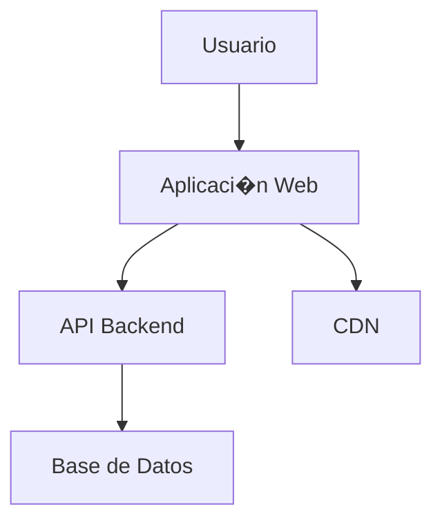

# Wiki de Documentación

<div align="center">


</div>

Servicio de documentación técnica basado en MkDocs para proporcionar una base de conocimientos centralizada, guías técnicas y documentación de proyectos para el ecosistema mlorente.dev.

## 🏗️ Arquitectura

- **Generador**: MkDocs con tema Material Design
- **Contenido**: Markdown con extensiones avanzadas
- **Búsqueda**: Índice de búsqueda integrado
- **Despliegue**: Docker con Nginx para servir contenido estático
- **Sincronización**: Sincronización simple con la rama actual

## 🗂️ Estructura del Proyecto

```text
apps/wiki/
├── README.md              # Esta documentación
├── docker-compose.yml     # Configuración del servicio
├── mkdocs.yml            # Configuración de MkDocs
├── mkdocs.yml.tmpl       # Plantilla de configuración
├── nginx.conf            # Configuración de Nginx
├── Dockerfile            # Imagen personalizada de MkDocs
├── site/                 # Sitio generado (ignorado en Git)
└── docs/                 # Contenido de documentación
    ├── index.md          # Página de inicio
    ├── guides/           # Guías técnicas
    ├── projects/         # Documentación de proyectos
    ├── reference/        # Material de referencia
    └── assets/           # Imágenes y recursos
```

## 📚 Características

### Características de Documentación

- **Markdown Avanzado**: Soporte para tablas, diagramas y extensiones
- **Navegaci�n Estructurada**: Men�s anidados y breadcrumbs
- **B�squeda Integrada**: B�squeda en tiempo real del contenido
- **Syntax Highlighting**: Resaltado de c�digo para m�ltiples lenguajes
- **Diagramas**: Soporte para Mermaid y otros formatos de diagramas

### Caracter�sticas T�cnicas

- **Tema Material**: Interface moderna y responsiva
- **Modo Oscuro**: Cambio autom�tico/manual entre temas
- **Optimizaci�n SEO**: Meta tags y estructura optimizada
- **Navegaci�n R�pida**: Enlaces de navegaci�n inteligentes
- **Responsive Design**: Optimizado para m�viles y tablets

## ⚙️ Configuración

### Configuración MkDocs (`mkdocs.yml`)

```yaml
site_name: Wiki Técnica - mlorente.dev
site_url: https://wiki.mlorente.dev
site_description: Base de conocimientos técnica y documentación de proyectos

# Configuraci�n del tema
theme:
  name: material
  language: es
  palette:
    # Modo claro
    - scheme: default
      primary: blue
      accent: blue
      toggle:
        icon: material/brightness-7
        name: Cambiar a modo oscuro
    # Modo oscuro
    - scheme: slate
      primary: blue
      accent: blue
      toggle:
        icon: material/brightness-4
        name: Cambiar a modo claro

  features:
    - navigation.tabs
    - navigation.tabs.sticky
    - navigation.sections
    - navigation.expand
    - navigation.top
    - search.suggest
    - search.highlight
    - content.code.annotate

# Estructura de navegaci�n
nav:
  - Inicio: index.md
  - Gu�as T�cnicas:
    - guides/index.md
    - DevOps: guides/devops.md
    - SRE: guides/sre.md
    - Docker: guides/docker.md
  - Proyectos:
    - projects/index.md
    - mlorente.dev: projects/mlorente-dev.md
    - Infraestructura: projects/infrastructure.md
  - Referencia:
    - reference/index.md
    - APIs: reference/apis.md
    - Comandos: reference/commands.md

# Extensiones de Markdown
markdown_extensions:
  - admonition
  - pymdownx.details
  - pymdownx.superfences:
      custom_fences:
        - name: mermaid
          class: mermaid
          format: !!python/name:pymdownx.superfences.fence_code_format
  - pymdownx.highlight:
      anchor_linenums: true
  - pymdownx.inlinehilite
  - pymdownx.snippets
  - attr_list
  - md_in_html
  - tables
  - toc:
      permalink: true

# Plugins
plugins:
  - search:
      lang: es
  - git-revision-date-localized:
      type: date
      locale: es
```

### Variables de Entorno

```bash
# Configuraci�n del contenedor
CONTAINER_NAME=wiki
IMAGE_NAME=mlorente-wiki
PORT=8080

# Configuraci�n de MkDocs
SITE_NAME="Wiki - mlorente.dev"
SITE_URL="https://wiki.mlorente.dev"
SITE_LANG="es"
```

## Despliegue

### Desarrollo Local
```bash
# Construir y ejecutar con recarga en vivo
docker-compose -f docker-compose.dev.yml up --build

# Acceder en http://localhost:8080
```

### Producci�n
```bash
# Desplegar con configuraci�n de producci�n
docker-compose -f docker-compose.prod.yml up -d

# Verificar estado
docker logs -f wiki
```

### Build Manual
```bash
# Instalar MkDocs localmente
pip install mkdocs-material

# Servir localmente
mkdocs serve

# Construir sitio est�tico
mkdocs build

# Desplegar (si est� configurado)
mkdocs gh-deploy
```

## 📄 Creaci�n de Contenido

### Estructura de Documentos

```markdown
---
title: "T�tulo de la P�gina"
description: "Descripci�n para SEO"
tags:
  - devops
  - tutorial
date: 2024-01-15
authors:
  - Manuel Lorente
---

# T�tulo de la P�gina

Introducci�n al contenido...

## Secci�n Principal

Contenido de la secci�n...

### Subsecci�n

Contenido detallado...

!!! note "Nota Importante"
    Esta es una nota destacada para informaci�n importante.

!!! warning "Advertencia"
    Esta es una advertencia sobre algo cr�tico.

```

### Elementos Avanzados

#### Diagramas Mermaid


#### Bloques de C�digo
```bash title="Comando de ejemplo"
# Ejemplo de comando con t�tulo
docker-compose up -d
```

#### Tablas de Referencia
| Comando | Descripci�n | Ejemplo |
|---------|-------------|---------|
| `ls` | Listar archivos | `ls -la` |
| `cd` | Cambiar directorio | `cd /home` |
| `pwd` | Directorio actual | `pwd` |

#### Cajas de Informaci�n
!!! tip "Consejo"
    Usa este formato para consejos �tiles.

!!! info "Informaci�n"
    Informaci�n adicional relevante.

!!! warning "Advertencia"
    Informaci�n cr�tica que requiere atenci�n.

!!! danger "Peligro"
    Advertencias sobre acciones peligrosas.

## 🗂️ Organizaci�n del Contenido

### Categor�as de Documentaci�n

#### Gu�as T�cnicas (`guides/`)

- **DevOps**: Pr�cticas de desarrollo y operaciones
- **SRE**: Ingenier�a de confiabilidad de sitios
- **Containers**: Docker, Kubernetes, orquestaci�n
- **CI/CD**: Pipelines de integraci�n continua
- **Monitoreo**: Observabilidad y alertas

#### Documentaci�n de Proyectos (`projects/`)

- **mlorente.dev**: Documentaci�n del monorepo
- **Infraestructura**: Configuraci�n de servidores
- **APIs**: Documentaci�n de servicios
- **Aplicaciones**: Documentaci�n espec�fica por app

#### Material de Referencia (`reference/`)

- **Comandos**: Referencia r�pida de comandos
- **APIs**: Especificaciones de APIs
- **Configuraciones**: Archivos de configuraci�n tipo
- **Troubleshooting**: Soluci�n de problemas comunes

### Directrices de Escritura

1. **Claridad**: Usar lenguaje claro y directo
2. **Estructura**: Organizar con encabezados l�gicos
3. **Ejemplos**: Incluir ejemplos pr�cticos y c�digo
4. **Actualizaci�n**: Mantener contenido actualizado
5. **Referencias**: Enlaces a recursos externos relevantes

## 🔍 Características de Búsqueda

### Búsqueda Avanzada

- **Búsqueda Completa**: Indexación de todo el contenido
- **Sugerencias**: Completado automático de términos
- **Resaltado**: Términos resaltados en resultados
- **Filtros**: Búsqueda por sección o categoría

### Optimización SEO

- **Meta Tags**: Títulos y descripciones optimizados
- **URLs Limpias**: URLs legibles y descriptivas
- **Estructura**: Encabezados jerárquicos apropiados
- **Sitemap**: Mapa del sitio automático

## 🎨 Personalización del Tema

### Variables de Color
```css
:root {
  --md-primary-fg-color: #1976d2;
  --md-primary-fg-color--light: #42a5f5;
  --md-primary-fg-color--dark: #1565c0;
}
```

### CSS Personalizado
```css
/* docs/stylesheets/extra.css */
.md-header {
  background-color: var(--md-primary-fg-color);
}

.md-nav__item--active > .md-nav__link {
  color: var(--md-primary-fg-color);
}
```

## 🔄 Sincronización y Updates

### Git Sync Automático

- **Intervalo**: Cada 60 segundos
- **Rama**: main (configurable)
- **Conflictos**: Resolución automática (remote wins)
- **Logs**: Registro de cambios y errores

### Workflow de Actualización

1. **Editar**: Modificar archivos markdown
2. **Commit**: Subir cambios al repositorio
3. **Sync**: Git-sync detecta cambios
4. **Build**: MkDocs regenera el sitio
5. **Serve**: Nginx sirve el contenido actualizado

## 📊 Métricas y Analíticas

### Métricas de Uso

- **Páginas más visitadas**
- **Términos de búsqueda populares**
- **Tiempo en página**
- **Tasa de rebote**

### Integración con Analytics
```html
<!-- En mkdocs.yml -->
google_analytics:
  - 'G-XXXXXXXXXX'
  - 'auto'
```

## Contribuir

### Proceso de Contribución

1. **Fork** del repositorio de contenido
2. **Branch** para nueva documentación
3. **Escribir** siguiendo las directrices
4. **Probar** localmente con MkDocs
5. **Pull Request** con descripción clara
6. **Review** y merge del contenido

### Estándares de Calidad

- Ortografía y gramática correctas
- Código probado y funcional
- Enlaces válidos y actualizados
- Imágenes optimizadas y con texto alternativo  
- Estructura coherente con el resto

## Servicios Relacionados

- **Web Frontend**: `apps/web` - Landing page principal
- **Blog**: `apps/blog` - Contenido t�cnico y tutoriales
- **API Backend**: `apps/api` - Documentaci�n de APIs
- **Infraestructura**: `infra/` - Documentaci�n de despliegue