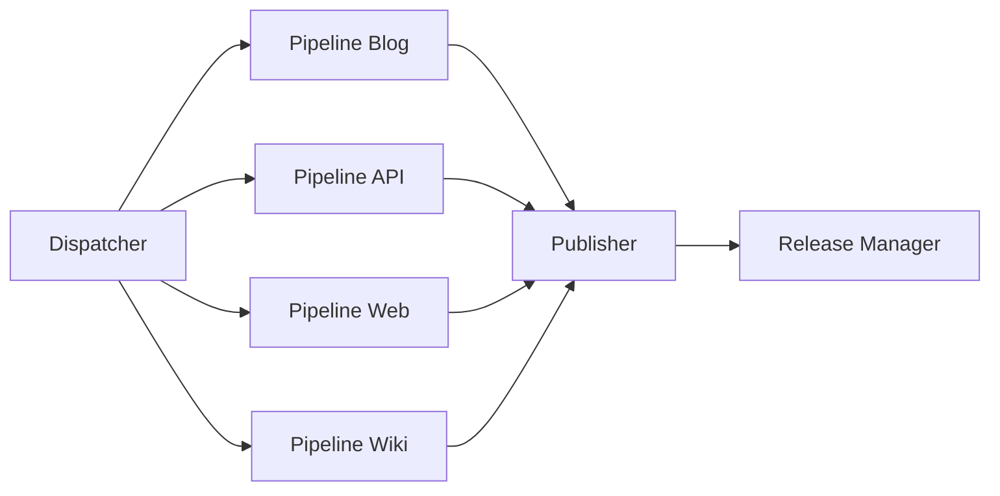
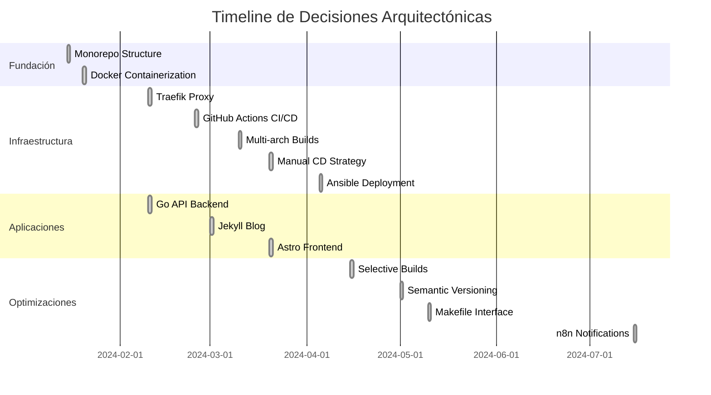

# Architecture and Decision Records

## Overview

This document combines the system architecture and architectural decision records (ADRs) of the mlorente.dev project. Each section captures the context, decision, and consequences of significant architectural decisions, providing a comprehensive view of the system.

---

## Architectural Decisions Index

| ADR | Title | Status | Date | Impact |
|-----|--------|--------|-------|---------|
| [ADR-001](#adr-001-monorepo-structure) | Monorepo Structure | ✅ Accepted | 2024-01 | 🔥 High |
| [ADR-002](#adr-002-docker-containerization) | Docker Containerization | ✅ Accepted | 2024-01 | 🔥 High |
| [ADR-003](#adr-003-traefik-as-reverse-proxy) | Traefik as Reverse Proxy | ✅ Accepted | 2024-02 | 🔥 High |
| [ADR-004](#adr-004-github-actions-for-cicd) | GitHub Actions for CI/CD | ✅ Accepted | 2024-02 | 🔥 High |
| [ADR-005](#adr-005-multi-architecture-builds) | Multi-Architecture Builds | ✅ Accepted | 2024-03 | 🔄 Medium |
| [ADR-006](#adr-006-manual-cd-strategy) | Manual CD Strategy | ✅ Accepted | 2024-03 | 🔄 Medium |
| [ADR-007](#adr-007-ansible-for-deployments) | Ansible for Deployments | ✅ Accepted | 2024-04 | 🔥 High |
| [ADR-008](#adr-008-selective-app-builds) | Selective App Builds | ✅ Accepted | 2024-04 | 🔄 Medium |
| [ADR-009](#adr-009-automatic-semantic-versioning) | Automatic Semantic Versioning | ✅ Accepted | 2024-05 | 🔄 Medium |
| [ADR-010](#adr-010-makefile-as-unified-interface) | Makefile as Unified Interface | ✅ Accepted | 2024-05 | 💡 Low |
| [ADR-011](#adr-011-go-for-backend-api) | Go for Backend API | ✅ Accepted | 2024-02 | 🔥 High |
| [ADR-012](#adr-012-jekyll-for-blog-platform) | Jekyll for Blog Platform | ✅ Accepted | 2024-03 | 🔄 Medium |
| [ADR-013](#adr-013-astro-for-frontend-application) | Astro for Frontend Application | ✅ Accepted | 2024-03 | 🔄 Medium |
| [ADR-014](#adr-014-n8n-webhook-notifications) | n8n Webhook Notifications | ✅ Accepted | 2024-07 | 💡 Low |

---

## Current Technology Stack

### Frontend
- **Web App:** Astro + TypeScript + Tailwind CSS
- **Blog:** Jekyll + Beautiful Jekyll theme
- **Reverse Proxy:** Traefik con SSL automático

### Backend
- **API:** Go 1.21 con librería estándar
- **Base de Datos:** Almacenamiento basado en archivos

### Infraestructura
- **Contenerización:** Docker + Docker Compose
- **Orquestación:** Ansible playbooks
- **CI/CD:** GitHub Actions (6 workflows, 1,388+ líneas)
- **Registry:** Docker Hub con builds multi-arch

### Operaciones
- **Monitorización:** Vector + Prometheus + Grafana
- **Automatización:** n8n para workflows
- **Gestión:** Portainer para supervisión

### Desarrollo
- **Repositorio:** Monorepo con builds selectivos
- **Versionado:** Semántico con sufijos por rama
- **Despliegue:** CD manual con CI automatizado
- **Interfaz:** Makefile unificado

---

## ADR-001: Monorepo Structure

**Status**: ✅ Accepted  
**Date**: 2024-01-15  
**Context**: Management of multiple related applications in the mlorente.dev ecosystem

### Problem

The ecosystem requires multiple applications (web, blog, API, infrastructure) that share configurations, deployment processes, and lifecycle. Decision between monorepo vs multiple repositories.

### Decision

**Chosen option**: Monorepo with organized structure and selective builds.

**Adopted structure**:
```
├── apps/                 # Aplicaciones principales
│   ├── web/             # Frontend Astro
│   ├── blog/            # Blog Jekyll  
│   ├── api/             # API Go
│   ├── monitoring/      # Stack de monitorización
│   └── wiki/            # Documentación técnica
├── infra/               # Infraestructura como código
├── .github/workflows/   # Pipelines CI/CD compartidos
└── Makefile            # Interfaz unificada
```

### Consecuencias

**Positivas**:
- Versionado coordinado entre aplicaciones
- CI/CD simplificado con builds selectivos (70% reducción en builds innecesarios)
- Configuración compartida (Traefik, Docker networks)
- Refactoring cross-app más fácil
- Tooling unificado (Makefile, scripts)

**Negativas**:
- Repo más grande (~50MB con assets)
- Acoplamiento potencial entre apps
- Lógica compleja de detección de cambios

**Implementación**:
- `dorny/paths-filter@v3` para detección de cambios
- Apps construidas en paralelo según cambios detectados

---

## ADR-002: Containerización con Docker

**Estado**: ✅ Aceptado  
**Fecha**: 2024-01-20  
**Contexto**: Entornos consistentes y despliegue portable para múltiples tech stacks

### Problema

Las aplicaciones usan diferentes tecnologías (Go, Node.js, Ruby) que requieren configuraciones específicas. Necesidad de portabilidad entre desarrollo, staging y producción.

### Decisión

**Opción elegida**: Docker containers con multi-stage builds optimizados.

**Implementación**:
```dockerfile
# Ejemplo Dockerfile optimizado
FROM node:20-alpine AS builder
WORKDIR /app
COPY package*.json ./
RUN npm ci --only=production

FROM node:20-alpine AS runner
RUN addgroup -g 1001 -S nodejs
RUN adduser -S astro -u 1001
COPY --from=builder --chown=astro:nodejs /app/node_modules ./node_modules
USER astro
```

### Consecuencias

**Positivas**:
- Paridad dev/prod garantizada
- Aislamiento de dependencias
- Builds reproducibles
- Escalado horizontal simplificado
- Imágenes optimizadas con multi-stage

**Negativas**:
- Overhead de recursos
- Complejidad adicional en debugging local

**Mitigaciones**:
- Docker Compose para desarrollo local
- Health checks en todos los contenedores
- Volúmenes para hot reload en desarrollo

---

## ADR-003: Traefik como Reverse Proxy

**Estado**: ✅ Aceptado  
**Fecha**: 2024-02-10  
**Contexto**: Routing inteligente, SSL automático y descubrimiento de servicios

### Problema

Múltiples aplicaciones necesitan exposición en diferentes subdominios con SSL automático y routing dinámico basado en labels de Docker.

### Decisión

**Opción elegida**: Traefik v3 con auto-discovery de Docker y Let's Encrypt.

**Configuración clave**:
```yaml
# traefik.yml
providers:
  docker:
    exposedByDefault: false
certificatesResolvers:
  letsencrypt:
    acme:
      email: admin@mlorente.dev
      storage: /acme.json
      httpChallenge:
        entryPoint: web

# Ejemplo configuración de servicio
labels:
  - "traefik.enable=true"
  - "traefik.http.routers.web.rule=Host(`mlorente.dev`)"
  - "traefik.http.routers.web.tls.certresolver=letsencrypt"
```

### Consecuencias

**Positivas**:
- SSL automático con renovación
- Auto-discovery de servicios
- Configuración vía labels Docker
- Dashboard integrado
- Métricas Prometheus built-in
- Actualizaciones de configuración sin reinicios

**Negativas**:
- Curva de aprendizaje específica
- Dependencia crítica adicional
- Más complejo que Nginx para casos simples

**Alternativas descartadas**: Nginx (configuración manual), HAProxy (setup complejo), Caddy (menos soporte ecosistema)

---

## ADR-004: GitHub Actions para CI/CD

**Estado**: ✅ Aceptado  
**Fecha**: 2024-02-25  
**Contexto**: Automatización CI/CD nativa con GitHub para builds paralelos

### Problema

Requerimiento de CI/CD automatizado con buena integración GitHub, soporte builds paralelos, y relación coste/beneficio favorable.

### Decisión

**Opción elegida**: GitHub Actions con workflows modulares (6 workflows, 1,388+ líneas).

**Arquitectura adoptada**:


### Consecuencias

**Positivas**:
- Integración nativa con GitHub
- Secrets management incluido
- Matrix builds para paralelización
- Marketplace extenso de actions
- Pricing generoso para proyectos pequeños

**Negativas**:
- Vendor lock-in con GitHub
- Limitaciones runners públicos
- Debugging menos directo que soluciones self-hosted

**Implementación**:
- Workflows reutilizables y modulares
- Caching extensivo para optimización
- Builds condicionales basados en cambios de rutas

---

## ADR-005: Builds Multi-Arquitectura

**Estado**: ✅ Aceptado  
**Fecha**: 2024-03-10  
**Contexto**: Soporte para servidores AMD64 y ARM64 (Apple Silicon, AWS Graviton)

### Problema

Necesidad de soportar tanto servidores x86_64 tradicionales como ARM64. Los builds single-arch limitan opciones de deployment.

### Decisión

**Opción elegida**: Builds multi-arquitectura usando Docker Buildx.

**Implementación**:
```yaml
- name: Build and Push Image
  uses: docker/build-push-action@v6
  with:
    platforms: linux/amd64,linux/arm64
    push: true
    cache-from: type=gha
    cache-to: type=gha,mode=max
```

### Consecuencias

**Positivas**:
- Flexibilidad en elección de hardware
- Mejor rendimiento en ARM64 nativo
- Preparación para adopción ARM en cloud
- Menor coste en proveedores ARM64

**Negativas**:
- Builds 40% más lentos (2x procesos)
- Mayor complejidad en troubleshooting
- Consumo adicional espacio registry

**Mitigaciones**:
- Caching agresivo GitHub Actions
- Tests específicos por arquitectura

---

## ADR-006: Estrategia de CD Manual

**Estado**: ✅ Aceptado  
**Fecha**: 2024-03-20  
**Contexto**: Balance entre automatización y control en despliegues de producción

### Problema

Decisión sobre nivel de automatización en despliegues: full automation vs control manual de cuándo y qué se despliega a producción.

### Decisión

**Opción elegida**: CD Semi-Automático con bundles de release.

**Flujo implementado**:
```
develop → Auto-build → Auto-release RC
master → Auto-build → Auto-release estable  
deploy → Manual trigger → Ansible → Production
```

### Consecuencias

**Positivas**:
- Control total sobre timing de despliegues
- Ventana de validación antes de producción  
- Bundles self-contained para rollbacks rápidos
- Revisión manual reduce riesgo
- Capacidad de agrupar múltiples cambios

**Negativas**:
- Tiempo a producción más lento
- Requiere intervención manual
- Potencial retraso en hot-fixes

**Implementación**:
```bash
# Proceso de despliegue simplificado
make deploy ENV=production RELEASE_VERSION=v1.2.0
```

---

## ADR-007: Ansible para Despliegues

**Estado**: ✅ Aceptado  
**Fecha**: 2024-04-05  
**Contexto**: Gestión automatizada de configuración de servidores

### Problema

Necesidad de automatizar configuración de servidores, despliegues y gestión de configuración de forma idempotente y repetible.

### Decisión

**Opción elegida**: Ansible con playbooks específicos por tarea y entornos.

**Estructura adoptada**:
```
infra/ansible/
├── playbooks/
│   ├── bootstrap.yml    # Server initial setup
│   ├── deploy.yml       # Application deployment  
│   └── rollback.yml     # Rollback procedures
├── roles/
│   ├── docker/         # Docker installation
│   ├── traefik/        # Traefik configuration
│   └── apps/           # Application deployment
└── inventories/
    ├── production/
    └── staging/
```

### Consecuencias

**Positivas**:
- Despliegues idempotentes (seguro re-ejecutar)
- Configuración declarativa YAML
- Agentless (solo SSH)
- Inventarios multi-entorno
- Reutilización vía roles
- Excelente integración con Docker

**Negativas**:
- Curva de aprendizaje YAML/Jinja2
- Debugging más complejo que bash
- Dependencia Python en máquina control

**Implementación**:
```bash
# Despliegues específicos por entorno
make deploy ENV=production  # Usa inventario production
make deploy ENV=staging     # Usa inventario staging
```

---

## ADR-008: Construcción Selectiva de Apps

**Estado**: ✅ Aceptado  
**Fecha**: 2024-04-15  
**Contexto**: Optimización de tiempos CI para monorepo

### Problema

En monorepo, cambios pequeños disparan builds de todas las aplicaciones, resultando en tiempos CI lentos y uso innecesario de recursos.

### Decisión

**Opción elegida**: Path-based detection con dorny/paths-filter.

**Implementación**:
```yaml
- uses: dorny/paths-filter@v3
  id: filter
  with:
    filters: |
      blog:
        - 'apps/blog/**'
        - 'apps/blog/Dockerfile'
      api:
        - 'apps/api/**'
        - 'apps/api/Dockerfile'
      web:
        - 'apps/web/**'
        - 'apps/web/Dockerfile'
      wiki:
        - 'apps/wiki/**'
```

### Consecuencias

**Positivas**:
- 70% reducción en builds innecesarios
- Tiempos de CI significativamente más rápidos
- Menor consumo recursos GitHub Actions
- Feedback más rápido en PRs

**Negativas**:
- Complejidad adicional en workflow logic
- Posibles false negatives en detección
- Dependencias implícitas no detectadas

**Mitigaciones**:
- Patterns comprehensivos incluyendo Dockerfiles
- Override manual para forzar builds completos

---

## ADR-009: Versionado Semántico Automático

**Estado**: ✅ Aceptado  
**Fecha**: 2024-05-01  
**Contexto**: Automatización de gestión de versiones basada en commits

### Problema

Gestión manual de versiones propensa a errores. Necesidad de versionado consistente y automático basado en el impacto de los cambios.

### Decisión

**Opción elegida**: Conventional Commits con lógica custom de semantic versioning.

**Reglas implementadas**:
```bash
feat: → MINOR bump
fix: → PATCH bump  
feat!: → MAJOR bump
BREAKING CHANGE: → MAJOR bump
docs:, style:, chore: → PATCH bump
```

**Estrategia por rama**:
- `feature/*` → `1.2.3-alpha.N`
- `hotfix/*` → `1.2.3-beta.N`
- `develop` → `1.2.3-rc.N`
- `master` → `1.2.3` + `latest`

### Consecuencias

**Positivas**:
- Versionado predictible y automático
- Semantic versioning proper
- Historial claro de cambios  
- Integración con release management
- Rollbacks precisos a versiones específicas

**Negativas**:
- Requiere disciplina en commit messages
- Lógica compleja de cálculo (390+ líneas bash)
- Posibles versiones no deseadas

**Implementación**:
- Validación conventional commits en CI
- Cálculo automático desde mensajes commit

---

## ADR-010: Makefile como Interfaz Unificada

**Estado**: ✅ Aceptado  
**Fecha**: 2024-05-10  
**Contexto**: Simplificación de comandos de desarrollo y operaciones

### Problema

Múltiples herramientas (Docker Compose, Ansible, scripts) con comandos complejos y difíciles de recordar.

### Decisión

**Opción elegida**: Makefile con targets bien organizados y autodocumentación.

**Estructura adoptada**:
```makefile
# Development
up: ## Start all services
down: ## Stop all services
logs: ## View logs

# Build & Deploy  
push-all: ## Build and push all apps
deploy: ## Deploy to environment
status: ## Check deployment status

# Utilities
check: ## Verify prerequisites
install-precommit-hooks: ## Install development tools
help: ## Show this help
```

### Consecuencias

**Positivas**:
- Interfaz única y consistente
- Autodocumentación con `make help`
- Funciona en cualquier sistema Unix
- Fácil onboarding nuevos desarrolladores
- Composición de comandos complejos

**Negativas**:
- Sintaxis Make puede ser arcana
- No funciona nativamente en Windows

**Mitigaciones**:
- Documentación exhaustiva con help
- WSL recomendado para Windows

---

## ADR-011: Go para Backend API

**Estado**: ✅ Aceptado  
**Fecha**: 2024-02-10  
**Contexto**: Backend API para gestión de suscripciones y lógica de negocio

### Problema

Elección de lenguaje para backend API que afecta rendimiento, mantenibilidad y estrategia de despliegue.

### Decisión

**Opción elegida**: Go 1.21 con dependencias mínimas y enfoque en librería estándar.

### Consecuencias

**Positivas**:
- Excelente rendimiento y bajo uso memoria
- Despliegue de binario único (perfecto para contenedores)
- Librería estándar robusta reduce dependencias
- Ciclos rápidos compilación y testing
- Excelente soporte concurrencia

**Negativas**:
- Más verboso que lenguajes interpretados
- Ecosistema más pequeño vs Node.js/Python
- Curva de aprendizaje para equipo

**Implementación**:
- Router HTTP con librería estándar
- Dependencias mínimas (solo logging y config)
- Hot reload con `air` en desarrollo
- Multi-stage builds para imágenes pequeñas

---

## ADR-012: Jekyll para Plataforma de Blog

**Estado**: ✅ Aceptado  
**Fecha**: 2024-03-01  
**Contexto**: Plataforma de blog para contenido técnico con SEO y rendimiento

### Decisión

**Opción elegida**: Jekyll con Beautiful Jekyll theme, desplegado como aplicación contenerizada.

### Consecuencias

**Positivas**:
- Excelente rendimiento (archivos estáticos)
- Fuertes capacidades SEO
- Gran ecosistema de temas y plugins
- Perfecto para contenido técnico con syntax highlighting
- Integración natural con Git workflow

**Negativas**:
- Stack dependencias Ruby
- Builds más lentos con muchos posts
- Menos funcionalidad dinámica

**Implementación**:
- Beautiful Jekyll theme para diseño profesional
- Contenedor Docker para builds consistentes
- Integración CI/CD para rebuilds automáticos

---

## ADR-013: Astro para Aplicación Frontend

**Estado**: ✅ Aceptado  
**Fecha**: 2024-03-20  
**Contexto**: Sitio web principal con rendimiento excelente y SEO

### Decisión

**Opción elegida**: Astro con hidratación selectiva y arquitectura islands.

### Consecuencias

**Positivas**:
- Excelente rendimiento con JavaScript mínimo
- Grandes puntuaciones SEO y Core Web Vitals
- Component islands permiten interactividad selectiva
- Experiencia desarrollo moderna con TypeScript
- Generación de sitio estático por defecto

**Negativas**:
- Framework más nuevo con ecosistema en evolución
- Curva aprendizaje para arquitectura islands
- Limitaciones para apps altamente interactivas

**Implementación**:
- TypeScript para type safety
- Tailwind CSS para styling
- Arquitectura basada en componentes .astro
- JavaScript mínimo del lado cliente

---

## ADR-014: Notificaciones Webhook n8n

**Estado**: ✅ Aceptado  
**Fecha**: 2024-07-15  
**Contexto**: Visibilidad en pipeline CI/CD y eventos de despliegue

### Decisión

**Opción elegida**: Notificaciones webhook a workflows n8n para procesamiento flexible.

**Implementación**:
```json
{
  "type": "docker_build_completed",
  "app": "blog",
  "docker_version": "1.2.0-rc.5",
  "status": "success",
  "timestamp": "2024-07-15T10:30:00Z"
}
```

### Consecuencias

**Positivas**:
- Control completo sobre lógica notificaciones
- Extensible para automatizaciones futuras
- Datos estructurados para analytics
- Auto-hospedado, sin dependencias externas

**Negativas**:
- Complejidad adicional pipeline CI/CD
- Dependencia que infraestructura n8n esté activa

---

## Timeline de Evolución Arquitectónica



---

## Métricas y Estado Actual

| Métrica | Valor | Notas |
|---------|-------|-------|
| **Total ADRs** | 14 | Decisiones documentadas |
| **Estado Aceptado** | 14 (100%) | Todas implementadas |
| **Cobertura Arquitectural** | Completa | Todas las decisiones clave documentadas |
| **Complejidad CI/CD** | 1,388+ líneas | 6 workflows en GitHub Actions |
| **Apps en Monorepo** | 5 | web, blog, api, monitoring, wiki |
| **Reducción Builds** | 70% | Gracias a construcción selectiva |
| **Arquitecturas Soportadas** | 2 | linux/amd64, linux/arm64 |
| **Última Actualización** | Diciembre 2024 | Mantenido activamente |

---

## Template para Nuevos ADRs

```markdown
## ADR-XXX: [Título de la Decisión]

**Estado**: 🔄 Propuesto | ✅ Aceptado | ❌ Rechazado | 📚 Deprecated  
**Fecha**: YYYY-MM-DD  
**Contexto**: [Situación que requiere la decisión]
**Impacto**: 🔥 Alto | 🔄 Medio | 💡 Bajo

### Problema
[Descripción del problema que se intenta resolver]

### Opciones Consideradas
1. **Opción A**: [Descripción]
2. **Opción B**: [Descripción]
3. **Opción C**: [Descripción]

### Decisión
**Opción elegida**: [Opción seleccionada]

[Justificación de la decisión]

### Consecuencias

**Positivas**:
- [Beneficio 1]
- [Beneficio 2]

**Negativas**:
- [Desventaja 1]
- [Desventaja 2]

**Mitigaciones**:
- [Cómo mitigar desventaja 1]
- [Cómo mitigar desventaja 2]

### Implementación
[Detalles técnicos relevantes, código, configuraciones]
```

---

*💡 **Nota**: Este documento unifica las anteriores arquitecturas ADR.md y ARCHITECTURE.md eliminando redundancias. Cuando tomes una nueva decisión arquitectural significativa, añádela siguiendo el template. Mantiene la documentación actualizada y ayuda a futuros desarrolladores a entender el "por qué" detrás del diseño actual.*