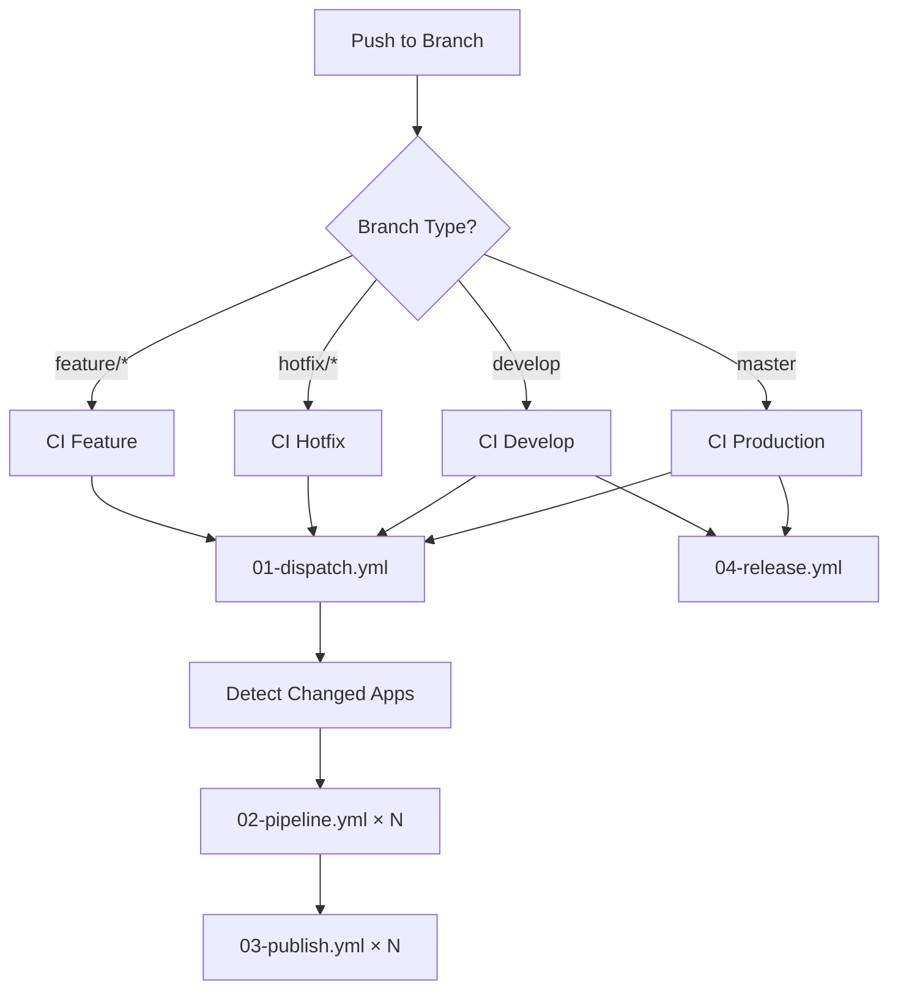

# 4.2 CI/CD Pipeline

This document explains how the CI/CD pipeline works for the mlorente.dev project. The pipeline consists of 6 GitHub Actions workflows that handle building, testing, and deploying applications.

## How it works

When you push code changes:

1. **Detection:** The system detects which applications have changed
2. **Building:** Only changed applications are built and tested
3. **Publishing:** Docker images are pushed to the registry
4. **Versioning:** Semantic versions are calculated automatically
5. **Release:** Release artifacts are created for deployments

## Workflow Overview



## Workflow Files

### 1. Dispatcher (ci-01-dispatch.yml)

**Purpose:** Entry point that detects changed applications and triggers parallel builds  
**Lines:** ~119 lines  
**Triggers:** Push to any branch, manual workflow dispatch

**Key features:**
- Detects which apps have changed based on file paths
- Triggers pipeline workflows for each changed app
- Handles both development and production branches
- Supports manual triggering with app selection

### 2. Pipeline (ci-02-pipeline.yml)

**Purpose:** Builds, tests, and validates individual applications  
**Lines:** ~380 lines per app  
**Triggers:** Called by dispatcher for each changed app

**Key features:**
- Multi-architecture builds (AMD64, ARM64)
- Application-specific testing
- Docker image building with caching
- Security scanning and linting
- Artifact generation

### 3. Publish (ci-03-publish.yml)

**Purpose:** Publishes Docker images to registry  
**Lines:** ~145 lines  
**Triggers:** Successful completion of pipeline workflow

**Key features:**
- Multi-architecture image publishing
- Tag management (latest, version-specific)
- Registry authentication
- Image metadata and labels

### 4. Release (ci-04-release.yml)

**Purpose:** Creates release bundles and manages versioning  
**Lines:** ~290 lines  
**Triggers:** Push to develop or master branches

**Key features:**
- Semantic version calculation
- Release bundle creation
- Changelog generation
- Git tag management

### 5. Wiki (ci-05-wiki.yml)

**Purpose:** Builds and deploys documentation  
**Lines:** ~98 lines  
**Triggers:** Changes to documentation files

**Key features:**
- MkDocs site generation
- Documentation validation
- Static site deployment

### 6. Health Check (ci-06-health.yml)

**Purpose:** Monitors deployment health and sends notifications  
**Lines:** ~156 lines  
**Triggers:** Scheduled runs, deployment completion

**Key features:**
- Service health validation
- Notification sending via n8n webhooks
- Deployment status reporting

## Version Calculation

The pipeline automatically calculates semantic versions based on conventional commits:

- **Major (X.0.0):** Breaking changes (`BREAKING CHANGE:` in commit)
- **Minor (x.Y.0):** New features (`feat:` commits)
- **Patch (x.y.Z):** Bug fixes (`fix:` commits)

Example commit types:
```bash
feat: add new API endpoint          # Minor version bump
fix: resolve authentication bug     # Patch version bump
feat!: change API response format   # Major version bump
docs: update README                 # No version bump
```

## Selective Building

To optimize build times, the pipeline only builds applications that have actually changed:

```yaml
# Apps are detected based on changed file paths
api: 
  - 'apps/api/**'
  - 'go.mod'
  - 'go.sum'

web:
  - 'apps/web/**'
  - 'package.json'
  - 'package-lock.json'

blog:
  - 'apps/blog/**'
  - 'Gemfile'
  - 'Gemfile.lock'
```

## Build Optimization

**Caching strategies:**
- Docker layer caching for faster image builds
- Dependency caching for npm, bundle, go modules
- Build artifact caching between workflow runs

**Parallel execution:**
- Multiple applications build simultaneously
- Independent testing and validation per app
- Concurrent publishing of successful builds

## Environment Management

**Branch strategies:**
- `feature/*` - Build and test only, no publishing
- `develop` - Build, test, publish with dev tags
- `master` - Build, test, publish with production tags

**Environment variables:**
- Secrets managed through GitHub Secrets
- Environment-specific configuration via .env files
- Runtime configuration through Docker labels

## Debugging CI/CD Issues

**Common issues and solutions:**

**Build failures:**
```bash
# View specific workflow run
gh run view <run-id> --log

# Re-run failed jobs
gh run rerun <run-id>

# Check workflow status
gh run list --branch feature/my-feature
```

**Version conflicts:**
```bash
# Check current tags
git tag -l | tail -10

# Force version calculation
git tag v1.0.1
git push origin v1.0.1
```

**App not building:**
- Check if files match the path filters
- Verify Dockerfile exists in app directory
- Check for syntax errors in workflow files

## Adding New Applications

To add a new application to the CI/CD pipeline:

1. **Add path filters** in `ci-01-dispatch.yml`
2. **Create Dockerfile** in the new app directory
3. **Update pipeline matrix** to include the new app
4. **Add environment variables** if needed

Example:
```yaml
# In ci-01-dispatch.yml
newapp:
  - 'apps/newapp/**'
  - 'apps/newapp/Dockerfile'
```

## Performance Metrics

Current pipeline performance:
- **Average build time:** 3-7 minutes per app
- **Parallel builds:** Up to 4 applications simultaneously
- **Cache hit rate:** ~85% for dependencies
- **Success rate:** ~95% (excluding infrastructure issues)

## Security Measures

- All secrets stored in GitHub Secrets
- Docker images scanned for vulnerabilities
- No secrets in build logs or artifacts
- Limited permissions for workflow tokens
- Multi-factor authentication required

## Troubleshooting

**Pipeline stuck:**
- Check runner availability
- Verify GitHub Actions status
- Look for dependency conflicts

**Images not publishing:**
- Check Docker Hub credentials
- Verify repository permissions
- Review publish workflow logs

**Version calculation wrong:**
- Check commit message format
- Verify conventional commits compliance
- Review tag history