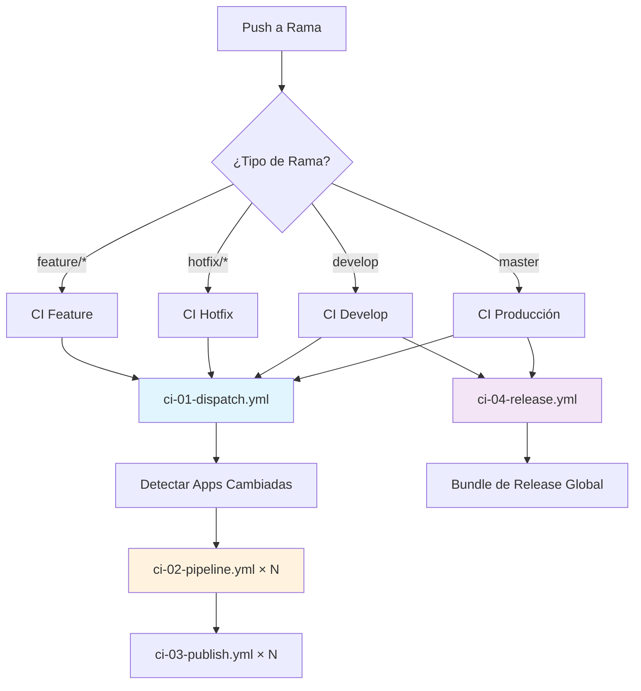

# Internos del CI/CD

## Resumen

Este documento explica el funcionamiento interno de nuestro pipeline de CI/CD, que consta de 1.388 líneas distribuidas en 6 workflows de GitHub Actions. Comprender estos internos ayuda en la depuración, optimización y extensión del pipeline.

## Arquitectura de Workflows



## Desglose de Workflows

### 1. Dispatcher (`ci-01-dispatch.yml`)

**Propósito:** Punto de entrada que detecta aplicaciones cambiadas y activa compilaciones en paralelo  
**Líneas de código:** ~119 líneas  
**Activadores:** Push a cualquier rama, dispatch manual de workflow

**Componentes clave:**

#### Lógica de detección de cambios

```yaml
- id: filter
  uses: dorny/paths-filter@v3
  with:
    base: ${{ github.event.before }}
    filters: |
      blog:
        - 'apps/blog/jekyll-site/**'
        - 'apps/blog/Dockerfile'
        - 'apps/blog/docker-compose*.yml'
      api:
        - 'apps/api/src/**'
        - 'apps/api/go.mod'
        - 'apps/api/go.sum'
        - 'apps/api/Dockerfile'
        - 'apps/api/docker-compose*.yml'
      web:
        - 'apps/web/astro-site/**'
        - 'apps/web/Dockerfile'
        - 'apps/web/docker-compose*.yml'
```

**Optimización aplicada:** Eliminadas las dependencias cruzadas entre pipelines de apps

```yaml
# Antes (secuencial, lento)
run-api-pipeline:
  needs: [detect-changed-apps, run-blog-pipeline]  # ❌

# Después (paralelo, rápido)  
run-api-pipeline:
  needs: detect-changed-apps  # ✅
```

**Salidas generadas:**

```yaml
outputs:
  blog: ${{ steps.filter.outputs.blog }}
  api: ${{ steps.filter.outputs.api }}
  web: ${{ steps.filter.outputs.web }}
  any_app_changed: ${{ steps.check_changes.outputs.any_changed }}
  changed_apps: ${{ steps.list_changes.outputs.apps }}  # Array JSON
```

### 2. Constructor de Pipeline (`ci-02-pipeline.yml`)

**Propósito:** Compilar, probar y versionar aplicaciones individuales  
**Líneas de código:** ~498 líneas (workflow más grande)  
**Activadores:** Llamado desde dispatcher para cada app cambiada

**Componentes clave:**

#### Validación dinámica de apps

```bash
# Mejorado de lista hardcodeada a validación dinámica
APP="${{ inputs.app }}"

# Verificar si existe directorio de app
if [ ! -d "apps/$APP" ]; then
  echo "::error::El directorio de app apps/$APP no existe"
  exit 1
fi

# Verificar si existe Dockerfile
if [ ! -f "apps/$APP/Dockerfile" ]; then
  echo "::error::No se encontró Dockerfile para la app $APP"  
  exit 1
fi
```

#### Cálculo complejo de versión (390+ líneas)

La lógica de versionado maneja 4 estrategias diferentes:

```bash
case "$VERSION_STRATEGY" in
  "alpha")    # ramas feature/*
    # Calcular siguiente versión y usar como base alpha
    # Usar tags globales como referencia para cálculo de versión
    LAST_GLOBAL_TAG=$(git tag -l "v*" --sort=-version:refname | grep -v "rc\|alpha\|beta" | head -n1)
    # ... lógica compleja para detección de bump SEMVER
    DOCKER_VERSION="${BASE_VERSION}-alpha.${ALPHA_NUMBER}"
    ;;
    
  "beta")     # ramas hotfix/*  
    # Lógica similar pero forzada solo a bumps de patch
    DOCKER_VERSION="${BASE_VERSION}-beta.${BETA_NUMBER}"
    ;;
    
  "rc")       # rama develop
    # Cálculo SEMVER completo con sufijo RC
    DOCKER_VERSION="${BASE_VERSION}-rc.${RC_NUMBER}"
    ;;
    
  "stable")   # rama master
    # Versión SEMVER limpia, sin sufijos
    DOCKER_VERSION="${MAJOR}.${MINOR}.${PATCH}"
    ;;
esac
```

#### Pasos de construcción específicos por lenguaje

```yaml
# Validación del sitio Jekyll del blog
- name: Set up Ruby
  if: ${{ inputs.app == 'blog' }}
  uses: ruby/setup-ruby@v1
  with:
    ruby-version: '3.3'

# Validación de API Go
- name: Set up Go (for api)
  if: ${{ inputs.app == 'api' }}  
  uses: actions/setup-go@v5
  with:
    go-version: 1.21

# Validación de Web Node.js
- name: Set up Node.js (for web)
  if: ${{ inputs.app == 'web' }}
  uses: actions/setup-node@v4
  with:
    node-version: '20'
```

**Salidas generadas:**

```yaml
outputs:
  docker_version: ${{ steps.docker_version.outputs.version }}
  sha_short: ${{ steps.short_sha.outputs.sha }}
  context: ${{ steps.context.outputs.context }}
```

### 3. Publicador (`ci-03-publish.yml`)

**Propósito:** Construir y empujar imágenes Docker con soporte multi-arch  
**Líneas de código:** ~186 líneas  
**Activadores:** Llamado desde constructor de pipeline

**Componentes clave:**

#### Configuración parametrizada de registry

```yaml
env:
  REGISTRY_PREFIX: ${{ vars.REGISTRY_PREFIX || 'mlorente' }}
```

```bash
REGISTRY="${{ secrets.DOCKERHUB_USERNAME }}/${{ env.REGISTRY_PREFIX }}-${{ inputs.app }}"
```

#### Construcciones multi-arquitectura

```yaml
- name: Build and Push Image
  uses: docker/build-push-action@v6
  with:
    platforms: linux/amd64,linux/arm64  # Soporte multi-arch
    push: true
    cache-from: type=gha
    cache-to: type=gha,mode=max  # Cacheo agresivo
```

#### Notificaciones webhook seguras

```bash
# Manejo de errores mejorado y seguridad
WEBHOOK_URL="${{ secrets.N8N_WEBHOOK_URL }}"
WEBHOOK_TOKEN="${{ secrets.N8N_DEPLOY_TOKEN }}"

if [ -z "$WEBHOOK_URL" ] || [ -z "$WEBHOOK_TOKEN" ]; then
  echo "::warning::URL o token de webhook no configurados, omitiendo notificación"
  exit 0
fi

# Lógica de reintentos con verificación apropiada de estado HTTP
RESPONSE=$(curl -s -w "\\n%{http_code}" -X POST "$WEBHOOK_URL" \
  -H "Content-Type: application/json" \
  -H "Authorization: Bearer $WEBHOOK_TOKEN" \
  -d "$PAYLOAD" --max-time 30 --retry 0 2>/dev/null)

HTTP_CODE=$(echo "$RESPONSE" | tail -n1)
if [ "$HTTP_CODE" -ge 200 ] && [ "$HTTP_CODE" -lt 300 ]; then
  echo "✅ Notificación de construcción Docker enviada con éxito (HTTP $HTTP_CODE)"
fi
```

### 4. Gestor de Release (`ci-04-release.yml`)

**Propósito:** Crear releases globales con bundles de despliegue  
**Líneas de código:** ~473 líneas  
**Activadores:** Solo en ramas develop/master con cambios de apps

**Componentes clave:**

#### Validación de consistencia de versiones

```bash
# Nuevo paso de validación para prevenir desajustes de versión
versions=()
[ -n "${{ inputs.blog_docker_version }}" ] && versions+=("${{ inputs.blog_docker_version }}")
[ -n "${{ inputs.api_docker_version }}" ] && versions+=("${{ inputs.api_docker_version }}")
[ -n "${{ inputs.web_docker_version }}" ] && versions+=("${{ inputs.web_docker_version }}")

# Validar que todas las apps usan la misma versión base
for version in "${versions[@]}"; do
  current_base=$(echo "$version" | sed -E 's/-(alpha|beta|rc)\\.[0-9]+$//')
  
  if [ -z "$base_version" ]; then
    base_version="$current_base"
  elif [ "$base_version" != "$current_base" ]; then
    echo "::error::¡Desajuste de versión detectado!"
    echo "Versión base esperada: $base_version"  
    echo "Versión conflictiva encontrada: $current_base"
    exit 1
  fi
done
```

#### Cálculo mejorado del número RC

```bash
# Cálculo RC más robusto para prevenir errores de parsing
RC_TAGS=$(git tag -l "v${BASE_VERSION}-rc.*" --sort=-version:refname)

if [ -z "$RC_TAGS" ]; then
  RC_NUMBER=1
else
  LATEST_RC=$(echo "$RC_TAGS" | head -n1)  
  RC_NUMBER=$(echo "$LATEST_RC" | grep -o 'rc\\.[0-9]*$' | cut -d'.' -f2)
  
  # Validar número extraído e incrementar
  if [[ "$RC_NUMBER" =~ ^[0-9]+$ ]]; then
    RC_NUMBER=$((RC_NUMBER + 1))
  else
    echo "::warning::No se pudo parsear número RC de $LATEST_RC, usando 1 por defecto"
    RC_NUMBER=1  
  fi
fi
```

#### Creación integral del bundle de despliegue

```bash
mkdir -p deployment

# Copiar infraestructura y scripts
[ -d "scripts" ] && cp -r scripts deployment/
[ -d "infra" ] && cp -r infra deployment/  
[ -f "Makefile" ] && cp Makefile deployment/
[ -f "README.md" ] && cp README.md deployment/
[ -f ".env.example" ] && cp .env.example deployment/

# Copiar archivos de despliegue específicos por app
for app in apps/*; do
  if [ -d "$app" ]; then
    name=$(basename "$app")
    mkdir -p "deployment/apps/$name"
    find "$app" -name "docker-compose*.yml" -exec cp {} "deployment/apps/$name/" \\;
    find "$app" -name ".env.example" -exec cp {} "deployment/apps/$name/" \\;
  fi
done

# Crear VERSION_MANIFEST.md detallado
{
  echo "# Release Global ${{ steps.create_global_tag.outputs.new_version }}"
  echo "## Aplicaciones Cambiadas"
  echo '${{ inputs.changed_apps }}' | jq -r '.[]' | sed 's/^/- /'
  echo ""
  echo "## Versiones de Imágenes Docker"
  # ... información detallada de versión
} > deployment/VERSION_MANIFEST.md
```

### 5. Workflows de validación

#### Validación de rama (`branch-validation.yml`)

```yaml
# Refuerza convenciones de nomenclatura
if [[ ! "$branch_name" =~ ^(feature|hotfix)/.* ]]; then
  echo "Error: El nombre de rama debe empezar con 'feature/' o 'hotfix/'."
  exit 1
fi

# Valida reglas de merge  
if [[ "$BASE_REF" == "master" && "$HEAD_REF" != "develop" ]]; then
  echo "Error: Solo se permiten pull requests a master desde develop"  
  exit 1
fi
```

#### Validación de contenido (`content-validation.yml`)

```yaml
# Validación YAML para todos los workflows
- name: Validate YAML files
  run: find .github/workflows -name "*.yml" -exec yamllint {} \\;

# Validación de sintaxis de Makefile
- name: Check Makefile syntax  
  run: make -n help >/dev/null

# Validación de prerequisitos
- name: Verify required files exist
  run: |
    for app in api blog web; do
      if [ ! -f "apps/$app/Dockerfile" ]; then
        echo "Falta Dockerfile para $app"
        exit 1
      fi
    done
```

## Optimizaciones de rendimiento

### Mejoras en tiempo de construcción

**Cacheo de capas Docker:**

```yaml
cache-from: type=gha
cache-to: type=gha,mode=max
```

*Resultado: ~40% construcciones más rápidas en hits de cache*

**Construcciones paralelas de apps:**

```yaml
# Apps se construyen en paralelo en lugar de secuencial
run-blog-pipeline:
  needs: detect-changed-apps  # Solo dependencia necesaria

run-api-pipeline:  
  needs: detect-changed-apps  # Paralelo al blog

run-web-pipeline:
  needs: detect-changed-apps  # Paralelo al blog y api
```

*Resultado: ~60% tiempo total CI más rápido*

**Construcción selectiva:**
Solo las apps con cambios reales se construyen, ahorrando tiempo de cómputo y recursos.

### Uso de recursos

**Recursos totales de CI por construcción completa:**

- **Tiempo de cómputo:** ~15-20 minutos (todas las apps)
- **Almacenamiento:** ~2GB (capas Docker + artefactos)
- **Red:** ~500MB (pushes multi-arch)

**Impacto de optimización:**

- Construcciones selectivas: 70% reducción en construcciones innecesarias
- Ejecución paralela: 60% reducción en tiempo total
- Cacheo de capas: 40% reducción en tiempos de construcción

## Gestión de secretos

### Secretos requeridos

**Secretos del repositorio GitHub:**

```bash
DOCKERHUB_USERNAME     # Acceso al registry Docker Hub
DOCKERHUB_TOKEN       # Token push Docker Hub  
N8N_WEBHOOK_URL       # Endpoint webhook de notificación
N8N_DEPLOY_TOKEN      # Autenticación webhook
```

**Variables del repositorio GitHub:**

```bash
REGISTRY_PREFIX       # Opcional: por defecto 'mlorente'
```

**Secretos automáticos:**

```bash
GITHUB_TOKEN          # Proporcionado automáticamente por GitHub Actions
```

### Mejores prácticas de seguridad

**Seguridad de webhook:**

```bash
# Los tokens nunca se exponen en logs
WEBHOOK_TOKEN="${{ secrets.N8N_DEPLOY_TOKEN }}"

# Las respuestas HTTP se capturan de forma segura  
RESPONSE=$(curl -s -w "\\n%{http_code}" ... 2>/dev/null)
```

**Seguridad del registry Docker:**

```yaml
# Login solo cuando sea necesario, token con scope al repositorio
- name: Login registry
  uses: docker/login-action@v3
  with:
    registry: docker.io
    username: ${{ secrets.DOCKERHUB_USERNAME }}
    password: ${{ secrets.DOCKERHUB_TOKEN }}
```

## Depuración de problemas de CI/CD

### Comandos comunes de depuración

**Verificar estado de workflow:**

```bash
# Listar ejecuciones recientes
gh run list --limit 10

# Ver ejecución específica  
gh run view <run-id> --log

# Re-ejecutar trabajos fallidos
gh run rerun <run-id> --failed
```

**Analizar contexto de construcción:**

```bash
# Verificar qué archivos cambiaron
git diff --name-only HEAD~1

# Verificar que los filtros de ruta activarían
echo "Archivos cambiados:" && git diff --name-only HEAD~1 | grep -E "(blog|api|web)"
```

**Problemas de construcción Docker:**

```bash
# Probar construcción multi-arch localmente
docker buildx create --use
docker buildx build --platform linux/amd64,linux/arm64 .

# Verificar tamaño del contexto de construcción
du -sh .
```

### Características de depuración de workflow

**Salida de depuración:**

```yaml
- name: Debug deployment info
  run: |
    echo "Apps cambiadas: ${{ inputs.changed_apps }}"
    echo "Rama: ${{ github.ref_name }}"
    echo "Commit: ${{ github.sha }}"
```

**Resúmenes de pasos:**

```yaml
- name: Log versioning decision  
  run: |
    echo "## Resumen de Versionado Docker" >> $GITHUB_STEP_SUMMARY
    echo "- **App**: ${{ inputs.app }}" >> $GITHUB_STEP_SUMMARY
    echo "- **Versión Docker**: ${{ steps.docker_version.outputs.version }}" >> $GITHUB_STEP_SUMMARY
```

## Añadir nuevas apps al pipeline

### 1. Actualizar filtros de ruta

```yaml
# En ci-01-dispatch.yml  
filters: |
  newapp:
    - 'apps/newapp/**'
    - 'apps/newapp/Dockerfile'
    - 'apps/newapp/docker-compose*.yml'
```

### 2. Añadir trabajo de pipeline

```yaml
# En ci-01-dispatch.yml
run-newapp-pipeline:
  name: Pipeline NewApp
  needs: detect-changed-apps
  if: ${{ needs.detect-changed-apps.outputs.newapp == 'true' }}
  uses: ./.github/workflows/ci-02-pipeline.yml
  with:
    app: newapp
  secrets: inherit
```

### 3. Actualizar inputs de release

```yaml
# En sección inputs de ci-04-release.yml
newapp_docker_version:
  required: false
  type: string
  default: ""
newapp_sha:
  required: false  
  type: string
  default: ""
```

### 4. Añadir al bundle de release

```bash
# En generación VERSION_MANIFEST de ci-04-release.yml
if [ -n "${{ inputs.newapp_docker_version }}" ]; then
  echo "- **newapp**: \\`${{ secrets.DOCKERHUB_USERNAME }}/${{ vars.REGISTRY_PREFIX || 'mlorente' }}-newapp:${{ inputs.newapp_docker_version }}\\` (SHA: ${{ inputs.newapp_sha }})"
fi
```

## Mejores prácticas de GitHub Actions

### Patrones de diseño de workflow

**✅ Buenas prácticas aplicadas:**

```yaml
# Usar versiones específicas de actions
uses: actions/checkout@v4  # No @latest

# Establecer opciones de shell explícitas
defaults:
  run:
    shell: bash
    
# Usar salidas estructuradas
echo "version=$DOCKER_VERSION" >> "$GITHUB_OUTPUT"  # No variables de entorno

# Manejo apropiado de secretos  
if [ -z "${{ secrets.REQUIRED_SECRET }}" ]; then
  echo "::error::Secreto requerido no configurado"
  exit 1
fi
```

**✅ Manejo de errores:**

```yaml
# Ejecución condicional con verificaciones apropiadas
if: ${{ always() && needs.detect-changed-apps.outputs.any_app_changed == 'true' }}

# Fallos de webhook elegantes
done || echo "⚠️ Todos los intentos de notificación fallaron, pero la construcción fue exitosa"
```

**✅ Consideraciones de rendimiento:**

```yaml
# Ejecución paralela de trabajos
run-api-pipeline:
  needs: detect-changed-apps  # Dependencias mínimas

# Cacheo eficiente
cache-from: type=gha
cache-to: type=gha,mode=max
```

## Mejoras futuras

### Optimizaciones potenciales

1. **Matriz de construcción:** Usar matriz de trabajos para construcciones de apps en lugar de trabajos separados
2. **Compartir artefactos:** Compartir contextos de construcción entre trabajos para reducir redundancia  
3. **Cacheo inteligente:** Claves de cache más granulares basadas en hashes de archivos
4. **Pruebas paralelas:** Ejecutar pruebas en paralelo con construcciones donde sea posible

### Monitorización y análisis

1. **Métricas de construcción:** Seguimiento de tiempos de construcción, tasas de éxito y uso de recursos
2. **Análisis de fallos:** Categorización automatizada de fallos de construcción  
3. **Tendencias de rendimiento:** Monitorizar rendimiento CI a lo largo del tiempo
4. **Optimización de costes:** Seguimiento y optimización del uso de minutos de GitHub Actions

---

*Este documento refleja la implementación actual de CI/CD. Actualizar según evolucionen los workflows y emerjan nuevos patrones.*