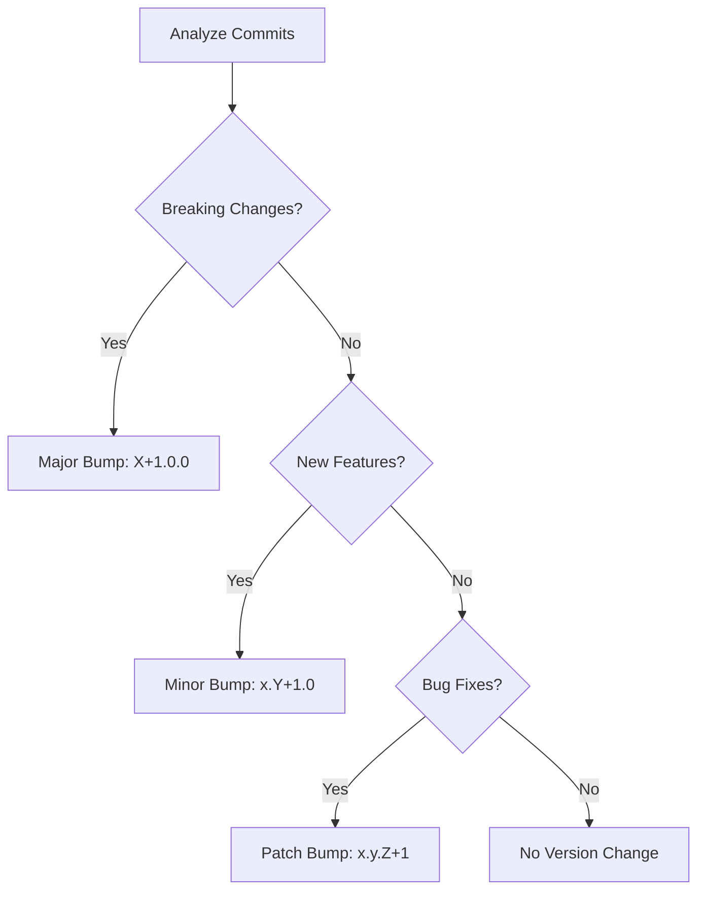

# 4.7 Versioning Strategy

This document explains how Docker images and releases are versioned across different branches in the mlorente.dev project. The versioning follows semantic versioning principles while providing specific builds for development branches.

## Versioning by Branch

### Feature Branches (`feature/*`)

**Purpose:** Development of new features in isolation

**Image Pattern:** `{registry}/{prefix}-{app}:{major.minor.patch}-alpha.{commits}`

```bash
# Example: feature/new-authentication
dockerhub-user/mlorente-blog:1.2.3-alpha.5
dockerhub-user/mlorente-api:1.2.3-alpha.7  
dockerhub-user/mlorente-web:1.2.3-alpha.12

# Where:
# - 1.2.3 = Next version calculated from last stable tag
# - alpha.X = Incremental number of commits in feature branch
```

**Characteristics:**
- No global releases created
- No deployment artifacts generated
- Docker images for testing only
- Automatic cleanup after 90 days

### Hotfix Branches (`hotfix/*`)

**Purpose:** Critical fixes that need immediate deployment

**Image Pattern:** `{registry}/{prefix}-{app}:{major.minor.patch}-beta.{commits}`

```bash
# Example: hotfix/security-fix
dockerhub-user/mlorente-blog:1.1.2-beta.3
dockerhub-user/mlorente-api:1.1.2-beta.4

# Where:
# - 1.1.2 = Patch version increment from last stable
# - beta.X = Number of commits in hotfix branch
# - Only patch bumps allowed (no features or breaking changes)
```

**Characteristics:**
- Creates pre-release for testing
- Only patch-level changes permitted
- Fast-track deployment process
- Requires immediate merge after validation

### Develop Branch (`develop`)

**Purpose:** Integration branch for upcoming releases

**Image Pattern:** `{registry}/{prefix}-{app}:{major.minor.patch}-rc.{commits}`

```bash
# Example: develop branch
dockerhub-user/mlorente-blog:1.3.0-rc.15
dockerhub-user/mlorente-api:1.3.0-rc.18
dockerhub-user/mlorente-web:1.3.0-rc.22

# Where:
# - 1.3.0 = Next version based on accumulated changes
# - rc.X = Release candidate with commit count
```

**Characteristics:**
- Creates pre-release bundles
- Full integration testing
- Staging environment deployment
- Preparation for production release

### Master Branch (`master`)

**Purpose:** Production-ready code

**Image Pattern:** `{registry}/{prefix}-{app}:{major.minor.patch}`

```bash
# Example: master branch
dockerhub-user/mlorente-blog:1.3.0
dockerhub-user/mlorente-api:1.3.0
dockerhub-user/mlorente-web:1.3.0

# Where:
# - 1.3.0 = Stable semantic version
# - Also tagged as 'latest'
```

**Characteristics:**
- Creates final release
- Production deployment artifacts
- Git tags created automatically
- Release notes generated

## Semantic Versioning Rules

### Major Version (X.0.0)
Breaking changes that require user action:
```bash
feat!: change API response format
BREAKING CHANGE: remove deprecated endpoints
```

### Minor Version (x.Y.0)
New features that are backward compatible:
```bash
feat: add user profile API
feat: implement search functionality
```

### Patch Version (x.y.Z)
Bug fixes and minor improvements:
```bash
fix: resolve authentication timeout
fix: correct date formatting issue
```

### Special Cases

**Documentation and configuration changes:**
```bash
docs: update API documentation    # No version bump
chore: update dependencies       # No version bump
style: fix code formatting       # No version bump
```

## Version Calculation Process

### 1. Commit Analysis
The system scans commits since the last version tag:

```bash
# Get commits since last tag
git log v1.2.3..HEAD --oneline

# Analyze conventional commit messages
feat: new user dashboard     # Minor bump
fix: login button styling    # Patch bump
feat!: change data format    # Major bump
```

### 2. Version Increment Logic



### 3. Pre-release Suffixes

Based on the branch, appropriate suffixes are added:

```bash
feature/auth-system  → 1.3.0-alpha.7
hotfix/urgent-fix    → 1.2.1-beta.3
develop              → 1.3.0-rc.12
master               → 1.3.0
```

## Release Management

### Pre-release Testing

1. **Alpha versions** (feature branches)
   - Basic functionality testing
   - Unit and integration tests
   - Development environment only

2. **Beta versions** (hotfix branches)
   - Critical fix validation
   - Staging environment testing
   - Limited production testing

3. **Release candidates** (develop branch)
   - Full system testing
   - User acceptance testing
   - Staging environment validation

### Production Releases

Production releases from master branch include:

- **Docker images** with semantic version tags
- **Release bundles** with deployment configs
- **Release notes** with changelog
- **Git tags** for version tracking

### Version Conflicts

When multiple apps have different changes, the highest version increment wins:

```bash
# If in the same release:
api: feat: new endpoint      # Minor: 1.3.0
web: fix: button color       # Patch: 1.2.1
blog: feat!: new theme       # Major: 2.0.0

# Result: All apps get 2.0.0
dockerhub-user/mlorente-api:2.0.0
dockerhub-user/mlorente-web:2.0.0
dockerhub-user/mlorente-blog:2.0.0
```

## Manual Version Override

Sometimes you need to manually set a version:

```bash
# Force a specific version
git tag v2.1.0
git push origin v2.1.0

# Trigger release workflow
gh workflow run ci-04-release.yml
```

## Version History

Track version history through:

```bash
# List all version tags
git tag -l | sort -V

# Show version details
git show v1.3.0

# Compare versions
git diff v1.2.0..v1.3.0

# See what changed in a version
git log v1.2.0..v1.3.0 --oneline
```

## Best Practices

### Commit Messages
Always use conventional commit format:
```bash
git commit -m "feat: add user authentication"
git commit -m "fix: resolve memory leak in API"
git commit -m "feat!: change database schema"
```

### Branch Management
- Keep feature branches short-lived
- Regular rebasing against develop
- Clean commit history before merging
- Delete feature branches after merge

### Version Planning
- Plan major versions for breaking changes
- Group related features in minor versions
- Release patches quickly for critical fixes
- Communicate breaking changes clearly

## Troubleshooting

**Version not calculating:**
- Check commit message format
- Verify conventional commits compliance
- Review git tag history

**Wrong version generated:**
- Check for breaking change indicators
- Verify commit scope and type
- Review version calculation logs

**Version conflicts:**
- Ensure all apps use same base version
- Check for conflicting version tags
- Verify branch synchronization