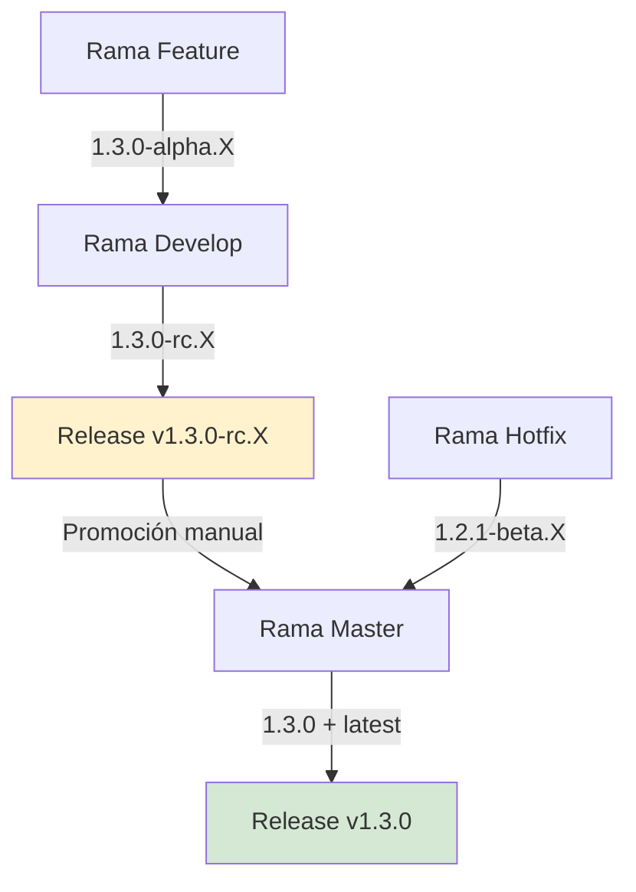

# Estrategia de Versionado de Imágenes Docker y Releases

## Visión General

Este documento explica cómo se nombran y versionan las imágenes Docker y artefactos de release en las diferentes ramas del monorepo mlorente.dev. Nuestra estrategia de versionado sigue los principios del versionado semántico mientras proporciona builds específicos para alpha, beta y release candidates según la rama.

## Estrategia de Versionado por Rama

### Ramas Feature (`feature/*`)

**Propósito:** Desarrollo de nuevas funcionalidades de forma aislada

**Patrón de Imagen:** `{registry}/{prefix}-{app}:{major.minor.patch}-alpha.{commits}`

```bash
# Ejemplo: feature/new-authentication
dockerhub-user/mlorente-blog:1.2.3-alpha.5
dockerhub-user/mlorente-api:1.2.3-alpha.7  
dockerhub-user/mlorente-web:1.2.3-alpha.12

# Donde:
# - 1.2.3 = Próxima versión calculada desde el último tag estable
# - alpha.X = Número incremental de commits en la rama feature
```

**Características:**

- ❌ No se crean releases globales
- ❌ No se generan artefactos de despliegue
- ✅ Imágenes Docker solo para testing
- ✅ Limpieza automática tras 90 días

### Ramas Hotfix (`hotfix/*`)

**Propósito:** Correcciones críticas que necesitan despliegue inmediato

**Patrón de Imagen:** `{registry}/{prefix}-{app}:{major.minor.patch}-beta.{commits}`

```bash
# Ejemplo: hotfix/security-fix
dockerhub-user/mlorente-blog:1.1.2-beta.3
dockerhub-user/mlorente-api:1.1.2-beta.4

# Donde:
# - 1.1.2 = Incremento de versión patch desde el último estable
# - beta.X = Número de commits en la rama hotfix
# - Solo se permiten bumps de patch (no features o breaking changes)
```

**Características:**

- ❌ No se crean releases globales
- ❌ No se generan artefactos de despliegue  
- ✅ Imágenes Docker para testing urgente
- ⚠️ Deben mergearse a master rápidamente

### Rama Develop

**Propósito:** Rama de integración para features listas para release

**Patrón de Imagen:** `{registry}/{prefix}-{app}:{major.minor.patch}-rc.{commits}`

```bash
# Ejemplo: rama develop
dockerhub-user/mlorente-blog:1.2.0-rc.15
dockerhub-user/mlorente-api:1.2.0-rc.23
dockerhub-user/mlorente-web:1.2.0-rc.18

# Donde:
# - 1.2.0 = SEMVER calculado desde conventional commits
# - rc.X = Número de release candidate (commits que afectan a cada app)
```

**Artefactos Generados:**

```bash
# GitHub Release (Prerelease)
Tag: v1.2.0-rc.5

# Bundle de Despliegue
global-release-v1.2.0-rc.5.zip
├── deployment/
│   ├── VERSION_MANIFEST.md    # Versiones RC documentadas
│   ├── scripts/               # Utilidades de despliegue
│   ├── infra/                 # Playbooks Ansible & configs Traefik
│   ├── Makefile              # Interfaz make completa
│   └── apps/*/docker-compose*.yml  # Archivos compose de producción
```

### Rama Master

**Propósito:** Releases estables de producción

**Patrón de Imagen:** `{registry}/{prefix}-{app}:{major.minor.patch}` + `latest`

```bash
# Ejemplo: rama master
dockerhub-user/mlorente-blog:1.2.0
dockerhub-user/mlorente-api:1.2.0  
dockerhub-user/mlorente-web:1.2.0

# Más tags latest
dockerhub-user/mlorente-blog:latest
dockerhub-user/mlorente-api:latest
dockerhub-user/mlorente-web:latest
```

**Artefactos Generados:**

```bash
# GitHub Release (Estable)
Tag: v1.2.0

# Bundle de Despliegue
global-release-v1.2.0.zip
├── deployment/
│   ├── VERSION_MANIFEST.md    # Versiones estables documentadas
│   ├── scripts/               # Scripts listos para producción
│   ├── infra/                 # Código de infraestructura probado
│   ├── Makefile              # Targets make de producción
│   └── apps/*/docker-compose*.yml  # Archivos compose estables
```

## Lógica de Cálculo de Versiones

### Bumping de Versión Semántica

Nuestro CI analiza mensajes de commit usando conventional commits:

```bash
# Versión MAJOR (breaking changes)
feat!: nuevo sistema de autenticación
fix!: cambiar formato de respuesta API
# → 1.0.0 → 2.0.0

# Versión MINOR (nuevas features)
feat: añadir dashboard de usuario
feat(api): implementar webhooks
# → 1.0.0 → 1.1.0

# Versión PATCH (bug fixes)
fix: resolver timeout de login
fix(blog): corregir typos
# → 1.0.0 → 1.0.1
```

### Consistencia de Versiones Entre Apps

Todas las apps en un release **deben usar la misma versión base**:

```bash
✅ VÁLIDO - Misma versión base
blog: 1.2.0-rc.15
api:  1.2.0-rc.23  
web:  1.2.0-rc.18

❌ INVÁLIDO - Versiones base mezcladas  
blog: 1.2.0-rc.15
api:  1.3.0-rc.5   # ¡Versión base diferente!
web:  1.2.0-rc.18
```

Nuestro paso de validación en `ci-04-release.yml` previene esto.

## Formato VERSION_MANIFEST.md

Cada bundle de release incluye un manifiesto detallado:

### Ejemplo Rama Develop

```markdown
# Global Release v1.2.0-rc.5
## Aplicaciones Modificadas
- blog
- api

## Versiones de Imágenes Docker  
- **blog**: `dockerhub-user/mlorente-blog:1.2.0-rc.15` (SHA: abc1234)
- **api**: `dockerhub-user/mlorente-api:1.2.0-rc.23` (SHA: def5678)

## Instrucciones de Despliegue
1. Extraer este bundle al entorno de despliegue
2. Revisar el VERSION_MANIFEST.md para componentes modificados  
3. Actualizar los archivos docker-compose con las nuevas tags de imagen
4. Ejecutar scripts de despliegue desde el directorio scripts/

## Versión Global del Proyecto
- **Versión del Proyecto**: v1.2.0-rc.5
- **Rama**: develop
- **Commit**: 1a2b3c4d
```

### Ejemplo Rama Master  

```markdown
# Global Release v1.2.0
## Aplicaciones Modificadas
- blog  
- api
- web

## Versiones de Imágenes Docker
- **blog**: `dockerhub-user/mlorente-blog:1.2.0` (SHA: xyz9876)
- **api**: `dockerhub-user/mlorente-api:1.2.0` (SHA: uvw5432)  
- **web**: `dockerhub-user/mlorente-web:1.2.0` (SHA: rst1098)

## Versión Global del Proyecto
- **Versión del Proyecto**: v1.2.0
- **Rama**: master
- **Commit**: 9z8y7x6w
```

## Flujo de Promoción de Versiones



## Estrategia de Rollback

### Usando Versiones Específicas

```bash
# Desplegar versión RC específica
make deploy ENV=production RELEASE_VERSION=v1.2.0-rc.5

# Rollback a versión estable anterior
make deploy ENV=production RELEASE_VERSION=v1.1.0
```

### Rollback de Emergencia

```bash
# Rollback rápido usando última versión conocida buena
export EMERGENCY_ROLLBACK_VERSION=v1.1.0
make emergency-rollback ENV=production
```

## Variables de Configuración

### Variables del Repositorio

- `REGISTRY_PREFIX` (por defecto: `mlorente`) - Prefijo configurable del registry Docker

### Secrets Requeridos

- `DOCKERHUB_USERNAME` - Usuario de Docker Hub
- `DOCKERHUB_TOKEN` - Token de acceso de Docker Hub  
- `N8N_WEBHOOK_URL` - Webhook para notificaciones de despliegue
- `N8N_DEPLOY_TOKEN` - Token de autenticación para webhooks
- `GITHUB_TOKEN` - Proporcionado automáticamente por GitHub Actions

## Solución de Problemas

### Errores de Version Mismatch

```bash
Error: Version mismatch detected!
Expected base version: 1.2.0
Found conflicting version: 1.3.0  
```

**Solución:** Asegúrate de que todas las apps usan la misma versión base antes del release.

### Imágenes Docker Faltantes

```bash
Error: Image not found: dockerhub-user/mlorente-api:1.2.0-rc.5
```

**Solución:** Verifica que el pipeline CI/CD se completó exitosamente para todas las apps.

### Fallo en Cálculo de Versión

```bash
Warning: Could not parse RC number from v1.2.0-rc.abc, defaulting to 1
```

**Solución:** Crear tags RC apropiados manualmente o dejar que el sistema auto-incremente.

## Mejores Prácticas

1. **Siempre probar versiones alpha/beta** antes de promover a RC
2. **Mantener ramas hotfix de corta duración** - mergear rápidamente
3. **Usar conventional commits** para cálculo apropiado de versión  
4. **Verificar bundles de despliegue** antes del despliegue manual
5. **Documentar breaking changes** en notas de release
6. **Monitorear notificaciones webhook** para estado de despliegue

---

*Última actualización: Enero 2025*

*Este documento refleja la implementación actual de CI/CD en `.github/workflows/`*