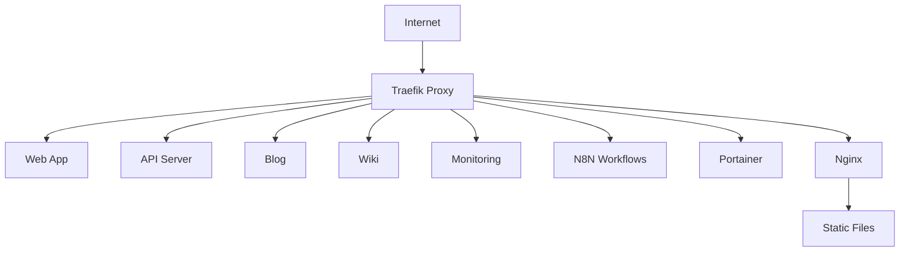

# 🔧 Infraestructura

**Configuraciones, proxies, DNS, despliegues y gestión de la infraestructura completa**

---

## Componentes de Infraestructura

  

    <h3><a href="#traefik">2.1 Traefik</a></h3>
    
Proxy reverso y load balancer con configuración automática.

    

      

        Proxy
        Load Balancer
        SSL
      

    

  

  
  

    <h3><a href="#nginx">2.2 Nginx</a></h3>
    
Servidor web de alta performance para contenido estático.

    

      

        Web Server
        Static Files
        Cache
      

    

  

  
  

    <h3><a href="#ansible">2.3 Ansible</a></h3>
    
Automatización de configuración y despliegue de infraestructura.

    

      

        Automation
        IaC
        Deployment
      

    

  

  
  

    <h3><a href="#docker">2.4 Docker</a></h3>
    
Containerización y orquestación de aplicaciones y servicios.

    

      

        Containers
        Docker Compose
        Orchestration
      

    

  

  
  

    <h3><a href="#dns">2.5 DNS & Domains</a></h3>
    
Configuración de DNS, dominios y subdominios del ecosistema.

    

      

        DNS
        Domains
        Routing
      

    

  

  
  

    <h3><a href="#ssl">2.6 SSL/TLS</a></h3>
    
Certificados SSL automáticos y configuración de seguridad.

    

      

        SSL
        Let's Encrypt
        Security
      

    

  

## Arquitectura de Red

La infraestructura está diseñada con los siguientes principios:

- **Proxy Reverso Centralizado**: Traefik como punto de entrada único
- **Seguridad por Defecto**: SSL/TLS automático y headers de seguridad
- **Alta Disponibilidad**: Configuración redundante y health checks
- **Monitorización Integrada**: Métricas y logs centralizados

## Diagrama de Red

## Configuraciones Clave

| Componente | Configuración | Ubicación | Estado |
|------------|---------------|-----------|--------|
| Traefik | docker-compose.yml | `/infra/traefik/` | 🟢 Activo |
| Nginx | nginx.conf | `/infra/nginx/` | 🟢 Activo |
| Ansible | playbooks/ | `/infra/ansible/` | 🟢 Configurado |
| Docker | Dockerfiles | `/apps/*/` | 🟢 Multi-container |
| DNS | mlorente.dev | Cloudflare | 🟢 Activo |
| SSL | Let's Encrypt | Automático | 🟢 Auto-renovación |

## Servicios de Red

### Puertos y Exposición

- **80/443**: Entrada HTTP/HTTPS (Traefik)
- **8080**: Dashboard Traefik (interno)
- **9443**: Portainer HTTPS
- **5678**: N8N workflows
- **3000-3004**: Aplicaciones (proxificadas)

### Dominios Configurados

- `mlorente.dev` - Sitio principal
- `api.mlorente.dev` - API REST/GraphQL
- `blog.mlorente.dev` - Blog personal
- `wiki.mlorente.dev` - Documentación técnica
- `monitoring.mlorente.dev` - Dashboards
- `n8n.mlorente.dev` - Automatización
- `portainer.mlorente.dev` - Gestión containers

---

💡 **Tip:** La infraestructura se gestiona principalmente mediante Docker Compose y scripts de automatización.