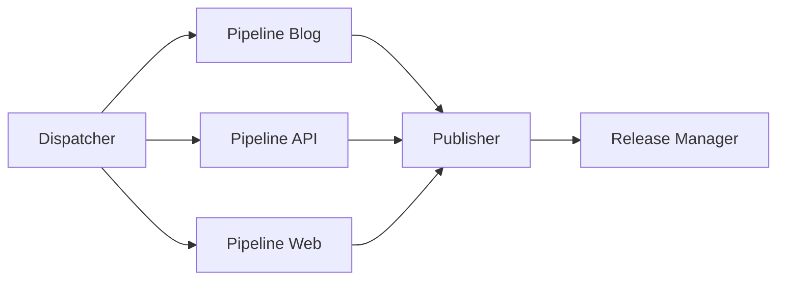

# Architecture Decision Records (ADRs)

## Índice de Decisiones

| ADR | Título | Estado | Fecha |
|-----|--------|--------|-------|
| [ADR-001](#adr-001-monorepo-structure) | Estructura de Monorepo | ✅ Aceptado | 2024-01 |
| [ADR-002](#adr-002-docker-containerization) | Containerización con Docker | ✅ Aceptado | 2024-01 |
| [ADR-003](#adr-003-traefik-reverse-proxy) | Traefik como Reverse Proxy | ✅ Aceptado | 2024-02 |
| [ADR-004](#adr-004-github-actions-cicd) | GitHub Actions para CI/CD | ✅ Aceptado | 2024-02 |
| [ADR-005](#adr-005-multi-architecture-builds) | Builds Multi-Arquitectura | ✅ Aceptado | 2024-03 |
| [ADR-006](#adr-006-manual-cd-strategy) | Estrategia de CD Manual | ✅ Aceptado | 2024-03 |
| [ADR-007](#adr-007-ansible-deployment) | Ansible para Despliegues | ✅ Aceptado | 2024-04 |
| [ADR-008](#adr-008-selective-app-building) | Construcción Selectiva de Apps | ✅ Aceptado | 2024-04 |
| [ADR-009](#adr-009-semantic-versioning) | Versionado Semántico Automático | ✅ Aceptado | 2024-05 |
| [ADR-010](#adr-010-makefile-interface) | Makefile como Interfaz Unificada | ✅ Aceptado | 2024-05 |

---

## ADR-001: Estructura de Monorepo

**Estado**: ✅ Aceptado  
**Fecha**: 2024-01-15  
**Contexto**: Necesidad de gestionar múltiples aplicaciones relacionadas

### Problema

El ecosistema mlorente.dev requiere múltiples aplicaciones (web, blog, API, infraestructura) que comparten configuraciones, procesos de despliegue y ciclo de vida. Decidir entre monorepo vs múltiples repositorios.

### Opciones Consideradas

1. **Múltiples repositorios**: Un repo por aplicación
2. **Monorepo**: Todas las aplicaciones en un solo repositorio
3. **Híbrido**: Apps principales en monorepo, utilidades separadas

### Decisión

**Opción elegida**: Monorepo con estructura organizada por aplicaciones.

**Estructura adoptada**:
```
├── apps/                 # Aplicaciones principales
│   ├── web/             # Frontend Astro
│   ├── blog/            # Blog Jekyll  
│   ├── api/             # API Go
│   └── monitoring/      # Stack de monitorización
├── infra/               # Infraestructura como código
├── .github/workflows/   # Pipelines CI/CD compartidos
└── Makefile            # Interfaz unificada
```

### Consecuencias

**Positivas**:
- Versionado coordinado entre aplicaciones
- CI/CD simplificado con builds selectivos
- Configuración compartida (Traefik, Docker networks)
- Refactoring cross-app más fácil

**Negativas**:
- Repo más grande y complejo
- Permisos granulares más difíciles
- Checkout inicial más pesado

**Mitigaciones**:
- Builds selectivos por cambios de rutas
- Documentación clara de estructura
- Scripts de setup automatizados

---

## ADR-002: Containerización con Docker

**Estado**: ✅ Aceptado  
**Fecha**: 2024-01-20  
**Contexto**: Necesidad de entornos consistentes y despliegue portable

### Problema

Las aplicaciones usan diferentes tecnologías (Go, Node.js, Ruby) que requieren configuraciones específicas. Necesidad de portabilidad entre desarrollo, staging y producción.

### Opciones Consideradas

1. **Instalación nativa**: Cada tech stack instalado en el host
2. **VMs individuales**: Una VM por aplicación
3. **Docker containers**: Containerización de todas las apps

### Decisión

**Opción elegida**: Docker containers con multi-stage builds optimizados.

**Implementación**:
```dockerfile
# Ejemplo Dockerfile optimizado
FROM node:20-alpine AS builder
WORKDIR /app
COPY package*.json ./
RUN npm ci --only=production

FROM node:20-alpine AS runner
RUN addgroup -g 1001 -S nodejs
RUN adduser -S astro -u 1001
COPY --from=builder --chown=astro:nodejs /app/node_modules ./node_modules
USER astro
```

### Consecuencias

**Positivas**:
- Paridad dev/prod garantizada
- Aislamiento de dependencias
- Builds reproducibles
- Fácil escalado horizontal

**Negativas**:
- Overhead de aprendizaje Docker
- Uso adicional de recursos
- Complejidad en debugging

**Mitigaciones**:
- Docker Compose para desarrollo local
- Health checks en todos los contenedores
- Volumenes para desarrollo en caliente

---

## ADR-003: Traefik como Reverse Proxy

**Estado**: ✅ Aceptado  
**Fecha**: 2024-02-10  
**Contexto**: Necesidad de routing inteligente y SSL automático

### Problema

Múltiples aplicaciones necesitan ser expuestas en diferentes subdominios con SSL automático. Requerimiento de routing dinámico basado en labels de Docker.

### Opciones Consideradas

1. **Nginx**: Configuración estática, SSL manual
2. **HAProxy**: Configuración estática avanzada
3. **Traefik**: Auto-discovery con Docker, SSL automático
4. **Cloudflare Tunnels**: Solución SaaS

### Decisión

**Opción elegida**: Traefik v3 con auto-discovery de Docker y Let's Encrypt.

**Configuración clave**:
```yaml
# traefik.yml
providers:
  docker:
    exposedByDefault: false
certificatesResolvers:
  letsencrypt:
    acme:
      email: admin@mlorente.dev
      storage: /acme.json
      httpChallenge:
        entryPoint: web
```

### Consecuencias

**Positivas**:
- SSL automático con renovación
- Auto-discovery de servicios
- Configuración vía labels Docker
- Dashboard integrado
- Métricas Prometheus built-in

**Negativas**:
- Menos familiar que Nginx
- Dependencia adicional crítica
- Configuración compleja para casos edge

**Mitigaciones**:
- Documentación exhaustiva de configuración
- Backup automático de certificados ACME
- Monitorización específica de Traefik

---

## ADR-004: GitHub Actions para CI/CD

**Estado**: ✅ Aceptado  
**Fecha**: 2024-02-25  
**Contexto**: Necesidad de automatización CI/CD nativa con GitHub

### Problema

Requerimiento de CI/CD automatizado que integre bien con GitHub, soporte builds paralelos, y tenga buena relación coste/beneficio.

### Opciones Consideradas

1. **Jenkins**: Auto-hospedado, muy flexible
2. **GitLab CI**: Cambio de plataforma requerido
3. **GitHub Actions**: Nativo, integración perfecta
4. **CircleCI**: SaaS dedicado
5. **Drone**: Auto-hospedado ligero

### Decisión

**Opción elegida**: GitHub Actions con workflows modulares.

**Arquitectura adoptada**:


### Consecuencias

**Positivas**:
- Integración nativa con GitHub
- Secrets management incluido
- Matrix builds para paralelización
- Marketplace de actions extenso
- Pricing generoso para proyectos pequeños

**Negativas**:
- Vendor lock-in con GitHub
- Limitaciones en runners públicos
- Debugging menos directo que Jenkins

**Mitigaciones**:
- Workflows modulares y reutilizables
- Extensive caching para optimizar tiempos
- Documentación detallada de workflows

---

## ADR-005: Builds Multi-Arquitectura

**Estado**: ✅ Aceptado  
**Fecha**: 2024-03-10  
**Contexto**: Soporte para servidores AMD64 y ARM64

### Problema

Necesidad de soportar tanto servidores x86_64 tradicionales como ARM64 (Apple Silicon, AWS Graviton). Los builds single-arch limitan opciones de deployment.

### Opciones Consideradas

1. **AMD64 solamente**: Limita opciones de hardware
2. **ARM64 solamente**: Compatibilidad limitada
3. **Builds separados**: Complejidad en gestión
4. **Multi-arch unified**: Un build, múltiples arquitecturas

### Decisión

**Opción elegida**: Builds multi-arquitectura usando Docker Buildx.

**Implementación**:
```yaml
- name: Build and Push Image
  uses: docker/build-push-action@v6
  with:
    platforms: linux/amd64,linux/arm64
    push: true
    cache-from: type=gha
    cache-to: type=gha,mode=max
```

### Consecuencias

**Positivas**:
- Flexibilidad en elección de hardware
- Mejor rendimiento en ARM64 nativo
- Preparación para futuro
- Menor coste en proveedores ARM64

**Negativas**:
- Builds más lentos (2x tiempo)
- Mayor complejidad en troubleshooting
- Consumo adicional de espacio registry

**Mitigaciones**:
- Caching agresivo para builds
- Tests específicos por arquitectura
- Documentación de diferencias por arch

---

## ADR-006: Estrategia de CD Manual

**Estado**: ✅ Aceptado  
**Fecha**: 2024-03-20  
**Contexto**: Balance entre automatización y control en despliegues

### Problema

Decisión sobre nivel de automatización en despliegues. Full automation vs control manual de cuándo y qué se despliega a producción.

### Opciones Consideradas

1. **CD Completamente Automático**: Auto-deploy a prod en merge
2. **CD Semi-Automático**: Auto-deploy a staging, manual a prod
3. **CD Manual**: Triggers manuales para todos los entornos
4. **Gitops**: Cambios via git commits

### Decisión

**Opción elegida**: CD Semi-Automático con bundles de release.

**Flujo implementado**:
```
develop → Auto-build → Auto-release RC
master → Auto-build → Auto-release estable  
deploy → Manual trigger → Ansible → Production
```

### Consecuencias

**Positivas**:
- Control total sobre timing de despliegues
- Ventana de validación antes de producción  
- Bundles self-contained para rollbacks
- Flexibilidad en rollouts

**Negativas**:
- Paso manual adicional
- Posible retraso en hot-fixes
- Requiere intervención humana

**Mitigaciones**:
- Scripts de deploy simplificados (`make deploy`)
- Bundles auto-generados con manifiestos
- Procedimientos de rollback documentados

---

## ADR-007: Ansible para Despliegues

**Estado**: ✅ Aceptado  
**Fecha**: 2024-04-05  
**Contexto**: Herramienta para gestión de configuración de servidores

### Problema

Necesidad de automatizar configuración de servidores, despliegues y gestión de configuración de forma idempotente y repetible.

### Opciones Consideradas

1. **Scripts Bash**: Simple pero frágil
2. **Ansible**: Agentless, YAML declarativo
3. **Terraform + Provisioners**: Enfocado en infra
4. **Docker Swarm**: Orquestación nativa
5. **Kubernetes**: Over-engineering para escala

### Decisión

**Opción elegida**: Ansible con playbooks específicos por tarea.

**Estructura adoptada**:
```
infra/ansible/
├── playbooks/
│   ├── bootstrap.yml    # Server initial setup
│   ├── deploy.yml       # Application deployment  
│   └── rollback.yml     # Rollback procedures
├── roles/
│   ├── docker/         # Docker installation
│   ├── traefik/        # Traefik configuration
│   └── apps/           # Application deployment
└── inventories/
    ├── production/
    └── staging/
```

### Consecuencias

**Positivas**:
- Idempotencia garantizada
- Configuración declarativa
- Agentless (solo SSH)
- Inventarios multi-entorno
- Reutilización via roles

**Negativas**:
- Curva de aprendizaje YAML/Jinja2
- Debugging más complejo que bash
- Dependencia Python en control machine

**Mitigaciones**:
- Playbooks bien documentados
- Testing con ansible-lint
- Rollback playbooks incluidos

---

## ADR-008: Construcción Selectiva de Apps

**Estado**: ✅ Aceptado  
**Fecha**: 2024-04-15  
**Contexto**: Optimización de tiempos de CI para monorepo

### Problema

En un monorepo, cambios pequeños en una app disparan builds de todas las aplicaciones, resultando en tiempos de CI lentos y uso innecesario de recursos.

### Opciones Consideradas

1. **Build Always**: Construir todas las apps siempre
2. **Path-based Detection**: Detectar cambios por rutas de archivos
3. **Dependency Graph**: Análisis de dependencias entre apps
4. **Manual Triggers**: Especificar manualmente qué construir

### Decisión

**Opción elegida**: Path-based detection con dorny/paths-filter.

**Implementación**:
```yaml
- uses: dorny/paths-filter@v3
  id: filter
  with:
    filters: |
      blog:
        - 'apps/blog/**'
        - 'apps/blog/Dockerfile'
      api:
        - 'apps/api/**'
        - 'apps/api/Dockerfile'
      web:
        - 'apps/web/**'
        - 'apps/web/Dockerfile'
```

### Consecuencias

**Positivas**:
- 70% reducción en builds innecesarios
- Tiempos de CI mucho más rápidos
- Menor consumo de recursos GitHub Actions
- Feedback más rápido en PRs

**Negativas**:
- Complejidad adicional en workflow logic
- Posibles false negatives en detección
- Dependencias implícitas no detectadas

**Mitigaciones**:
- Patterns comprehensivos incluyendo Dockerfiles
- Override manual para forzar builds completos
- Testing exhaustivo de detección de cambios

---

## ADR-009: Versionado Semántico Automático

**Estado**: ✅ Aceptado  
**Fecha**: 2024-05-01  
**Contexto**: Automatización de gestión de versiones basada en commits

### Problema

Gestión manual de versiones propensa a errores humanos. Necesidad de versionado consistente y automático basado en el impacto de los cambios.

### Opciones Consideradas

1. **Versionado Manual**: Control total pero propenso a errores
2. **Semantic Release**: Automatización completa
3. **Conventional Commits + Custom**: Híbrido con control
4. **Calendar Versioning**: Basado en fechas

### Decisión

**Opción elegida**: Conventional Commits con lógica custom de semantic versioning.

**Reglas implementadas**:
```bash
feat: → MINOR bump
fix: → PATCH bump  
feat!: → MAJOR bump
BREAKING CHANGE: → MAJOR bump
docs:, style:, chore: → PATCH bump
```

**Estrategia por rama**:
- `feature/*` → `1.2.3-alpha.N`
- `hotfix/*` → `1.2.3-beta.N`
- `develop` → `1.2.3-rc.N`
- `master` → `1.2.3`

### Consecuencias

**Positivas**:
- Versionado predictible y automático
- Semantic versioning proper
- Historial claro de cambios  
- Integración con release management

**Negativas**:
- Requiere disciplina en commit messages
- Lógica compleja de cálculo de versión
- Posibles versiones no deseadas

**Mitigaciones**:
- Validación de conventional commits en CI
- Override manual para casos edge
- Documentación clara de estrategia

---

## ADR-010: Makefile como Interfaz Unificada

**Estado**: ✅ Aceptado  
**Fecha**: 2024-05-10  
**Contexto**: Simplificación de comandos de desarrollo y operaciones

### Problema

Múltiples herramientas (Docker Compose, Ansible, scripts) con comandos complejos y difíciles de recordar. Necesidad de interfaz consistente para desarrolladores y operadores.

### Opciones Consideradas

1. **Scripts Bash Individuales**: Un script por operación
2. **Task Runner** (Task, Just): Herramientas modernas
3. **Makefile**: Estándar clásico con targets
4. **NPM Scripts**: Limitado a proyectos Node
5. **Wrapper Scripts**: Scripts que llaman a otros scripts

### Decisión

**Opción elegida**: Makefile con targets bien organizados.

**Estructura adoptada**:
```makefile
# Development
up: ## Start all services
down: ## Stop all services
logs: ## View logs

# Build & Deploy  
push-all: ## Build and push all apps
deploy: ## Deploy to environment
status: ## Check deployment status

# Utilities
check: ## Verify prerequisites
env-setup: ## Install development tools
help: ## Show this help
```

### Consecuencias

**Positivas**:
- Interfaz única y consistente
- Autodocumentación con `make help`
- Funciona en cualquier Unix system
- Fácil para nuevos desarrolladores
- Composición de comandos complejos

**Negativas**:
- Sintaxis Make puede ser arcana
- Limitaciones en variables complejas
- No funciona nativamente en Windows

**Mitigaciones**:
- Makefile bien documentado con help
- Variables claramente definidas
- WSL recomendado para Windows

---

## Template para Nuevos ADRs

```markdown
## ADR-XXX: [Título de la Decisión]

**Estado**: 🔄 Propuesto | ✅ Aceptado | ❌ Rechazado | 📚 Deprecated  
**Fecha**: YYYY-MM-DD  
**Contexto**: [Situación que requiere la decisión]

### Problema
[Descripción del problema que se intenta resolver]

### Opciones Consideradas
1. **Opción A**: [Descripción]
2. **Opción B**: [Descripción]
3. **Opción C**: [Descripción]

### Decisión
**Opción elegida**: [Opción seleccionada]

[Justificación de la decisión]

### Consecuencias

**Positivas**:
- [Beneficio 1]
- [Beneficio 2]

**Negativas**:
- [Desventaja 1]
- [Desventaja 2]

**Mitigaciones**:
- [Cómo mitigar desventaja 1]
- [Cómo mitigar desventaja 2]
```

---

## Métricas de ADRs

| Métrica | Valor | Notas |
|---------|-------|-------|
| **Total ADRs** | 10 | Decisiones documentadas |
| **Estado Aceptado** | 10 (100%) | Todas implementadas |
| **Cobertura Arquitectural** | Alta | Todas las decisiones clave documentadas |
| **Última Actualización** | Mayo 2024 | Mantenido activamente |

---

*💡 **Tip**: Cuando tomes una nueva decisión arquitectural significativa, crea un nuevo ADR siguiendo el template. Esto mantiene la documentación de decisiones actualizada y ayuda a futuros desarrolladores a entender el "por qué" detrás del diseño actual.*