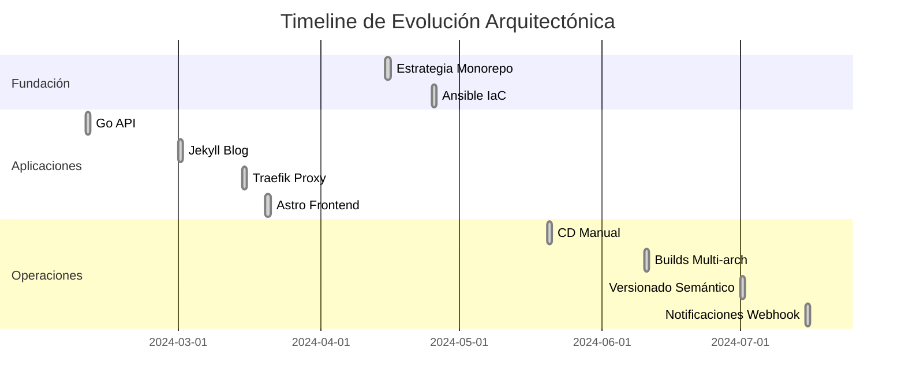

# Registros de Decisiones Arquitectónicas (ADRs)

## Visión General

Este documento contiene las decisiones arquitectónicas tomadas para el proyecto mlorente.dev. Cada ADR captura el contexto, decisión y consecuencias de las decisiones arquitectónicas significativas.

---

## ADR-001: Estrategia Monorepo vs Multi-repo

**Estado:** ✅ Aceptado  
**Fecha:** 2024-04-15  
**Decisores:** @mlorentedev  

### Contexto

Necesitábamos elegir entre mantener repositorios separados para cada aplicación (blog, web, api) vs mantener todo en un único monorepo. La decisión impacta la complejidad CI/CD, gestión de dependencias y coordinación de despliegues.

### Decisión

**Elegido: Monorepo con builds selectivos**

Todas las aplicaciones (blog, web, api) y código de infraestructura viven en un único repositorio con detección de cambios basada en rutas para triggers de CI/CD.

### Alternativas Consideradas

1. **Multi-repo:** Repos separados para cada app
2. **Monorepo con builds completos:** Construir todas las apps en cada cambio
3. **Monorepo con builds selectivos:** Solo construir apps que han cambiado ✅

### Consecuencias

**Positivas:**

- Pipeline CI/CD unificado con construcción selectiva
- Tooling y configuración compartidos (Makefile, Docker, scripts)
- Versionado coordinado entre todos los componentes
- Única fuente de verdad para infraestructura
- Refactoring y consistencia cross-app más fácil

**Negativas:**

- Tamaño de clone mayor (~50MB con assets)
- Acoplamiento potencial entre apps no relacionadas
- Lógica de detección de cambios más compleja en CI

**Implementación:**

- Usa `dorny/paths-filter@v3` para detección de cambios
- Apps se construyen en paralelo cuando cambian
- Código de infra compartido en directorio `/infra`

---

## ADR-002: CD Manual vs Despliegue Automatizado

**Estado:** ✅ Aceptado  
**Fecha:** 2024-05-20  
**Decisores:** @mlorentedev  

### Contexto

Podríamos automatizar el despliegue directamente desde CI/CD pero elegimos mantener el despliegue manual. Esto afecta la velocidad de despliegue vs control/seguridad.

### Decisión

**Elegido: CD Manual con CI Automatizado (Build/Push)**

- CI automáticamente construye y pushea imágenes Docker
- El despliegue requiere ejecución manual de `make deploy`
- Los bundles de release se preparan automáticamente pero no se despliegan

### Justificación

1. **Seguridad de Producción:** Revisión manual antes del despliegue
2. **Timing Flexible:** Desplegar cuando sea conveniente, no en cada merge
3. **Control de Rollback:** Selección explícita de versión
4. **Eficiencia de Costes:** No necesita infraestructura de despliegue siempre activa
5. **Aprendizaje:** Mejor entendimiento del proceso de despliegue

### Consecuencias

**Positivas:**

- Control completo sobre despliegues de producción
- Sin riesgo de despliegues automáticos rotos
- Capacidad de agrupar múltiples cambios
- Costes de infraestructura menores
- Rastro de auditoría claro de despliegues manuales

**Negativas:**

- Tiempo a producción más lento
- Requiere intervención manual
- Potencial para error humano en comandos de despliegue

**Implementación:**

```bash
# CI construye imágenes automáticamente
# Proceso de despliegue manual:
make deploy ENV=production RELEASE_VERSION=v1.2.0
```

---

## ADR-003: Builds Docker Multi-arquitectura

**Estado:** ✅ Aceptado  
**Fecha:** 2024-06-10  
**Decisores:** @mlorentedev  

### Contexto

Las imágenes Docker necesitaban ejecutarse tanto en arquitecturas AMD64 (desarrollo/mayoría VPS) como ARM64 (potencial Apple Silicon, servidores ARM).

### Decisión

**Elegido: Builds Docker multi-arquitectura**

Todas las imágenes Docker se construyen para plataformas `linux/amd64` y `linux/arm64` usando Docker Buildx.

### Alternativas Consideradas

1. **Solo AMD64:** Más simple pero limita opciones de despliegue
2. **Multi-arch:** Construir para AMD64 y ARM64 ✅
3. **Solo ARM64:** Enfocado al futuro pero rompe despliegues actuales

### Consecuencias

**Positivas:**

- Compatible con servidores basados en ARM y máquinas de desarrollo
- Preparado para el futuro para adopción ARM en proveedores cloud
- Mejor rendimiento en dispositivos ARM

**Negativas:**

- Tiempos de build más largos (2x procesos de construcción)
- Configuración CI/CD más compleja
- Almacenamiento adicional usado en registry

**Implementación:**

```yaml
# En ci-03-publish.yml
platforms: linux/amd64,linux/arm64
```

**Impacto en Tiempo de Build:** ~40% builds más largos, pero vale la pena la compatibilidad.

---

## ADR-004: Versionado Semántico con Sufijos Específicos por Rama

**Estado:** ✅ Aceptado  
**Fecha:** 2024-07-01  
**Decisores:** @mlorentedev  

### Contexto

Necesitábamos una estrategia de versionado que soporte múltiples entornos (dev, staging, prod) mientras mantiene principios de versionado semántico y habilita rollbacks.

### Decisión

**Elegido: SEMVER con sufijos específicos por rama**

- **Ramas Feature:** `1.2.3-alpha.X`
- **Ramas Hotfix:** `1.2.3-beta.X`  
- **Rama Develop:** `1.2.0-rc.X`
- **Rama Master:** `1.2.0` + `latest`

### Justificación

1. **Mapeo Claro de Entornos:** Cada tipo de rama tiene versionado distinto
2. **Cumplimiento Semver:** Las versiones base siguen versionado semántico
3. **Capacidad de Rollback:** Versiones específicas permiten rollbacks precisos
4. **Conventional Commits:** Cálculo automático de versión desde mensajes de commit

### Consecuencias

**Positivas:**

- Jerarquía de versiones clara y ruta de promoción
- Soporta despliegue gradual (alpha → rc → stable)
- Cálculo automático de versión reduce error humano
- Compatible con herramientas estándar de despliegue

**Negativas:**

- Lógica compleja de cálculo de versión (390 líneas en ci-02-pipeline.yml)
- Requiere disciplina en formato de mensajes de commit
- Los números de versión pueden ser confusos para newcomers

**Implementación:**

- 390+ líneas de lógica bash para cálculo de versión
- Valida consistencia de versión entre apps
- Soporta rollback a cualquier versión anterior

---

## ADR-005: Traefik como Reverse Proxy

**Estado:** ✅ Aceptado  
**Fecha:** 2024-03-15  
**Decisores:** @mlorentedev  

### Contexto

Necesitábamos una solución de reverse proxy para enrutar tráfico a múltiples aplicaciones, manejar certificados SSL y proporcionar balanceado de carga.

### Decisión

**Elegido: Traefik con descubrimiento automático de servicios**

Traefik maneja todo el enrutado, terminación SSL y descubrimiento de servicios a través de labels Docker y configuración basada en archivos.

### Alternativas Consideradas

1. **Nginx:** Tradicional, bien conocido, pero configuración manual
2. **Traefik:** Descubrimiento automático de servicios, integración Docker ✅
3. **Caddy:** Config simple pero menos soporte de ecosistema
4. **HAProxy:** Enfocado en rendimiento pero setup complejo

### Consecuencias

**Positivas:**

- Descubrimiento automático de servicios vía labels Docker
- Integración Let's Encrypt incorporada
- Actualizaciones de configuración dinámicas sin reinicios
- Excelente integración con ecosistema Docker
- Dashboard incorporado para monitorización

**Negativas:**

- Curva de aprendizaje para conceptos específicos de Traefik
- Más complejo que setup simple de Nginx
- Potencial sobre-ingeniería para proyectos pequeños

**Implementación:**

```yaml
# Ejemplo configuración de servicio
labels:
  - "traefik.enable=true"
  - "traefik.http.routers.web.rule=Host(`mlorente.dev`)"
  - "traefik.http.routers.web.tls.certresolver=letsencrypt"
```

---

## ADR-006: Notificaciones de Despliegue Basadas en Webhooks

**Estado:** ✅ Aceptado  
**Fecha:** 2024-07-15  
**Decisores:** @mlorentedev  

### Contexto

Necesidad de visibilidad en el estado del pipeline CI/CD y eventos de despliegue para propósitos de monitorización y alertas.

### Decisión

**Elegido: Notificaciones webhook n8n**

El pipeline CI/CD envía payloads webhook estructurados a workflows n8n para procesar notificaciones, logging y automatización potencial.

### Alternativas Consideradas

1. **Notificaciones email:** Simple pero funcionalidad limitada
2. **Slack/Discord:** Buena UX pero vendor lock-in
3. **Webhooks n8n:** Flexible, auto-hospedado, extensible ✅
4. **Sin notificaciones:** Más simple pero menos visibilidad

### Consecuencias

**Positivas:**

- Control completo sobre lógica de notificaciones
- Extensible para disparar otras automatizaciones
- Datos estructurados para analytics futuros
- Auto-hospedado, sin dependencias externas

**Negativas:**

- Complejidad adicional en pipeline CI/CD
- Requiere que infraestructura n8n esté ejecutándose
- Solución custom necesita mantenimiento

**Implementación:**

```bash
# Estructura payload webhook
{
  "type": "docker_build_completed",
  "app": "blog",
  "docker_version": "1.2.0-rc.5",
  "status": "success",
  "timestamp": "2024-07-15T10:30:00Z"
}
```

---

## ADR-007: Ansible para Gestión de Infraestructura

**Estado:** ✅ Aceptado  
**Fecha:** 2024-04-25  
**Decisores:** @mlorentedev  

### Contexto

Necesitábamos solución infrastructure-as-code para configuración de servidor, despliegue de aplicaciones y gestión de entornos a través de diferentes etapas (staging, producción).

### Decisión

**Elegido: Ansible con entornos basados en inventarios**

Los playbooks Ansible manejan setup de servidor, despliegue de aplicaciones y gestión de configuración con inventarios específicos por entorno.

### Alternativas Consideradas

1. **Terraform + Ansible:** IaC completo pero excesivo para despliegues de servidor único
2. **Solo Docker Compose:** Simple pero no maneja configuración de servidor
3. **Scripts Bash:** Personalizable pero no idempotente o escalable
4. **Ansible:** Declarativo, idempotente, bueno para gestión de servidores ✅

### Consecuencias

**Positivas:**

- Despliegues idempotentes (seguro re-ejecutar)
- Configuraciones específicas por entorno
- Excelente documentación y comunidad
- Se integra bien con workflow Docker existente

**Negativas:**

- Curva de aprendizaje para conceptos Ansible
- Complejidad YAML para escenarios avanzados
- Requiere Python en servidores objetivo

**Implementación:**

```yaml
# Despliegue específico por entorno
make deploy ENV=production  # Usa inventario production
make deploy ENV=staging     # Usa inventario staging
```

---

## ADR-008: Go para Backend API

**Estado:** ✅ Aceptado  
**Fecha:** 2024-02-10  
**Decisores:** @mlorentedev  

### Contexto

El backend API necesitado para gestión de suscripciones, lead magnets y lógica de negocio futura. La elección de lenguaje afecta rendimiento, mantenibilidad y despliegue.

### Decisión

**Elegido: Go 1.21 con dependencias mínimas**

Servidor HTTP Go simple con enfoque en librería estándar, dependencias externas mínimas y despliegue Docker-first.

### Alternativas Consideradas

1. **Node.js:** Desarrollo rápido pero overhead de runtime
2. **Python Flask/FastAPI:** Prototipado rápido pero rendimiento más lento
3. **Go:** Rendimiento, simplicidad, gran soporte para contenedores ✅
4. **Rust:** Mejor rendimiento pero tiempo de desarrollo más largo

### Consecuencias

**Positivas:**

- Excelente rendimiento y bajo uso de memoria
- Despliegue de binario único (perfecto para contenedores)
- Librería estándar fuerte reduce dependencias
- Ciclos rápidos de compilación y testing

**Negativas:**

- Más verboso que lenguajes interpretados
- Ecosistema más pequeño comparado con Node.js/Python
- Curva de aprendizaje para miembros del equipo no familiarizados con Go

**Implementación:**

- Router HTTP simple con librería estándar
- Dependencias mínimas (solo logging y config env)
- Hot reload con `air` en desarrollo
- Builds Docker multi-etapa para imágenes finales pequeñas

---

## ADR-009: Jekyll para Plataforma de Blog

**Estado:** ✅ Aceptado  
**Fecha:** 2024-03-01  
**Decisores:** @mlorentedev  

### Contexto

Plataforma de blog necesaria para contenido técnico con buen SEO, rendimiento e integración con el ecosistema existente.

### Decisión

**Elegido: Jekyll con tema Beautiful Jekyll**

Generación de sitio estático con Jekyll, desplegado como aplicación contenerizada junto con otros servicios.

### Alternativas Consideradas

1. **WordPress:** Full-featured pero pesado en recursos y problemas de seguridad
2. **Ghost:** Moderno pero requiere base de datos y más recursos
3. **Blog Astro:** Consistente con web app pero mezclando concerns
4. **Jekyll:** Estático, performante, ecosistema establecido ✅

### Consecuencias

**Positivas:**

- Excelente rendimiento (archivos estáticos)
- Fuertes capacidades SEO
- Gran ecosistema de temas y plugins
- Perfecto para blogging técnico con syntax highlighting

**Negativas:**

- Stack de dependencias Ruby
- Tiempos de build pueden ser más lentos con muchos posts
- Menos funcionalidad dinámica comparado con soluciones con base de datos

**Implementación:**

- Tema Beautiful Jekyll para apariencia profesional
- Contenedor Docker para builds consistentes
- Integración con CI/CD para rebuilds automáticos

---

## ADR-010: Astro para Aplicación Frontend

**Estado:** ✅ Aceptado  
**Fecha:** 2024-03-20  
**Decisores:** @mlorentedev  

### Contexto

El sitio web principal necesitaba framework frontend moderno con excelente rendimiento, SEO y experiencia de desarrollador para sitio enfocado en contenido.

### Decisión

**Elegido: Astro con hidratación selectiva**

Framework Astro para el sitio web principal con arquitectura de islands para hidratación selectiva de JavaScript donde sea necesario.

### Alternativas Consideradas

1. **Next.js:** Full-featured pero potencialmente sobre-ingeniería
2. **Nuxt.js:** Ecosistema Vue pero equipo más familiarizado con React
3. **SvelteKit:** Moderno pero ecosistema más pequeño
4. **Astro:** Enfocado en rendimiento, content-first ✅

### Consecuencias

**Positivas:**

- Excelente rendimiento con JavaScript mínimo
- Grandes puntuaciones SEO y Core Web Vitals
- Los component islands permiten interactividad selectiva
- Experiencia de desarrollo moderna con TypeScript

**Negativas:**

- Framework más nuevo con ecosistema en evolución
- Curva de aprendizaje para arquitectura islands
- Algunas limitaciones para aplicaciones altamente interactivas

**Implementación:**

- TypeScript para type safety
- Tailwind CSS para styling
- Arquitectura basada en componentes con archivos .astro
- JavaScript mínimo del lado cliente para rendimiento óptimo

---

## Resumen del Stack Tecnológico

Basado en las decisiones arquitectónicas anteriores, nuestro stack actual es:

### Frontend

- **Web App:** Astro + TypeScript + Tailwind CSS
- **Blog:** Jekyll + tema Beautiful Jekyll
- **Reverse Proxy:** Traefik con SSL automático

### Backend

- **API:** Go 1.21 con enfoque en librería estándar
- **Base de Datos:** Almacenamiento basado en archivos (futuro: PostgreSQL si es necesario)

### Infraestructura

- **Contenerización:** Docker + Docker Compose
- **Orquestación:** Playbooks Ansible
- **CI/CD:** GitHub Actions (1,388 líneas a través de 6 workflows)
- **Registry:** Docker Hub con builds multi-arch

### Operaciones

- **Monitorización:** Vector + Prometheus + Grafana
- **Automatización:** n8n para workflows y notificaciones
- **Gestión:** Portainer para supervisión de contenedores

### Desarrollo

- **Repositorio:** Monorepo con builds selectivos
- **Versionado:** Versionado semántico con sufijos por rama
- **Despliegue:** CD manual con CI automatizado
- **Interfaz:** Makefile como interfaz de comando unificada

---

## Timeline de Decisiones



---

*Este documento está vivo y se actualizará a medida que se tomen nuevas decisiones arquitectónicas. Cada ADR debe revisarse periódicamente para asegurar que aún sirve a las necesidades del proyecto.*