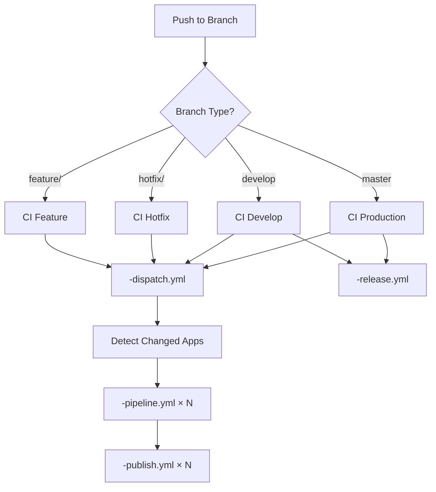

 . CI/CD Pipeline

This document explains how the CI/CD pipeline works for the kubelab.live project. The pipeline consists of  GitHub Actions workflows that handle building, testing, and deploying applications.

 How it works

When you push code changes:

. Detection: The system detects which applications have changed
. Building: Only changed applications are built and tested
. Publishing: Docker images are pushed to the registry
. Versioning: Semantic versions are calculated automatically
. Release: Release artifacts are created for deployments

 Workflow Overview



 Workflow Files

 . Dispatcher (ci--dispatch.yml)

Purpose: Entry point that detects changed applications and triggers parallel builds  
Lines: ~ lines  
Triggers: Push to any branch, manual workflow dispatch

Key features:
- Detects which apps have changed based on file paths
- Triggers pipeline workflows for each changed app
- Handles both development and production branches
- Supports manual triggering with app selection

 . Pipeline (ci--pipeline.yml)

Purpose: Builds, tests, and validates individual applications
Lines: ~ lines per app
Triggers: Called by dispatcher for each changed app

Key features:
- Multi-architecture builds (AMD, ARM)
- Application-specific testing and validation
- Docker image building with caching
- Security scanning: gitleaks (secrets), bandit (Python SAST), gosec (Go SAST), pip-audit, govulncheck, npm audit
- Linting and code quality checks
- Artifact generation for deployment

 . Publish (ci--publish.yml)

Purpose: Publishes Docker images to registry
Lines: ~ lines
Triggers: Successful completion of pipeline workflow

Key features:
- Multi-architecture image publishing (AMD, ARM)
- Tag management (latest, version-specific, dev tags)
- Registry authentication and secure credential handling
- Image metadata and OCI-compliant labels
- Trivy vulnerability scanning of built images (CRITICAL, HIGH, MEDIUM)
- Security scan results uploaded to GitHub Security tab

 . Release (ci--release.yml)

Purpose: Creates release bundles and manages versioning  
Lines: ~ lines  
Triggers: Push to develop or master branches

Key features:
- Semantic version calculation
- Release bundle creation
- Changelog generation
- Git tag management

 . Wiki (ci--wiki.yml)

Purpose: Builds and deploys documentation  
Lines: ~ lines  
Triggers: Changes to documentation files

Key features:
- MkDocs site generation
- Documentation validation
- Static site deployment

 . Health Check (ci--health.yml)

Purpose: Monitors deployment health and sends notifications  
Lines: ~ lines  
Triggers: Scheduled runs, deployment completion

Key features:
- Service health validation
- Notification sending via nn webhooks
- Deployment status reporting

 Version Calculation

The pipeline automatically calculates semantic versions based on conventional commits:

- Major (X..): Breaking changes (`BREAKING CHANGE:` in commit)
- Minor (x.Y.): New features (`feat:` commits)
- Patch (x.y.Z): Bug fixes (`fix:` commits)

Example commit types:
```bash
feat: add new API endpoint           Minor version bump
fix: resolve authentication bug      Patch version bump
feat!: change API response format    Major version bump
docs: update README                  No version bump
```

 Selective Building

To optimize build times, the pipeline only builds applications that have actually changed:

```yaml
 Apps are detected based on changed file paths
api: 
  - 'apps/api/'
  - 'go.mod'
  - 'go.sum'

web:
  - 'apps/web/'
  - 'package.json'
  - 'package-lock.json'

blog:
  - 'apps/blog/'
  - 'Gemfile'
  - 'Gemfile.lock'
```

 Build Optimization

Caching strategies:
- Docker layer caching for faster image builds
- Dependency caching for npm, bundle, go modules
- Build artifact caching between workflow runs

Parallel execution:
- Multiple applications build simultaneously
- Independent testing and validation per app
- Concurrent publishing of successful builds

 Environment Management

Branch strategies:
- `feature/` - Build and test only, no publishing
- `develop` - Build, test, publish with dev tags
- `master` - Build, test, publish with production tags

Environment variables:
- Secrets managed through GitHub Secrets
- Environment-specific configuration via `infra/config/values/*.yaml`
- Runtime configuration through Docker labels

 Debugging CI/CD Issues

Common issues and solutions:

Build failures:
```bash
 View specific workflow run
gh run view <run-id> --log

 Re-run failed jobs
gh run rerun <run-id>

 Check workflow status
gh run list --branch feature/my-feature
```

Version conflicts:
```bash
 Check current tags
git tag -l | tail -

 Force version calculation
git tag v..
git push origin v..
```

App not building:
- Check if files match the path filters
- Verify Dockerfile exists in app directory
- Check for syntax errors in workflow files

 Adding New Applications

To add a new application to the CI/CD pipeline:

. Add path filters in `ci--dispatch.yml`
. Create Dockerfile in the new app directory
. Update pipeline matrix to include the new app
. Add environment variables if needed

Example:
```yaml
 In ci--dispatch.yml
newapp:
  - 'apps/newapp/'
  - 'apps/newapp/Dockerfile'
```

 Performance Metrics

Current pipeline performance:
- Average build time: - minutes per app
- Parallel builds: Up to  applications simultaneously
- Cache hit rate: ~% for dependencies
- Success rate: ~% (excluding infrastructure issues)

 Security Measures

The pipeline includes comprehensive security scanning at multiple stages:

 Pre-commit Hooks (Local)

Developers run automated security checks before commits:
- Secret detection: gitleaks scans for exposed credentials
- Path validation: Prevents commits to old/deprecated paths
- Configuration files: Blocks unencrypted secrets from `infra/config/secrets/`
- Python linting: Ruff, black, mypy with strict typing
- YAML/JSON validation: Prevents configuration errors

Install hooks: `poetry run pre-commit install`

 CI/CD Security Scanning

Secret Scanning (all builds):
- gitleaks: Detects hardcoded secrets, API keys, tokens
- Runs on every build regardless of app
- Blocks merge if secrets detected

Python Security (toolkit + wiki):
- bandit: SAST scanner for Python code vulnerabilities
- pip-audit: Checks dependencies for known CVEs
- Scans toolkit directory for security issues
- Reports findings as warnings (non-blocking)

Go Security (API only):
- gosec: SAST scanner for Go code vulnerabilities
- govulncheck: Scans Go dependencies for CVEs
- Checks `apps/api/src` for security issues
- Reports findings as warnings (non-blocking)

Node.js Security (Web only):
- npm audit: Scans npm dependencies for vulnerabilities
- Audit level: moderate and above
- Reports findings as warnings (non-blocking)

Docker Image Scanning (all apps):
- Trivy: Scans built images for vulnerabilities
- Checks OS packages and application dependencies
- Severity levels: CRITICAL, HIGH, MEDIUM
- Results uploaded to GitHub Security tab
- Runs after successful Docker build

 Security Best Practices

- All secrets stored in GitHub Secrets (never in code)
- No secrets in build logs or artifacts
- Limited permissions for workflow tokens
- Multi-factor authentication required for repository access
- Regular dependency updates via Dependabot
- Signed commits enforced for production branches

 Troubleshooting

Pipeline stuck:
- Check runner availability
- Verify GitHub Actions status
- Look for dependency conflicts

Images not publishing:
- Check Docker Hub credentials
- Verify repository permissions
- Review publish workflow logs

Version calculation wrong:
- Check commit message format
- Verify conventional commits compliance
- Review tag history
