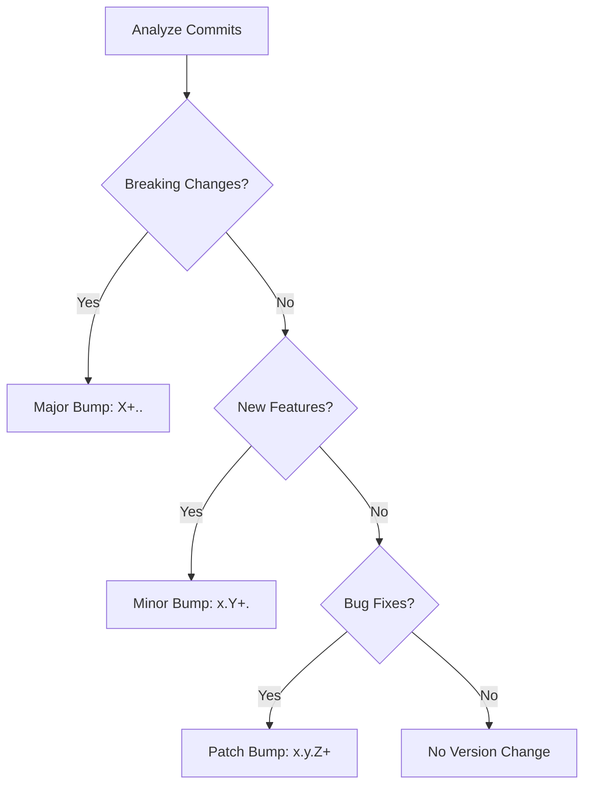

 . Versioning Strategy

This document explains how Docker images and releases are versioned across different branches in the cubelab.cloud project. The versioning follows semantic versioning principles while providing specific builds for development branches.

 Versioning by Branch

 Feature Branches (`feature/`)

Purpose: Development of new features in isolation

Image Pattern: `{registry}/{prefix}-{app}:{major.minor.patch}-alpha.{commits}`

```bash
 Example: feature/new-authentication
dockerhub-user/mlorente-blog:..-alpha.
dockerhub-user/mlorente-api:..-alpha.  
dockerhub-user/mlorente-web:..-alpha.

 Where:
 - .. = Next version calculated from last stable tag
 - alpha.X = Incremental number of commits in feature branch
```

Characteristics:
- No global releases created
- No deployment artifacts generated
- Docker images for testing only
- Automatic cleanup after  days

 Hotfix Branches (`hotfix/`)

Purpose: Critical fixes that need immediate deployment

Image Pattern: `{registry}/{prefix}-{app}:{major.minor.patch}-beta.{commits}`

```bash
 Example: hotfix/security-fix
dockerhub-user/mlorente-blog:..-beta.
dockerhub-user/mlorente-api:..-beta.

 Where:
 - .. = Patch version increment from last stable
 - beta.X = Number of commits in hotfix branch
 - Only patch bumps allowed (no features or breaking changes)
```

Characteristics:
- Creates pre-release for testing
- Only patch-level changes permitted
- Fast-track deployment process
- Requires immediate merge after validation

 Develop Branch (`develop`)

Purpose: Integration branch for upcoming releases

Image Pattern: `{registry}/{prefix}-{app}:{major.minor.patch}-rc.{commits}`

```bash
 Example: develop branch
dockerhub-user/mlorente-blog:..-rc.
dockerhub-user/mlorente-api:..-rc.
dockerhub-user/mlorente-web:..-rc.

 Where:
 - .. = Next version based on accumulated changes
 - rc.X = Release candidate with commit count
```

Characteristics:
- Creates pre-release bundles
- Full integration testing
- Staging environment deployment
- Preparation for production release

 Master Branch (`master`)

Purpose: Production-ready code

Image Pattern: `{registry}/{prefix}-{app}:{major.minor.patch}`

```bash
 Example: master branch
dockerhub-user/mlorente-blog:..
dockerhub-user/mlorente-api:..
dockerhub-user/mlorente-web:..

 Where:
 - .. = Stable semantic version
 - Also tagged as 'latest'
```

Characteristics:
- Creates final release
- Production deployment artifacts
- Git tags created automatically
- Release notes generated

 Semantic Versioning Rules

 Major Version (X..)
Breaking changes that require user action:
```bash
feat!: change API response format
BREAKING CHANGE: remove deprecated endpoints
```

 Minor Version (x.Y.)
New features that are backward compatible:
```bash
feat: add user profile API
feat: implement search functionality
```

 Patch Version (x.y.Z)
Bug fixes and minor improvements:
```bash
fix: resolve authentication timeout
fix: correct date formatting issue
```

 Special Cases

Documentation and configuration changes:
```bash
docs: update API documentation     No version bump
chore: update dependencies        No version bump
style: fix code formatting        No version bump
```

 Version Calculation Process

 . Commit Analysis
The system scans commits since the last version tag:

```bash
 Get commits since last tag
git log v....HEAD --oneline

 Analyze conventional commit messages
feat: new user dashboard      Minor bump
fix: login button styling     Patch bump
feat!: change data format     Major bump
```

 . Version Increment Logic



 . Pre-release Suffixes

Based on the branch, appropriate suffixes are added:

```bash
feature/auth-system  → ..-alpha.
hotfix/urgent-fix    → ..-beta.
develop              → ..-rc.
master               → ..
```

 Release Management

 Pre-release Testing

. Alpha versions (feature branches)
   - Basic functionality testing
   - Unit and integration tests
   - Development environment only

. Beta versions (hotfix branches)
   - Critical fix validation
   - Staging environment testing
   - Limited production testing

. Release candidates (develop branch)
   - Full system testing
   - User acceptance testing
   - Staging environment validation

 Production Releases

Production releases from master branch include:

- Docker images with semantic version tags
- Release bundles with deployment configs
- Release notes with changelog
- Git tags for version tracking

 Version Conflicts

When multiple apps have different changes, the highest version increment wins:

```bash
 If in the same release:
api: feat: new endpoint       Minor: ..
web: fix: button color        Patch: ..
blog: feat!: new theme        Major: ..

 Result: All apps get ..
dockerhub-user/mlorente-api:..
dockerhub-user/mlorente-web:..
dockerhub-user/mlorente-blog:..
```

 Manual Version Override

Sometimes you need to manually set a version:

```bash
 Force a specific version
git tag v..
git push origin v..

 Trigger release workflow
gh workflow run ci--release.yml
```

 Version History

Track version history through:

```bash
 List all version tags
git tag -l | sort -V

 Show version details
git show v..

 Compare versions
git diff v....v..

 See what changed in a version
git log v....v.. --oneline
```

 Best Practices

 Commit Messages
Always use conventional commit format:
```bash
git commit -m "feat: add user authentication"
git commit -m "fix: resolve memory leak in API"
git commit -m "feat!: change database schema"
```

 Branch Management
- Keep feature branches short-lived
- Regular rebasing against develop
- Clean commit history before merging
- Delete feature branches after merge

 Version Planning
- Plan major versions for breaking changes
- Group related features in minor versions
- Release patches quickly for critical fixes
- Communicate breaking changes clearly

 Troubleshooting

Version not calculating:
- Check commit message format
- Verify conventional commits compliance
- Review git tag history

Wrong version generated:
- Check for breaking change indicators
- Verify commit scope and type
- Review version calculation logs

Version conflicts:
- Ensure all apps use same base version
- Check for conflicting version tags
- Verify branch synchronization
