# KubeLab — Platform Architecture

> Last updated: 2026-03-22
>
> ⚠ **Stale-as-of 2026-05-15:** mermaid nodes `OpenClaw` + `PicoClaw` pending rename to `Hermes` per orchestrator pivot. Routing flow `OpenClaw → DeepSeek` to be updated (OpenRouter eliminated, direct provider access). See 2026-05-15-orchestrator-pivot.

## Full Architecture Diagram

```mermaid
flowchart TB
    classDef edge fill:#ffd8a8,stroke:#f59e0b,color:#1e1e1e
    classDef security fill:#ffc9c9,stroke:#ef4444,color:#1e1e1e
    classDef app fill:#a5d8ff,stroke:#4a9eed,color:#1e1e1e
    classDef obs fill:#eebefa,stroke:#8b5cf6,color:#1e1e1e
    classDef core fill:#b2f2bb,stroke:#22c55e,color:#1e1e1e
    classDef data fill:#c3fae8,stroke:#0d9488,color:#1e1e1e
    classDef ai fill:#fff3bf,stroke:#f59e0b,color:#1e1e1e
    classDef ext fill:#e5e5e5,stroke:#757575,color:#1e1e1e

    User([User / Browser]):::ext
    Slack([Slack]):::ext
    GitHub([GitHub]):::ext
    DeepSeek([DeepSeek / OpenRouter]):::ext

    subgraph Acemagic["Acemagic 12GB — Staging"]
        direction TB
        subgraph EdgeLayer["Edge"]
            Traefik[Traefik]:::edge
            Nginx[Nginx Errors]:::edge
            CrowdSec[CrowdSec WAF]:::edge
        end
        subgraph SecurityLayer["Security"]
            Authelia[Authelia SSO]:::security
        end
        subgraph AppsLayer["Custom Apps"]
            Web[Web - Astro]:::app
            API[API - Go]:::app
            Blog[Blog - Jekyll]:::app
        end
        subgraph ObsLayer["Observability"]
            Grafana[Grafana]:::obs
            Loki[Loki + Vector]:::obs
            Prometheus[Prometheus]:::obs
            NodeExp[Node Exporter]:::obs
            cAdvisor[cAdvisor]:::obs
        end
        subgraph CoreLayer["Core Services"]
            Portainer[Portainer]:::core
            Vikunja[Vikunja Tasks]:::core
            N8N[n8n Orchestrator]:::core
            KB[Knowledge Base]:::core
            Gitea[Gitea]:::core
        end
        subgraph DataLayer["Data"]
            PG[(PostgreSQL)]:::data
            MinIO[(MinIO S3)]:::data
        end
    end

    subgraph VPS["Hetzner VPS — Production"]
        direction TB
        VPSNote["Same stack as staging\n+ Uptime Kuma status page\n+ Let's Encrypt TLS\n+ Public access"]
    end

    subgraph RPi4["RPi 4 8GB — Gateway + Agents"]
        Bridge[Bridge/NAT]:::edge
        PiHole[Pi-hole]:::edge
        CoreDNS[CoreDNS]:::edge
        TSRouter[Tailscale Subnet Router]:::edge
        OpenClaw[OpenClaw]:::ai
        PicoClaw[PicoClaw]:::ai
    end

    subgraph RPi3["RPi 3 1GB — Monitor"]
        UptimeExt[Uptime Kuma External]:::obs
    end

    subgraph Jetson["Jetson Nano 4GB — Pollex"]
        LlamaCpp[llama.cpp + Qwen 2.5]:::ai
    end

    subgraph Beelink["Beelink 8GB — Lab"]
        Proxmox[Proxmox VE]
    end

    %% User traffic
    User -->|HTTPS| Traefik
    Traefik --> Authelia
    Traefik --> Web & API & Blog
    Traefik --> Grafana & Portainer
    Traefik --> Vikunja & KB

    %% Agent delegation flow
    Vikunja -->|webhook| N8N
    N8N -->|execute| RPi4
    N8N <-->|checkpoints| Slack
    OpenClaw -->|clone/push| GitHub
    OpenClaw & PicoClaw -->|LLM API| DeepSeek

    %% Monitoring pipeline
    NodeExp & cAdvisor & Traefik -->|metrics| Prometheus
    Prometheus & Loki -->|datasource| Grafana
    Grafana -->|alerts| Slack

    %% Edge infrastructure
    User -->|DNS| CoreDNS
    CoreDNS --> Acemagic
    Traefik --> Jetson
    Bridge -->|uplink| User

    %% External monitoring
    UptimeExt -.->|probe| Acemagic
    UptimeExt -.->|probe| VPS

    %% Data connections
    Vikunja & API & N8N & Gitea --> PG

    %% Knowledge Base sync
    GitHub -->|git sync| KB
```

## Color Legend

| Color | Layer | Services |
|-------|-------|----------|
| Orange | Edge | Traefik, Nginx, CrowdSec, CoreDNS, Pi-hole |
| Red | Security | Authelia |
| Blue | Custom Apps | Web (Astro), API (Go), Blog (Jekyll) |
| Purple | Observability | Grafana, Loki, Prometheus, Node Exporter, cAdvisor, Uptime Kuma |
| Green | Core Services | Portainer, Vikunja, n8n, Knowledge Base, Gitea |
| Teal | Data | PostgreSQL, MinIO |
| Yellow | AI / Agents | OpenClaw, PicoClaw, Pollex (llama.cpp) |

## Key Data Flows

1. **User traffic**: User -> Traefik -> Authelia (SSO) -> Service
2. **Agent delegation**: Vikunja (Acemagic) -> n8n (Acemagic) -> OpenClaw (RPi 4) <-> Slack (human checkpoints)
3. **Agent inference**: OpenClaw/PicoClaw (RPi 4) -> DeepSeek/OpenRouter APIs (external LLM)
4. **Metrics pipeline**: Node Exporter + cAdvisor + Traefik -> Prometheus -> Grafana -> Slack alerts
5. **Log pipeline**: All containers -> Vector -> Loki -> Grafana
6. **Knowledge Base sync**: GitHub (vault repo) -> git pull cron -> Quartz build -> nginx serve
7. **External monitoring**: RPi 3 Uptime Kuma probes homelab (via Tailscale) + VPS (independent internet)
8. **Network gateway**: Router -> RPi 4 (USB Ethernet uplink) -> Switch (built-in Ethernet downlink)
9. **Staging DNS**: User -> CoreDNS (RPi 4) -> Acemagic (Tailscale IP)
10. **Pollex routing**: Traefik (Acemagic) -> Jetson Nano (polish.staging.kubelab.live)

## Hardware → Production Mapping

| Homelab Node | Production Equivalent |
|---|---|
| Acemagic (staging stack) | Hetzner VPS (same compose, prod overlay) |
| RPi 4 (gateway + CoreDNS + Tailscale) | Cloudflare DNS (public) |
| RPi 4 (OpenClaw + PicoClaw) | Homelab only (personal AI agents) |
| RPi 3 (Uptime Kuma external) | Stays on RPi 3, probes VPS + homelab independently |
| Beelink (Proxmox) | Homelab only (lab/experiments) |
| Jetson Nano #1 (Pollex) | Homelab only (accessible via Tailscale + Cloudflare Tunnel) |
| Jetson Nano #2 (spare) | Backup hardware |

## Service Count

| Category | Count | Services |
|---|---|---|
| Edge | 5 | Traefik, Nginx, CrowdSec, CoreDNS, Pi-hole |
| Security | 1 | Authelia |
| Custom Apps | 3 | Web, API, Blog |
| Observability | 5 | Grafana, Loki, Prometheus, Node Exporter, cAdvisor |
| Monitoring | 1 | Uptime Kuma (external, on RPi 3) |
| Core Services | 5 | Portainer, Vikunja, n8n, Knowledge Base, Gitea |
| Data | 2 | PostgreSQL, MinIO |
| AI / Agents | 3 | OpenClaw, PicoClaw, Pollex (llama.cpp) |
| **Total** | **25 services across 5 active nodes + 1 spare** |

## Related

- _index — Project overview
- [service-catalog](service-catalog.md) — Detailed service inventory
-  — Hardware specs and topology
- ADRs — Architecture Decision Records
