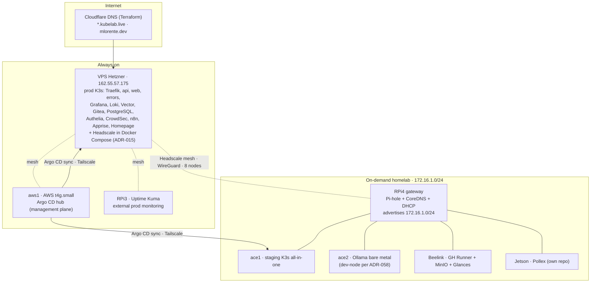
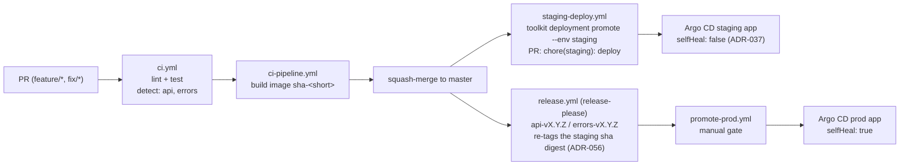
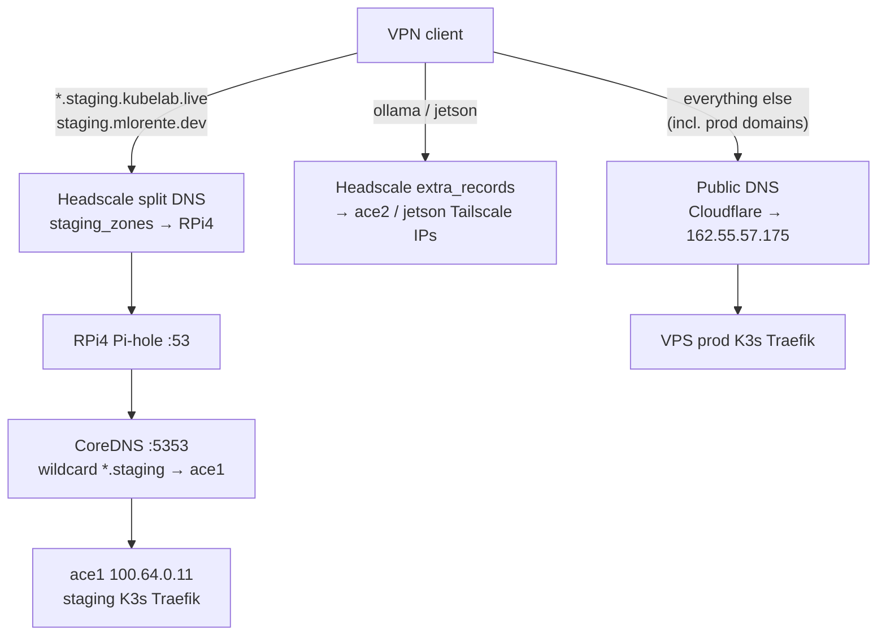
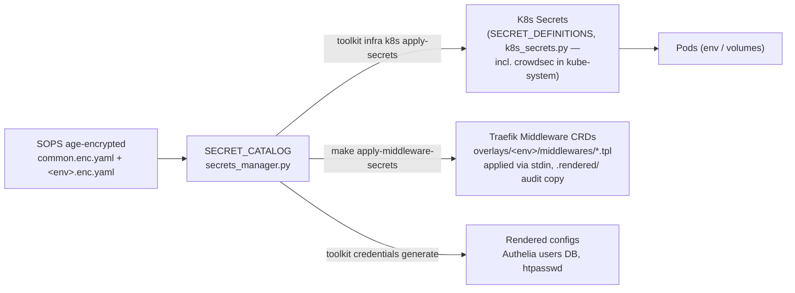
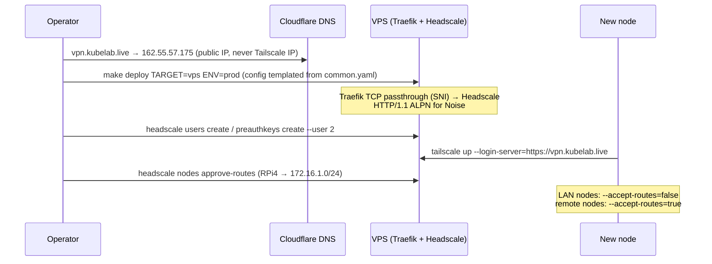

# Documentation Audit — 2026-07-07

Full audit of every reader-facing surface in this repo: `README.md`, `CONTRIBUTING.md`, `CHANGELOG.md`, `docs/**` (54 ADRs, 13 architecture docs, 48 runbooks, 17 troubleshooting docs, `lessons.md`), active `specs/`, sub-READMEs (`toolkit/`, `infra/*`, `apps/*`, `tests/e2e/`), the Makefile help surface, the toolkit CLI tree, `infra/config/values/*.yaml` comments, and the `apps/wiki/generated_docs` mirror. Every accuracy claim was checked against code (Makefile, `toolkit/`, `infra/config/values/`, `infra/k8s/`, `infra/ansible/`, `infra/terraform/`, `.github/workflows/`) and marked **CONFIRMED** (verified against code) or **PLAUSIBLE** (suspected; exact check listed). Method: eight parallel verification passes over disjoint batches, plus independent spot-checks of the highest-severity claims and a mechanical repo-wide dead-link scan.

**Headline:** the *recent* operational docs are healthy (`gitops-delivery-promotion.md`, `ollama-api-key-rotation.md`, `pvc-backup-restore.md`, `uptime-kuma-maintenance.md`, `new-service.md`, `aws1-*.md`, `k3s-setup.md`), but the **outer ring a newcomer reads first — README, the architecture diagram, the service catalog, versioning/CI/deployment runbooks, `toolkit/README.md` — describes the platform as it was two or three migrations ago** (Docker Compose prod, Proxmox VMs, Gitflow + `develop`, Portainer/Vikunja/Vaultwarden, Ollama on Beelink). A newcomer following the docs alone would deploy to the wrong runtime, SSH to the wrong nodes, and run a dozen commands that no longer exist. Counts: **92 findings — 10 critical, 38 high, 32 medium, 12 low** (86 CONFIRMED, 6 PLAUSIBLE; two PLAUSIBLE entries bundle the docs not fully re-verified this pass, with their exact pending checks in §3.5).

---

## 1. Summary table

Severity order. IDs are stable — a fixing agent should cite them.

| ID | Sev | Document | Issue | Status |
|----|-----|----------|-------|--------|
| D1 | critical | README.md:7-43,169-176 | ace2/Beelink roles swapped: says ace2=GH Runner+MinIO, Beelink=Ollama; reality is inverse (ADR-028 executed) | CONFIRMED |
| D2 | critical | README.md:45,134 | Prod described as Docker Compose "migrating to K3s in Phase 2"; cutover is done — prod is K3s on VPS | CONFIRMED |
| D3 | critical | docs/architecture/diagram.md:18-129 | The one platform diagram draws a Compose-era architecture: Portainer/Vikunja, no K3s, no ArgoCD hub, Beelink=Proxmox | CONFIRMED |
| D4 | critical | docs/architecture/service-catalog.md | Inventory wrong both directions: lists Portainer/Vikunja/Blog; omits Postgres, Redis, Vector, Apprise, Homepage, Argo CD | CONFIRMED |
| D5 | critical | docs/architecture/versioning-strategy.md | Describes paulhatch semantic-version + Gitflow `develop` + `0.0.0-dev.{sha}`; reality is release-please + trunk + `sha-<short>` | CONFIRMED |
| D6 | critical | docs/runbooks/cicd.md | Documents 4 of 12 workflows; CalVer/`develop` branch-protection world; real delivery path entirely absent | CONFIRMED |
| D7 | critical | docs/runbooks/deployment.md | Compose/Gitflow prod flow + nonexistent `make deploy-prod`; contradicts the canonical gitops-delivery-promotion.md | CONFIRMED |
| D8 | critical | toolkit/README.md | Documents a `commands/lib/utils` architecture and `apps`/`edge`/`tools env-*`/`wiki-*` commands that don't exist; ~70% of command surface wrong | CONFIRMED |
| D9 | critical | docs/runbooks/hardware-setup.md:15-124 | Bring-up guide for the retired Proxmox+3-VM world; Ollama on wrong node | CONFIRMED |
| D10 | critical | docs/runbooks/proxmox-setup.md | `status: active`, zero supersede banner; no Proxmox host exists in the fleet | CONFIRMED |
| D11 | high | sops-and-secrets.md:235-258; secrets-reference.md:112,118,253 | Authelia admin hash key documented as `users_admin_password_hash`; real key is `users_operator_password_hash` | CONFIRMED |
| D12 | high | secrets-reference.md:194,246 | n8n encryption key path `apps.services.core.n8n.*`; real is `apps.services.automation.n8n.*` | CONFIRMED |
| D13 | high | secrets-reference.md:216-231,248 | SMTP documented at `apps.platform.api.email.*`; moved to `infra.smtp.*` (ADR-036); api-secrets keys wrong | CONFIRMED |
| D14 | high | sops-and-secrets.md:330-336 | Claims separate `grafana-oidc` Secret; reality one `grafana-admin` with 3 keys; `api-secrets` shown as empty (has 4 keys) | CONFIRMED |
| D15 | high | headscale-setup.md:206-231,250,331-349,397-432 | Node roster lists 3 removed VMs, stale LAN IPs, ace1/ace2 as "Proxmox hosts :8006"; internal IP contradiction for RPi4 | CONFIRMED |
| D16 | high | headscale-setup.md:446-453,779; dns-homelab.md:111,337 | Instructs hand-editing `/opt/headscale/config/config.yaml` + scp from a repo path that doesn't exist; config is Ansible-templated and reverts | CONFIRMED |
| D17 | high | headscale-setup.md:453 | Split-DNS example points staging zones at `100.64.0.5` labeled "RPi4 Pi-hole" — that IP is ace2 (LLM box); RPi4 is `100.64.0.10` | CONFIRMED |
| D18 | high | dns-homelab.md:68,72,152,347-349,442 | References `edge/dns-gateway/{Corefile,compose.base.yml,pihole-forwarding.conf}`; that directory doesn't exist (coredns Ansible role now) | CONFIRMED |
| D19 | high | dns-homelab.md:32,51,157-186 | Corefile sample resolves staging → `100.64.0.4` (removed VM) and ollama → `100.64.0.3` (Beelink); real: ace1 `.11`, ace2 `.5` | CONFIRMED |
| D20 | high | toolkit.md:47-91,361-381 | `ENVIRONMENT=x tk …` env-var pattern, `tk terraform`, `services test`, `credentials generate <user> <pass>` — none exist in the CLI | CONFIRMED |
| D21 | high | CONTRIBUTING.md:26,181,208-210,250,332-334 | `toolkit tools env-init/env-validate/env-examples` in setup + PR checklist — commands don't exist | CONFIRMED |
| D22 | high | README.md:123; apps/README.md:19; CONTRIBUTING.md:31 | `make dev` doesn't exist (real: `make up-dev`) — first command a newcomer runs fails | CONFIRMED |
| D23 | high | CONTRIBUTING.md:305-311 | `make deploy-staging` / `make deploy-prod` don't exist (real: `make deploy-k8s ENV=…`, `make deploy TARGET=… ENV=…`) | CONFIRMED |
| D24 | high | README.md:78; apps/README.md:6-11; CLAUDE.md:178 | Links/lists `apps/web/` (extracted to own repo) and `blog` (killed); `apps/` = api + wiki | CONFIRMED |
| D25 | high | README.md:5-47,166-178 | AWS ArgoCD hub (aws1) and PostgreSQL absent from architecture diagram, topology, and service list | CONFIRMED |
| D26 | high | testing-guide.md:26-33 | Test tree `tests/test_cli/ test_core/ …` fabricated; real layout is flat `tests/test_*.py` + `e2e/` + `infra/` | CONFIRMED |
| D27 | high | architecture-overview.md:4-6 | Self-declared `status: stale / superseded` doc is the de-facto architecture hub every sibling links back to | CONFIRMED |
| D28 | high | architecture-overview.md:22-68 | Hardware allocation: Proxmox VMs on ace1/ace2, Ollama on Beelink; repo list names repos that don't exist | CONFIRMED |
| D29 | high | architecture/infra/networking-topology.md:33-37 | Mesh inventory lists removed VM IPs (.4/.7/.9 as k3s-server/agents), omits ace1 (.11) and aws1 (.7) | CONFIRMED |
| D30 | high | architecture/infra/dns-cloudflare.md | Raw BIND export "2025-08-30" for mlorente.dev with portainer/wiki records; Terraform (`infra/terraform/dns/`) is the live SoT | CONFIRMED |
| D31 | high | troubleshooting/ (quick-diagnostics:44,99; networking-dns:297; docker-containers:70; services-observability:133,196) | `infra/compose/` + `docker-compose.<env>.yml` paths; real: `infra/stacks/` + `compose.<env>.yml` | CONFIRMED |
| D32 | high | quick-diagnostics.md:52; networking-dns.md:253-267 | `docker network … mlorente-network`; real network is external `kubelab` (migrated from `proxy`) | CONFIRMED |
| D33 | high | networking-dns.md:185-186,277-278 | VPN triage via `wg show` / `ping 10.0.0.1` WireGuard gateway; stack is Headscale+Tailscale (`tailscale status/ping`) | CONFIRMED |
| D34 | high | services-apps.md:14-67; security-authentication.md:193-195 | Whole Portainer troubleshooting section; Portainer is not deployed anywhere | CONFIRMED |
| D35 | high | services-apps.md:188-246; security-authentication.md:52,205; services-observability.md:41 | "Store credentials in Vaultwarden" + Vaultwarden reset flows; not deployed — SOPS via `toolkit secrets` is the SoT | CONFIRMED |
| D36 | high | services-traefik-nginx.md:92-151 | Standalone Nginx edge-cache tier (`/var/cache/nginx`, `proxy_cache`) that doesn't exist; edge = cloudflared/errors/traefik | CONFIRMED |
| D37 | high | application-debugging.md:108-277; docker-containers.md:14-46 | Debug flows for `apps/web/site` and `apps/blog/jekyll-site` — directories don't exist in this repo | CONFIRMED |
| D38 | high | troubleshooting/quick-diagnostics.md | Advertised triage router links to **zero** of its 16 sibling docs — the set is orphaned from its entry point | CONFIRMED |
| D39 | high | docs/lessons.md | 3,119 lines, single `## Registry`, no TOC, chronological only, 3 entries break heading level — knowledge buried | CONFIRMED |
| D40 | high | docs/runbooks/cicd.md (absence) | Self-hosted runner routing (`fromJSON(vars.RUNNER_DOCKER)`, fork→`ubuntu-latest`) documented nowhere | CONFIRMED |
| D41 | high | toolkit/README.md (absence) | 6 real command groups (`secrets`, `sync`, `monitoring`, `registry`, `dashboard`, whole `infra` subtree) + `deployment promote/rollback` undocumented | CONFIRMED |
| D42 | high | adr-056:21,34,81,95,97; adr-046:120 | 4 dead links to absent `ADR-055-semver-everywhere-delivery.md` (lives in extracted web repo) + 2 links to wrong adr-027 filename | CONFIRMED |
| D43 | high | adr-021 vs CLAUDE.md:54,174 | CLAUDE.md cites "ADR-021 Rev2 = Kustomize only"; ADR contains no Rev2 and still prescribes hybrid Helm; `infra/helm/` holds only argocd values | CONFIRMED |
| D44 | high | Makefile:29-106 (help) | `make help` hides ~25 real targets and advertises `dev-app`/`build-app` which have **no recipes** | CONFIRMED |
| D45 | high | architecture/dash-001-homepage-cockpit.md | `status: active`, "prod pending" — feature is shipped (homepage.yaml + IngressRoutes both envs) | CONFIRMED |
| D46 | high | architecture/components/kubelab-agents.md, kubelab-console.md | L1 product specs whose SoT was extracted to the vault (2026-02-21); repo copies diverge (OpenClaw→Hermes) — two sources of truth | CONFIRMED |
| D47 | high | architecture/current-state-2026-03-22.md | Linked as "Current architecture"; 3.5 months stale; self-contradicts (Ollama on both Beelink and ace2); aws1 IP stale | CONFIRMED |
| D48 | high | docs/troubleshooting/ (absence) | No troubleshooting doc for ArgoCD sync, SOPS/age key loss, Apprise, CrowdSec bouncer, Kustomize pitfalls — today's main failure domains | CONFIRMED |
| D49 | medium | CHANGELOG.md | Frozen at 2026-03-26; misses prod-K3s cutover, ArgoCD hub, Postgres, homepage, ADR-034..058 era | CONFIRMED |
| D50 | medium | CONTRIBUTING.md:1-8,42,341-342 | Repo branded "mlorente.dev": wrong clone URL, wrong issues URL, stale structure tree | CONFIRMED |
| D51 | medium | CONTRIBUTING.md:215-235 | Inline PR-description template competes with `.github/pull_request_template.md` | CONFIRMED |
| D52 | medium | CONTRIBUTING.md:322-336 | Stale toolkit syntax (positional env, `ENVIRONMENT=` var) and `blog` service examples | CONFIRMED |
| D53 | medium | README.md:31-40,82-108,178 | Staging pod list stale; self-hosted services list incomplete; structure tree omits `infra/helm`, `infra/n8n`, `apps/wiki`; "8 nodes" vs 7 listed | CONFIRMED |
| D54 | medium | docs/adr/ (all) | Status vocabulary chaos: ~20 ADRs use undefined `active` vs `accepted`; 2 template generations coexist | CONFIRMED |
| D55 | medium | adr-028, adr-029 | Amended by ADR-058 (ace2 → dev-node, Ollama retired) but carry no amendment banner; still read as current truth | CONFIRMED |
| D56 | medium | adr-015; CLAUDE.md:104 | Pattern C migration completed (prod.yaml ports now 80/443) but ADR still "active/future"; CLAUDE.md gotcha claims 8080/8443 still in prod.yaml | CONFIRMED |
| D57 | medium | docs/adr/2026-03-26-homepage-endpoints-tab.md | An implementation plan, not an ADR; violates adr-NNN naming; inflates the decision record | CONFIRMED |
| D58 | medium | docs/adr/ (absence) | No index — 54 ADRs navigable only by filename; docs/README.md links the bare folder | CONFIRMED |
| D59 | medium | apps/wiki/generated_docs/ | Committed mirror frozen at adr-051 (missing 052-058); no CI regeneration wired (`generated_docs` referenced only in toolkit constants) | CONFIRMED |
| D60 | medium | specs/NOTIFY-001, specs/TOOL-009 | Both shipped (notify-router.json + `make notify-smoke`; `cluster_bootstrap` + `make sync-operators`) but not archived — delivered vs planned indistinguishable | CONFIRMED |
| D61 | medium | deployment.md:148-158 vs gitops-delivery-promotion.md:37-40 | Two contradictory rollback procedures (`git checkout <tag>` vs revert-the-promotion-PR) | CONFIRMED |
| D62 | medium | .github/workflows/ci-release.yml | Second live release mechanism (CalVer zip bundles) alongside release-please; bundle instructions cite incomplete `make deploy` | CONFIRMED |
| D63 | medium | secrets-reference.md:66-248; sops-and-secrets.md:330-341 | Catalog/K8s tables omit apprise, notify webhook, postgres, github_runner, ollama key, crowdsec (kube-system!), homepage, n8n, minio, gitea secrets; grafana/gitea key lists incomplete; "19 secrets" count frozen (catalog has ~44) | CONFIRMED |
| D64 | medium | Makefile:413-416 vs toolkit/features/secrets_manager.py | ArgoCD SOPS keys (`argocd.admin_password_hash`, `oidc_client_secret_argocd`, webhooks) absent from SECRET_CATALOG and from every doc — invisible to `secrets audit` | CONFIRMED |
| D65 | medium | sops-and-secrets.md:114-135,187-224,301-302,350-352 | Instructs raw `sops`/`openssl`-style flows, violating the repo's own "all secret ops via toolkit" rule | CONFIRMED |
| D66 | medium | dns-homelab.md:116 | Sample config shows `override_local_dns: true`; template hard-sets `false` (true would break all client DNS when VPN down) | CONFIRMED |
| D67 | medium | dns-homelab.md:226,230 | `make deploy-dns` doesn't exist (real: `make deploy TARGET=dns ENV=prod`) | CONFIRMED |
| D68 | medium | k3s-upgrade.md:202 (also operations.md, aws1-destroy-replace.md) | `make fetch-kubeconfig-hub` doesn't exist (real: `make fetch-kubeconfig ENV=hub`) | CONFIRMED |
| D69 | medium | services-observability.md:242-243 | Log-shipping triage via Promtail; pipeline is Vector | CONFIRMED |
| D70 | medium | toolkit.md:96,107-111 | `deploy-k8s` pipeline order fabricated (claims image+OIDC sync steps that don't run) | CONFIRMED |
| D71 | medium | headscale-setup.md:42-74,630-641 | "VPS uses Docker network `proxy`" + Traefik v3.0; real: network `kubelab`, Traefik v3.6 | CONFIRMED |
| D72 | medium | troubleshooting/ naming | `deployment.md` collides with runbooks/deployment.md; `development.md` overlaps runbooks/local-development; three naming schemes coexist | CONFIRMED |
| D73 | medium | runbooks/energy-consumption.md | Analysis/reference (no procedure) misfiled in runbooks/; node roles stale | CONFIRMED |
| D74 | medium | CLAUDE.md:100 | Claims feature branches produce `{next-version}-rc.{N}` Docker tags; CI produces `sha-<short>` (RC scheme dropped) | CONFIRMED |
| D75 | medium | current-state-2026-03-22.md:29; dash-001.md:92 | aws1 Tailscale IP hardcoded `100.64.0.4`; real `.7` and rotating — MagicDNS name is the stable id | CONFIRMED |
| D76 | medium | headscale-setup.md:155-165; common.yaml:556 | Verify step `curl …/health` → v0.28 has no /health endpoint (compose healthcheck uses `headscale version`); `health_path: /health` in common.yaml shares the assumption | PLAUSIBLE |
| D77 | medium | services-apps.md:69-186; security-authentication.md:200-201 | DB-reset commands assume per-service DB containers (`n8n-db`, `grafana-db`); K3s reality is shared `postgres` + SQLite PVCs | PLAUSIBLE |
| D78 | medium | adr023-phase1-minipc-provisioning.md | Completed one-shot migration log still `status: active` with `-K` bootstrap steps | PLAUSIBLE |
| D79 | medium | cicd.md:52-61,73-95,153-162 | RC-tag origin row and `github-secrets-manager.sh`/`N8N_*` notification secrets unverified against current workflows | PLAUSIBLE |
| D80 | medium | runbook-argocd-spoke-management.md; rollback-k3s-to-compose.md; pre-prod-verification.md; onboard-vpn-fleet-agent.md; runbook-disaster-recovery.md; ssh-keys.md; grafana-loki.md; monitoring.md (Grafana half); dns-terraform.md; rpi4-*/rpi3-* bodies; dependency-updates.md; operations.md; automation.md; local-development.md; developer-guide.md; debugging.md; docker.md; deploy-new-k3s-service.md; operate-from-new-workstation.md; non-admin-workstation-access.md; remaining troubleshooting bodies | Not fully verified this pass — exact checks listed in §3.3; same stale-pattern priors apply (esp. `-K`, t4g.micro, compose-era paths) | PLAUSIBLE |
| D81 | low | CLAUDE.md:162-163 | Ollama gotcha doubly stale: swap to ace2 already done, and EndpointSlice uses Tailscale IP (100.64.0.5), not either LAN IP | CONFIRMED |
| D82 | low | CLAUDE.md:194 | Lists `docs/architecture/plans/` which doesn't exist | CONFIRMED |
| D83 | low | ssl-certificates.md:216,240; application-debugging.md:87 | Command typos: `python3 -m json.tools`, `go tools pprof` | CONFIRMED |
| D84 | low | testing-guide.md:19-20,443-471,458-461 | Numerals stripped throughout (bare "%"), cites `pytest.ini` (config in pyproject), recommends `ptw` (not a dep) | CONFIRMED |
| D85 | low | apps/api/README.md | Rendered with stripped headings and redaction artifacts (`Go .+`, `PORT=`, `api-v..`); lists blog/wiki as sibling apps | CONFIRMED |
| D86 | low | architecture/infra/networking-topology.md:44-48 | RPi4 interfaces documented eth0/eth1; gateway role defaults use `wlan0` for the outer side | CONFIRMED |
| D87 | low | toolkit.md:244 | `poetry run black toolkit/` — black not a dependency; formatter is ruff | CONFIRMED |
| D88 | low | toolkit/README.md:46-57,363-368 | Points config SSOT at `infra/config/env/env.*`; live SSOT is `infra/config/values/*.yaml` | CONFIRMED |
| D89 | low | adr-018 | Rejection ADR carries status `active` — semantically empty | CONFIRMED |
| D90 | low | architecture/hardware/nodos-arm.png | Orphaned — zero inbound references anywhere in docs/ | CONFIRMED |
| D91 | low | secrets-and-variables.md | No scope banner delimiting it from the two SOPS docs; external dotfiles scripts unverifiable from repo | CONFIRMED |
| D92 | low | pihole-setup.md:52-66,211; ssl-certificates.md:137-144; error-headscale-noise-http2.md | Manual-scp deploy path parallel to Ansible-canonical; dev vs VPS ACME paths mixed; Noise/HTTP2 content likely triplicated with runbook + CLAUDE.md | PLAUSIBLE |

---

## 2. Doc map — current vs proposed

### 2.1 Current map (what exists, what it claims, who it serves)

| Surface | Claims to cover | Audience | Reality check |
|---|---|---|---|
| README.md | Platform front door: architecture, stack, quick start, environments | Newcomer, external | Structure good; core topology/prod claims wrong (D1, D2, D25) |
| CONTRIBUTING.md | Contributor workflow, setup, PR process | Contributor | Branded for a different repo; key commands don't exist (D21-D23, D50) |
| CHANGELOG.md | Change history | Maintainer | Frozen 3.5 months (D49) |
| docs/README.md | Docs index | Everyone | Accurate but minimal: 5 folder links, no routing by question |
| docs/adr/ (54 + 1 outlier) | Decision records | Maintainer, agents | Solid recent ADRs (042-058); older ones lack status hygiene; no index (D54-D58) |
| docs/architecture/ (12 + png) | System design, catalog, versioning | Newcomer, operator | The weakest directory: hub doc self-stale, diagram/catalog/versioning describe dead architecture (D3-D5, D27-D30, D45-D47) |
| docs/runbooks/ (48) | Operational procedures | Operator | Bimodal: post-March docs healthy; pre-March docs (hardware, proxmox, cicd, deployment, toolkit, headscale/dns parts) badly drifted |
| docs/troubleshooting/ (17) | Symptom → fix | Operator | Compose-era paths/networks/services throughout; no router; key domains missing (D31-D38, D48) |
| docs/lessons.md | Dated lessons log | Maintainer | Valuable but 3.1k lines unindexed (D39) |
| toolkit/README.md | CLI reference | Operator, contributor | Describes a previous CLI generation (D8, D41) |
| specs/ (9 active) | In-flight feature specs | Maintainer, agents | 2 shipped-but-unarchived (D60); 3 with unresolved AGENT-DRAFT tags (known) |
| apps/wiki/generated_docs/ | Generated docs mirror | Wiki readers | Stale committed copy, frozen at adr-051 (D59) |
| Sub-READMEs (infra/*, tests/e2e, apps/api) | Per-directory guides | Contributor | apps/api README render-corrupted (D85); others not fully verified this pass (D80) |

### 2.2 Proposed map

Executable reorganization. Actions tagged: **fix** (content update in place), **rewrite**, **retire** (delete or archive with banner), **move**, **new**, **generate** (derive from code SSOT).

```
README.md                        fix: D1 D2 D22 D24 D25 D53 — regenerate diagram (§5.1), prod=K3s,
                                 add aws1 hub + Postgres, apps table → api + wiki + link to web repo
CONTRIBUTING.md                  rewrite: kubelab branding, real commands (up-dev, deploy-k8s),
                                 drop inline PR template (canonical: .github/pull_request_template.md)
CHANGELOG.md                     fix: backfill 2026-04..07 or delegate explicitly to release-please tags
docs/
├── README.md                    rewrite as routed index: "I want to … → doc" table; link CHANGELOG,
                                 architecture subtree, audits/, adr index
├── adr/
│   ├── README.md                NEW (generate): number | title | status | superseded-by table
│   ├── adr-015/-028/-029        fix: completion/amendment banners (D55 D56)
│   ├── adr-056, adr-046         fix: dead ADR-055 links → plain-text cross-repo citation; adr-027 filename (D42)
│   ├── (all)                    fix: normalize status vocab active→accepted (D54, D89)
│   └── 2026-03-26-homepage-…    move → docs/architecture/plans/ (D57)
├── architecture/
│   ├── overview.md              NEW: one-page "what runs where today" (leads with topology diagram §5.1)
│   ├── architecture-overview.md retire → archive/ (self-declared stale hub, D27-D28)
│   ├── diagram.md               rewrite: replace graph with §5.1 (D3)
│   ├── service-catalog.md       generate from infra/k8s/base/kustomization.yaml + common.yaml apps (D4)
│   ├── versioning-strategy.md   rewrite around release-please + sha-<short> build-once + §5.2 (D5)
│   ├── plans/                   NEW dir: dash-001 (mark shipped, D45), homepage-endpoints-tab (D57)
│   ├── archive/                 NEW dir: current-state-2026-03-22 (rename "…-snapshot", D47),
│   │                            components/kubelab-{agents,console} → stubs pointing at vault SoT (D46);
│   │                            gateway/memory stay (correctly marked absorbed)
│   └── infra/
│       ├── networking-topology.md  fix: regenerate mesh list from common.yaml (D29, D86); keep the
│       │                            accept-routes teaching (accurate and valuable)
│       └── dns-cloudflare.md    retire → 10-line pointer: "DNS SoT = infra/terraform/dns/ (public),
│                                common.yaml staging_zones (split DNS)" (D30)
├── runbooks/
│   ├── gitops-delivery-promotion.md   keep — CANONICAL deploy/promotion doc; add §5.2 diagram
│   ├── deployment.md            retire → redirect stub to gitops-delivery-promotion.md (D7, D61)
│   ├── cicd.md                  rewrite: 12 workflows, runner routing, release-please, ci-release decision (D6, D40, D62)
│   ├── toolkit.md               retire → toolkit/README.md (D20)
│   ├── hardware-setup.md        rewrite bare-metal (ADR-023/028 world); absorb reusable steps of
│   │                            adr023-phase1 (D9); add §5 fleet diagram
│   ├── proxmox-setup.md         retire (historical banner or delete) (D10)
│   ├── adr023-phase1-….md       fix: mark done/historical (D78)
│   ├── headscale-setup.md       fix (major): node tables → common.yaml reference; SSOT-edit flow
│   │                            instead of hand-edits; kubelab network; /health → headscale version
│   │                            (D15-D17, D71, D76); add §5.5 bootstrap sequence
│   ├── dns-and-domains.md       trim → DNS index routing to the two below
│   ├── dns-homelab.md           fix: paths → coredns role, IPs from SSOT, deploy target, override_local_dns
│   │                            (D18 D19 D66 D67); replace ASCII with §5.3
│   ├── dns-terraform.md         keep (verify body per D80)
│   ├── testing-guide.md         fix: real test tree, restore numerals, pyproject not pytest.ini,
│   │                            lead with kubelab-specifics (D26, D84)
│   ├── secrets triad            keep all three, insert SSOT banners: sops-and-secrets = mechanics/recovery;
│   │                            secrets-reference = catalog+rotation (tables GENERATED from
│   │                            SECRET_CATALOG/SECRET_DEFINITIONS); secrets-and-variables = CI/dotfiles
│   │                            (D11-D14, D63, D65, D91)
│   ├── energy-consumption.md    move → docs/architecture/ (reference, not runbook) (D73)
│   ├── k3s-upgrade.md           fix: fetch-kubeconfig ENV=hub (D68)
│   └── (rest)                   keep; run the §3.3 pending checks (D80)
├── troubleshooting/
│   ├── quick-diagnostics.md     rewrite as symptom→doc router linking all siblings (D38); global sweeps:
│   │                            infra/compose→infra/stacks, mlorente-network→kubelab,
│   │                            WireGuard→tailscale, Vaultwarden→toolkit secrets (D31-D33, D35)
│   ├── deployment.md            rename → deployment-failures.md (D72)
│   ├── development.md           merge into runbooks/local-development.md or rename local-dev-issues.md
│   ├── services-apps.md         fix: drop Portainer/Vaultwarden sections; keep gitea+n8n with K8s variants (D34 D35 D77)
│   ├── services-traefik-nginx.md rename → edge-traefik.md; drop Nginx-cache fiction (D36)
│   ├── application-debugging.md trim to api + wiki; link out to web repo (D37)
│   ├── services-observability.md fix: Promtail → Vector (D69)
│   ├── error-headscale-noise-http2.md keep as symptom pointer; dedupe vs runbook (D92)
│   └── NEW: argocd-sync.md, secrets-sops.md, apprise-notifications.md,
│        crowdsec-bouncer.md, k8s-manifests.md (D48); refresh database.md for shared Postgres
├── lessons.md                   fix: linked TOC at top, normalize 3 stray headings, extract clusters →
│                                troubleshooting/runbooks leaving dated one-line stubs (D39)
└── audits/docs-audit-2026-07-07.md   (this report)
toolkit/README.md                generate from CLI tree (`toolkit --help` walk) (D8, D41, D88)
Makefile                         fix: help ↔ targets parity; drop dev-app/build-app or add recipes (D44)
apps/wiki/generated_docs/        decide (owner): regenerate in CI or gitignore the mirror (D59)
apps/api/README.md               rewrite from a clean template (render corruption) (D85)
specs/                           archive NOTIFY-001 + TOOL-009 after /adversarial-review (D60)
CLAUDE.md                        fix: D24 D43 D56 D74 D81 D82 (agent-facing spec must not lie)
```

---

## 3. Drift verification

Every CONFIRMED accuracy finding with the exact check and result. (PLAUSIBLE checks in §3.3.)

### 3.1 Platform topology & runtime

| ID | Claim | Check run | Result |
|---|---|---|---|
| D1 | ace2 = GH Runner+MinIO; Beelink = Ollama | `infra/k8s/base/external/ollama.yaml:41` (`100.64.0.5 # = networking.nodes.ace2.tailscale_ip`); `common.yaml:118` (ace2 `compute_nodes`, "ADR-028: Ollama only"), `:163` (beelink `platform_nodes`, "MinIO + GH Runner + Glances") | Inverted. ace2 runs Ollama; Beelink is the platform node |
| D2 | Prod = Docker Compose, K3s later | `infra/config/values/prod.yaml:28` — VPS `ansible_groups: ["vps","docker_hosts","k3s_servers"]  # VPS runs K3s in prod only`; `infra/k8s/overlays/prod/` contains argocd/headscale/backup manifests; CHANGELOG:75 records Compose Traefik stopped | Cutover done; prod is K3s |
| D25 | (inverse) hub/Postgres exist but undocumented | `common.yaml:74-98` (aws t4g.small hub), `:313-321` (argocd.spokes staging→ace1, prod→vps), `:213-226` (infra.postgres); `infra/k8s/base/kustomization.yaml:16` (postgres.yaml); `infra/terraform/aws/` | Real, absent from README |
| D56 | Pattern C ports still staged in prod.yaml | `grep '8080\|8443' infra/config/values/prod.yaml` → only app-internal ports; ADR-verifier read `http_port: 80 / https_port: 443` | Cutover complete; ADR-015 + CLAUDE.md:104 stale |
| D81 | Ollama EndpointSlice will move 172.16.1.3→172.16.1.5 | `ollama.yaml:41` = `100.64.0.5` (Tailscale, ace2) | Swap done; uses mesh IP, not either LAN IP |
| D75 | aws1 = 100.64.0.4 | `common.yaml:87` `aws.tailscale_ip: 100.64.0.7` (+ADR-025: IP rotates, MagicDNS is stable) | Stale IP |
| D29 | Mesh = k3s-server(.4)/agent-1(.7)/agent-2(.9) | `common.yaml:100-101` ("Old k3s_server/.10, k3s_agent_1/.11, k3s_agent_2/.12 removed"); `.7` now aws1; generated inventories contain no VM hosts | Dead nodes; ace1=.11, aws1=.7 missing |
| D15 | headscale-setup node roster / ace1-ace2 "Proxmox :8006" | `common.yaml:102-123` (ace1/ace2 bare-metal Tailscale peers .11/.5); generated `hosts.yml` has no proxmox/k3s-agent hosts | Dead roster; no Proxmox |
| D9/D10/D28 | Proxmox VE runs on ace1/ace2 | `grep -i proxmox infra/config/values/common.yaml infra/ansible/generated/**` → none; ADR-023 Phase 1 | No Proxmox anywhere in fleet |
| D24 | `apps/web/` exists | `ls apps/` → `README.md api wiki`; `specs/archive/WEB-020-web-repo-extraction/`; web delivered via `.github/workflows/web-image-receiver.yml` | Gone; extracted |
| D53 | "13 pods" list on ace1 | `infra/k8s/base/kustomization.yaml:6-24` — includes postgres, apprise, homepage (absent in README); api/web overlay-only | Stale list |

### 3.2 Commands, CLI, CI

| ID | Claim | Check run | Result |
|---|---|---|---|
| D22 | `make dev` | `grep -n '^dev:' Makefile` → none; real targets `up-dev/down-dev/build-dev/restart-dev` | Fails |
| D23 | `make deploy-staging/deploy-prod` | Makefile deploy surface = `deploy TARGET=… ENV=…` (:640-644), `deploy-k8s ENV=…` (:829) | Fail |
| D21 | `toolkit tools env-init/env-validate/env-examples` | `toolkit/cli/tools.py` registers only `certs` sub-app (install-mkcert/generate/status); repo-grep hits only toolkit/README.md | Don't exist |
| D20 | `ENVIRONMENT=x tk deployment deploy`; `tk terraform plan`; `services test`; `credentials generate u p` | `toolkit/cli/deployment.py:56-64` (`--env` required option, no env-var binding); no `cli/terraform.py` — terraform under `infra terraform` (infra.py:1075+); `services.py` has no `test`; `credentials.py:133-157` takes only `--env --auto-update` | All fail |
| D8 | toolkit layout `commands/lib/utils`; `apps`/`edge` groups; `tools wiki-*` | `find toolkit -type d` → cli/config/core/features/scripts; `grep add_typer toolkit/main.py` → config, credentials, dashboard, deployment, infra, monitoring, registry, secrets, services, sync, tools | Fictional architecture; groups absent |
| D41 | (inverse) undocumented CLI | main.py registers `secrets` (10 cmds), `sync` (5), `monitoring` (7), `registry`, `dashboard`, `infra` subtree (ansible/terraform/k8s/access/backup/argo/headscale/n8n), `deployment promote/image-tag/backup/restore/rollback` — none in toolkit/README | Confirmed gap |
| D5/D6 | paulhatch + CalVer + `develop` + blog | `grep -r paulhatch .github/` → none; `ci.yml:78-83` detects only api+errors; `release-please-config.json` components api/errors; `ci-pipeline.yml:96` builds `sha-<short>`; triggers only master | Fictional pipeline |
| D74 | Feature branches → `{next-version}-rc.{N}` | `ci-pipeline.yml:87-99` (`sha-<short>`); `ci-cleanup.yml:10` notes `-rc.*` scheme dropped | Stale claim (CLAUDE.md) |
| D40 | (inverse) runner routing undocumented | `ci.yml:24-28,58-61,115-118` — `fromJSON(vars.RUNNER_DOCKER \|\| '"ubuntu-latest"')`, fork PRs forced to ubuntu-latest; zero doc hits | Confirmed gap |
| D62 | Single release mechanism | `ci-release.yml` (CalVer zip bundles on master push) coexists with `release.yml` (release-please) | Two live mechanisms |
| D7 | `make deploy-prod` + Gitflow prod flow | `grep deploy-prod Makefile` → none; gitops-delivery-promotion.md:7-14 documents the real model (matches ADR-037/046 + workflows) | Fails; contradicts canonical |
| D67 | `make deploy-dns` | Makefile has only generic `deploy TARGET=dns` | Fails |
| D68 | `make fetch-kubeconfig-hub` | Makefile:371-373 — `fetch-kubeconfig ENV=x` only | Fails |
| D44 | `make help` = discovery surface | Help block Makefile:29-106 hand-maintained; `grep -n 'dev-app\|build-app' Makefile` → only echo lines 52-53, no recipes; ~25 targets (connect/disconnect, watch-argocd, sync-app, apply-middleware-secrets, tf-*, aws1-*, notify-smoke, …) absent from help | Advertises ghosts, hides realities |
| D26 | tests/{test_cli,test_core,…} | `ls tests/` → flat test_*.py + e2e/ + infra/ | Fabricated tree |
| D87 | black formatter | pyproject.toml deps have no black; `make format` = ruff format | Wrong tool |
| D70 | deploy-k8s runs image+OIDC sync | Makefile:829-833 — prereqs apply-secrets, apply-middleware-secrets, validate-sync (check only), then `toolkit infra k8s deploy`, import-n8n | Fabricated order |

### 3.3 Secrets & config

| ID | Claim | Check run | Result |
|---|---|---|---|
| D11 | `users_admin_password_hash` | `secrets_manager.py:126-134` — key_path `…users_operator_password_hash` (tracks `apps.auth.admin_username: operator`, common.yaml:447) | Wrong key in both secrets docs |
| D12 | `apps.services.core.n8n.encryption_key` | `secrets_manager.py:272`; `k8s_secrets.py:79-81` — `apps.services.automation.n8n.*` | Moved |
| D13 | `apps.platform.api.email.*` / EMAIL_* keys | `secrets_manager.py:368-379` (infra.smtp.pass); `k8s_secrets.py:116-126` (INFRA_SMTP_PASS, BEEHIIV_API_KEY, ZOHO_CLIENT_ID/SECRET) | Moved (ADR-036); keys wrong |
| D14 | Separate `grafana-oidc` Secret; api-secrets empty | `k8s_secrets.py:45-52` — one grafana-admin, 3 keys; api-secrets 4 keys | Wrong both |
| D63 | Tables complete; "19 secrets" | SECRET_CATALOG ~44 entries (secrets_manager.py:64-434); SECRET_DEFINITIONS 11 K8s mappings incl. crowdsec-bouncer-traefik in kube-system | Materially incomplete |
| D64 | — | Makefile:413-416 reads 4 argocd.* SOPS keys; `grep argocd secrets_manager.py` → none | Untracked by catalog & docs |
| D16 | Edit /opt/headscale/config/config.yaml; repo path infra/stacks/…/headscale/config/ | `infra/ansible/roles/headscale/templates/config.yaml.j2` + deploy-vps.yml:45-48 template it from `staging_zones`; `ls infra/stacks/services/core/headscale/` → compose files only | Hand-edits reverted; path dead |
| D17 | staging zones → 100.64.0.5 "RPi4" | common.yaml: ace2=.5, rpi4=.10; template targets `rpi4.tailscale_ip` | Wrong node label |
| D19 | Corefile staging→.4, ollama→.3 | common.yaml:35-39 vpn_extra_records (ollama→ace2), nodes ace1=.11 | Dead/wrong IPs |
| D66 | `override_local_dns: true` | config.yaml.j2:40 sets `false` | Doc sample would break clients |
| D71 | VPS Docker network `proxy` | common.yaml:56 `docker_network: kubelab` ("migrated from proxy, ADR-020 2b"); edge.traefik.image v3.6 | Stale |
| D88 | Config SSOT = infra/config/env/env.* | Makefile drift-gate + generators read `infra/config/values/*.yaml` | Wrong pointer |

### 3.4 Troubleshooting & structure

| ID | Claim | Check run | Result |
|---|---|---|---|
| D31 | `infra/compose/…/docker-compose.dev.yml` | `ls infra/stacks/apps/api/` → compose.{base,dev,prod,staging}.yml; no infra/compose/ | Dead paths |
| D32 | `mlorente-network` | `git grep -i mlorente-network infra/` → 0; stacks attach to external `kubelab` | Dead network name |
| D33 | `wg show`, gateway 10.0.0.1 | Stack = Headscale v0.28 + Tailscale (common.yaml, CLAUDE.md); addressing 100.64.0.0/10 + 172.16.1.0/24 | Wrong tooling |
| D34/D35/D36 | Portainer / Vaultwarden / Nginx cache tier | `ls infra/stacks/services/*/`, `ls infra/k8s/base/services/`, `ls infra/stacks/edge/` (cloudflared/errors/traefik) → none of the three exist as services | Fictional services |
| D37 | apps/web/site, apps/blog/jekyll-site | `ls apps/` | Dead flows |
| D69 | Promtail | vector.yaml in base services; no promtail anywhere | Wrong shipper |
| D38 | quick-diagnostics routes to siblings | File contains zero links to the 16 sibling docs | Confirmed |
| D42 | ADR links | Mechanical link scan: 6 dead relative links total in repo docs — README→apps/web, adr-046:120 + adr-056:97 → `adr-027-config-drift-gate.md` (real file: adr-027-generated-code-drift-detection.md), adr-056:21,34,95 → ADR-055 (absent) | Confirmed (full-repo scan; only these 6) |
| D59 | Wiki mirror current | Mirror = 49 files ending adr-051; docs/adr has 7 more (052-058 + outlier); `grep -rl generated_docs .github/ Makefile apps/wiki/` → only toolkit constants (no CI wiring) | Stale committed mirror |
| D45 | Homepage "prod pending" | homepage.yaml + home.staging/home.kubelab.live IngressRoutes in kustomization:26-38 | Shipped |
| D60 | NOTIFY-001/TOOL-009 in flight | notify-router.json + `make notify-smoke` + `infra n8n smoke`; `cluster_bootstrap:` common.yaml:295 + `infra k8s bootstrap` + `make sync-operators` | Shipped, unarchived |
| D86 | RPi4 eth0/eth1 | `infra/ansible/roles/gateway/defaults/main.yml:6` → `wlan0` | Iface-name drift |
| D30 | dns-cloudflare = live DNS | `ls infra/terraform/dns/` (records_kubelab.tf, records_mlorente.tf, zone_settings.tf); `grep -rln 'portainer\|wiki' infra/terraform/dns/` → none | Terraform is SoT; export stale |

### 3.5 Pending checks (PLAUSIBLE — run these to close)

- **D76**: `curl -sv https://vpn.kubelab.live/health` on v0.28 (expect 404) + fix `common.yaml:556 health_path`.
- **D77**: `kubectl get pods -n kubelab | grep -E 'postgres|n8n|grafana'` vs the container names in services-apps.md DB resets.
- **D78**: read adr023-phase1 body for a completion marker; add "done" banner.
- **D79**: read `ci-publish.yml` + `ci-cleanup.yml` for N8N_* secrets and the real RC/prune lifecycle.
- **D80** (per doc): spoke-management — grep for `t4g.micro|replicas=0|oidc` vs Makefile:391-416 + common.yaml:77; rollback-k3s-to-compose — verify compose files still ship to VPS given `when: "'k3s_servers' not in group_names"` guards; pre-prod-verification — diff commands vs Makefile .PHONY list; onboard-vpn-fleet-agent — confirm ADR-041/VPNACL-001 mechanics exist before presenting as operational; ssh-keys/grafana-loki/monitoring(Grafana half)/dns-terraform/rpi4-*/rpi3-*/operations/automation/local-development/developer-guide/debugging/docker/deploy-new-k3s-service/dependency-updates/operate-from-new-workstation/non-admin-workstation-access + remaining troubleshooting bodies — run the global stale-pattern grep: `git grep -nE "infra/compose|mlorente-network|wireguard|portainer|vaultwarden|toolkit edge|make deploy-dns|fetch-kubeconfig-hub|deploy-prod|ENVIRONMENT=" docs/`.
- **D92**: read error-headscale-noise-http2.md vs headscale-setup + CLAUDE.md:132 for triplication.

---

## 4. Findings by hunt category

Compact — evidence lives in §3; each entry adds the reader scenario and direction.

### 4.1 Drift / inaccuracy (primary)

The pattern across D1-D37: **three platform migrations (Proxmox→bare-metal, Compose→K3s+GitOps, Gitflow→trunk+release-please) landed in code and in the newest docs, but the previous generation of docs was never retired.** Concrete broken reader tasks, worst first:

- **Rebuild/onboard a node** (D9, D10, D15, D28): hardware-setup + proxmox-setup + headscale-setup Phase 2/4 would have you install Proxmox, create three VMs that were deleted in March, and put Ollama on the wrong box. Direction: rewrite hardware-setup for the ADR-028 bare-metal fleet; banner proxmox-setup; regenerate all node tables from `common.yaml networking.*`.
- **Deploy to prod** (D2, D7, D23, D61): README + deployment.md route you to Compose-era flows and `make deploy-prod`; the real path (staging PR → release-please → promote-prod.yml → Argo CD selfHeal) exists only in gitops-delivery-promotion.md. Direction: retire deployment.md to a redirect stub; fix README env table.
- **Operate secrets** (D11-D14, D63-D65): both secrets reference docs give a wrong Authelia key, a wrong n8n path, a pre-ADR-036 SMTP path, and secret tables missing half the real Secrets — during an incident each of these costs a wrong rotation. Direction: generate the catalog tables from `SECRET_CATALOG`/`SECRET_DEFINITIONS`; keep prose only for mechanics.
- **Fix DNS/VPN** (D16-D19, D33, D66-D67): both DNS runbooks direct edits at Ansible-templated files (silently reverted on next deploy) and dead IPs. Direction: document the SSOT-edit flow (`common.yaml staging_zones` → `make deploy TARGET=vps ENV=prod`).
- **Use the CLI** (D8, D20-D22, D41, D87-D88): toolkit.md + toolkit/README.md + CONTRIBUTING teach ~20 commands that error immediately, while the ten command groups operators actually need are undocumented. Direction: regenerate toolkit/README from the CLI tree; retire toolkit.md.
- **Understand CI** (D5, D6, D40, D62, D74): versioning-strategy + cicd describe a pipeline with zero surviving components. Direction: rewrite around the 12 real workflows; decide ci-release.yml's fate (see §7).
- **Troubleshoot** (D31-D37, D69, D77): compose-era paths, a nonexistent Docker network, WireGuard tooling, and three fictional services (Portainer, Vaultwarden, Nginx cache) poison the triage docs. Direction: the four global sweeps in §2.2 + section retirements.
- **Agent-facing spec** (D24, D43, D56, D74, D81, D82 — CLAUDE.md): six confirmed stale claims in the file agents treat as ground truth. Direction: patch in the same pass (ADR-058 already schedules D81).

### 4.2 Inverted-pyramid violations

- **CONTRIBUTING.md** — setup/test/PR essentials buried under fork boilerplate and a duplicate PR template; the first actionable command (`make dev`) is wrong. Scenario: newcomer's first 10 minutes fail. Direction: lead with the 5-command happy path (clone → poetry install → make setup → make up-dev → make test).
- **toolkit.md** — the one durable fact ("runs locally via poetry, never on servers") is buried mid-doc under a stale diagram and wrong tables. (Being retired per D20 anyway.)
- **testing-guide.md** — 200 lines of generic pytest tutorial precede the kubelab-specific content (markers, e2e `expectations.py` registry, `skip_in_envs`, infra SSH suite). Scenario: maintainer hunting "how do I add an e2e expectation" scrolls past boilerplate. Direction: kubelab-specifics first, generic pytest last (or link out).
- **architecture-overview.md** — opens with obsolete Feb-2026 repo/SDK decisions before (also wrong) topology. Direction: the NEW overview.md leads with "what runs where today" + diagram.
- **lessons.md** — inverted the wrong way: newest, most relevant lessons at the bottom of 3.1k lines with no index (D39).
- **headscale-setup.md** — solid but assumes context; add a 3-line "what/when/SSOT pointers" header. Minor.
- Healthy examples worth imitating: gitops-delivery-promotion.md (model table first), ollama-api-key-rotation.md (TL;DR mechanism → steps → rollback), pihole-setup.md, k3s-upgrade.md (summary table).

### 4.3 Sizing / decomposition

- **lessons.md (3,119 lines)** — split per §2.2: extract DNS/networking, Headscale/VPN, Authelia/OIDC, Kustomize-pitfalls, ArgoCD/GitOps, SOPS clusters into their troubleshooting/runbook homes, leaving dated one-line stubs; keep the file as the chronological origin log with a TOC. (D39)
- **headscale-setup.md (850 lines)** — keep as canonical, but its size comes partly from restating node inventories and config bodies that belong to `common.yaml`/templates; after the D15/D16 fix it should shrink ~30% naturally. Optional split: "operate Headscale" vs "bootstrap from zero".
- **cicd.md rewrite** — split CI mechanics (lint/build/scan/runners) from delivery/promotion (already owned by gitops-delivery-promotion.md) to avoid re-creating an overlap.
- **Merge candidates**: dns-and-domains → thin index over dns-homelab + dns-terraform (three docs currently share intro material); troubleshooting/development.md → runbooks/local-development.md; error-headscale-noise-http2.md → pointer into networking-dns.md; CONTRIBUTING's duplicated project tree → link to README's.
- **Fragments that should merge**: the secrets triad stays three docs but each needs the scope banner so detail lands in exactly one (D91).

### 4.4 Architecture as drawn process

Existing diagrams and their state: README ASCII (stale, D1/D2/D25) · architecture/diagram.md Mermaid (stale, D3) · current-state ASCII (accurate for March, archived) · networking-topology accept-routes ASCII (**accurate — keep**) · dns-homelab ASCII chain (stale IPs, D19) · hardware-setup ASCII (stale, D9) · toolkit.md + cicd.md ASCII (stale) · sops-and-secrets ASCII trees (one stale) · nodos-arm.png (orphaned, D90). Missing pictures and drafts: see §5.

### 4.5 Usefulness / audience fit

- **energy-consumption.md** — analysis, not a runbook; misfiled (D73).
- **dash-001 + 2026-03-26 homepage plan** — task specs living in architecture/ and adr/; move to plans/ (D45, D57).
- **components/kubelab-{agents,console}** — product-portfolio material whose SoT moved to the vault; repo copies now mislead (D46). gateway/memory are correctly archived — keep as the model.
- **current-state-2026-03-22.md** — useful as history, harmful as "current"; rename + archive (D47).
- **apps/api/README.md** — render-corrupted (stripped headings, redacted values); not usable as the API's front door (D85).
- **Mode-mixing**: troubleshooting docs mixing how-to + reference + explanation are mostly fine for a homelab, but the Portainer/Vaultwarden/Nginx sections show the cost of never retiring explanation for retired systems.
- **Zero-to-first-success test**: fails today at step 3 (`make dev`, D22) and again at first deploy (D23). After D21-D24 fixes, the README quick start would pass.

### 4.6 Coverage

- No troubleshooting for: ArgoCD sync/hub-spoke, SOPS/age key loss (ties to BACKUP-023), Apprise/notify routing, CrowdSec bouncer, Kustomize namespace/patch pitfalls (D48).
- CI: runner routing, fork policy, ci-cleanup, check-config-drift, web-image-receiver, add-to-project/bitacora-status — undocumented (D40).
- CLI: `secrets`, `sync`, `monitoring`, `registry`, `dashboard`, `infra k8s access`, `deployment promote/rollback` — undocumented (D41); ~25 Makefile targets invisible in help (D44).
- API: no doc anywhere enumerates apps/api public endpoints (PLAUSIBLE — extract from the Go router).
- Secrets: ArgoCD SOPS keys outside both catalog and docs (D64).
- Non-obvious decisions without an ADR: none found — ADR coverage since 042 is exemplary; the reserved ADR-039 slot is the only open promise.

### 4.7 Single source of truth

| Fact | Homes today | Canonical (propose) |
|---|---|---|
| Node inventory/IPs/roles | README ×2, CLAUDE.md, 6+ docs (all divergent) | `common.yaml networking.*`; docs reference, never restate (repo rule already says so) |
| Service inventory | service-catalog, diagram, README, dash-001 | generate from `kustomization.yaml` + `common.yaml apps` |
| Versioning/tag scheme | versioning-strategy, cicd, CLAUDE.md:100 (all three wrong) | workflows + release-please-config.json; one rewritten doc |
| Deploy/promotion/rollback | deployment.md vs gitops-delivery-promotion.md (contradictory) | gitops-delivery-promotion.md |
| Secret catalog/K8s mappings | 2 docs + code (3 different answers for api-secrets) | SECRET_CATALOG/SECRET_DEFINITIONS, tables generated |
| Split-DNS config | 2 runbooks + template | `common.yaml staging_zones` + config.yaml.j2 |
| PR template | CONTRIBUTING inline + .github/ | .github/pull_request_template.md |
| Gotchas | CLAUDE.md + lessons.md + troubleshooting (restated) | CLAUDE.md one-liner; troubleshooting links, lessons.md holds the dated origin (repo's own rule, currently violated) |
| Component specs (L1) | repo components/ + vault | vault; repo stubs |
| ADR mirror | docs/adr + apps/wiki copy | docs/adr; mirror generated or gitignored |

Terminology drift: "platform node" vs "lab" for Beelink; `kubelab` vs `mlorente-network`/`proxy`; "wiki" as app vs generated docs; OpenClaw vs Hermes across agent docs.

### 4.8 Findability / navigation

- docs/README.md is 5 folder links — no question-routing; CHANGELOG, audits/, architecture subtree unreachable from it. The real router a reader needs ("my staging DNS is broken → dns-homelab") doesn't exist anywhere.
- quick-diagnostics.md, the intended triage router, links to zero siblings (D38).
- No ADR index (D58); ADRs findable only by grep.
- Dead links: exactly 6 repo-wide (mechanical scan, §3.4 D42) — a good sign; the navigation problem is missing indexes, not rot.
- Orphans: nodos-arm.png (D90), dns-cloudflare.md, apps/api/CHANGELOG.md + version.txt, apps/wiki/generated_docs (unlinked), and the whole architecture subtree reachable mainly via the stale overview hub.
- Naming collisions: troubleshooting/deployment.md vs runbooks/deployment.md; development.md vs local-development.md; three troubleshooting naming schemes (D72).

---

## 5. Diagram backlog

Ranked by value. Top five drafted; validate rendering before committing.

### 5.1 Platform topology (replaces architecture/diagram.md graph + README ASCII) — highest value

Target: `docs/architecture/diagram.md` (and a simplified copy in README).



### 5.2 Delivery & promotion flow (anchors the cicd.md + versioning rewrite)

Target: `docs/runbooks/gitops-delivery-promotion.md` (top) and referenced from rewritten cicd.md.



### 5.3 DNS resolution paths, staging vs prod (replaces dns-homelab ASCII; reuse in networking-dns.md)

Target: `docs/runbooks/dns-homelab.md`.



### 5.4 Secret delivery paths (ADR-038 as a picture)

Target: `docs/runbooks/secrets-reference.md` (top).



### 5.5 Headscale bootstrap order (encodes the circular-dependency caveats)

Target: `docs/runbooks/headscale-setup.md`.



Backlog beyond the top five: node on-demand vs always-on stateDiagram (ADR-028, gives nodos-arm.png a successor); request-path debugging flowchart with middleware chain (quick-diagnostics router); cert-issuance decision tree dev-mkcert vs prod-ACME (ssl-certificates.md); auth-strategy decision tree ForwardAuth/OIDC/bypass (security-authentication.md — currently a table, fine as-is if preferred); backup/restore sequence (pvc-backup-restore.md).

---

## 6. Missing-docs backlog

Priority = unblocking value for onboarding/operations.

1. **docs/README.md routed index** ("I want to X → doc") — cheapest fix with the broadest effect; nothing else is findable until this exists.
2. **troubleshooting/secrets-sops.md** — age-key loss & recovery, apply-secrets failures, audit gaps. The age key is the platform's single point of catastrophic failure (BACKUP-023); today no doc covers losing it.
3. **troubleshooting/argocd-sync.md** — hub-spoke sync failures, RBAC/wildcard-read gotchas, recover-argocd/watch-argocd targets. Prod self-heals from this system; zero triage doc.
4. **Rewritten cicd.md** (12 workflows + runner routing + fork policy + ci-release decision) — CI is undebuggable from docs today.
5. **Regenerated toolkit/README.md + Makefile help parity** — the two discovery surfaces operators touch daily (D8, D41, D44).
6. **docs/adr/README.md index** (generated table).
7. **troubleshooting/apprise-notifications.md** (notify-smoke flow) and **crowdsec-bouncer.md** (plugin, LAPI key, 403 semantics).
8. **troubleshooting/k8s-manifests.md** — the Kustomize pitfalls cluster currently living only in CLAUDE.md gotchas + lessons.md.
9. **API endpoint reference** for apps/api (generate from the Go router or document in apps/api/README rewrite).
10. **SECRET_CATALOG entries or documented exception for the four argocd.* SOPS keys** (D64 — code change, surfaced here because docs can't be right until the catalog is).
11. **Example/first-success path check**: after D21-D24 fixes, add a smoke "newcomer path" (clone → make setup → make up-dev → hit a *.kubelab.test URL) to CONTRIBUTING and keep it CI-verified if feasible.

---

## 7. Open questions (maintainer)

1. **ci-release.yml** — is the CalVer zip-bundle release still wanted alongside release-please, or retire it? (D62; affects the cicd.md rewrite.)
2. **apps/wiki/generated_docs** — who consumes the wiki today? Regenerate in CI, or gitignore the mirror and treat docs/ as the only SoT? (D59)
3. **components/kubelab-{agents,console}.md** — retire to stubs pointing at the vault, or re-import the vault specs into the repo? The extraction note says vault is SoT; the repo copies disagree with it. (D46)
4. **toolkit.md vs toolkit/README.md** — agree the runbook dies and the README is regenerated? Or keep a thin "toolkit concepts" runbook? (D20)
5. **proxmox-setup.md / tailscale-setup.md / adr023-phase1** — archive-with-banner or delete? (Repo has no docs/archive convention yet; §2.2 proposes docs/architecture/archive/ — confirm the pattern before moving files.)
6. **ADR-055** — lives in the extracted web repo. Adopt a cross-repo citation convention (plain text + repo name) for ADR links that leave this repo? (D42)
7. **ADR-039 reserved slot** — still planned (SECRET-RELOAD-001c), or release the number? (adr-040:268)
8. **lessons.md extraction appetite** — full cluster extraction (§4.3) or TOC-only as a first step?
9. **service-catalog generation** — hand-fix once, or invest in a small generator (kustomization + common.yaml → markdown) so D4 can't recur? Same question for the secrets tables (D63) and the ADR index (D58).
10. **CLAUDE.md patches** (D24, D43, D56, D74, D81, D82) — apply together with the doc fixes, or per ADR-058's already-scheduled PR-2?
