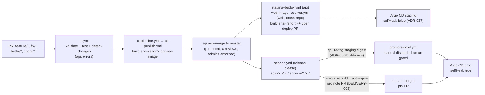

# CI/CD

## Overview

GitHub Actions CI/CD for KubeLab: 11 workflow files covering PR validation, per-app build/test,
Docker publish, release-please, continuous staging delivery, gated prod promotion, and repo
housekeeping (image pruning, config-drift gates, bitácora board automation).

For **how a build actually reaches staging/prod** (the delivery model, troubleshooting
promotion, rollback), see [gitops-delivery-promotion.md](gitops-delivery-promotion.md) — that
is the canonical doc; this runbook covers the pipeline mechanics and workflow inventory. For
**what gets versioned and how**, see
[versioning-strategy.md](../architecture/versioning-strategy.md).

## Prerequisites

- `gh` CLI installed and authenticated
- Access to the `mlorentedev/kubelab` GitHub repository
- Git repository cloned with tags fetched (`git fetch --tags`)
- DockerHub account with valid access token (Read & Write)

## Pipeline architecture



Nothing commits to `master` directly outside this flow — it is protected (0 required reviews,
admins enforced, no force-push/deletion). Every version or deploy change lands as a PR.

## Runner routing

CI runs on GitHub-hosted runners by default (`ubuntu-latest`) since the repo is public and
hosted minutes are free — see [ADR-030](../adr/adr-030-self-hosted-ci-runner.md) (amended
2026-06-26). Self-hosted (`kubelab-bee`, the Beelink on-demand node) is opt-in:

```bash
gh variable set RUNNER_DOCKER --body '["self-hosted","linux","docker"]'  # opt in
gh variable unset RUNNER_DOCKER                                          # falls back to hosted
```

Every job that can route routes via `fromJSON(vars.RUNNER_DOCKER || '"ubuntu-latest"')`.
**Fork PRs are always forced to `ubuntu-latest`**, regardless of the variable — a self-hosted
runner has Docker socket access, and a fork PR's workflow content isn't trusted. `ci.yml` and
`check-config-drift.yml` both carry this fork check explicitly (`github.event.pull_request.head.repo.fork`).

Superseded runs are cancelled on a new push to the same PR/ref
(`concurrency: cancel-in-progress: true` on `ci.yml` and `check-config-drift.yml`) — frees
runners instead of letting stale builds occupy the fleet.

## Docker registry

- **Registry**: `mlorentedev/kubelab-{app}` (e.g., `mlorentedev/kubelab-api`)
- **Config variable**: `vars.REGISTRY_PREFIX` (default: `kubelab`)

## Versioning

Full detail in [versioning-strategy.md](../architecture/versioning-strategy.md). In short:
release-please owns `api`/`errors` semver (Conventional Commits drive the bump); feature
branches and staging both run immutable `sha-<short>` tags; prod runs immutable semver. No
RC scheme, no CalVer bundle (see [ADR-059](../adr/adr-059-retire-calver-release-bundle.md)).

## Change detection paths

| App | Triggers on changes to |
|---|---|
| `api` | `apps/api/**` |
| `errors` | `edge/errors/**` |

`web` has no build trigger in this repo — its source and CI live in `mlorentedev/web`; a
`repository_dispatch` (`web-image-published`) is what reaches `web-image-receiver.yml` here.
Changes to `infra/config/values/*.yaml` do NOT trigger app rebuilds (GitOps pull model).

## Required GitHub secrets

| Secret | Purpose | How to rotate |
|---|---|---|
| `DOCKERHUB_USERNAME` | DockerHub login user | `github-secrets-manager.sh --from-mapping --select DOCKERHUB_USERNAME` |
| `DOCKERHUB_TOKEN` | DockerHub push access (Read & Write) | Regenerate at hub.docker.com/settings/security, then `github-secrets-manager.sh --from-mapping --select DOCKERHUB_TOKEN` |
| `N8N_WEBHOOK_URL` | Build notification endpoint (ADR-044 envelope) | Update in n8n, then `gh secret set N8N_WEBHOOK_URL` |
| `N8N_DEPLOY_TOKEN` | Webhook auth token | Rotate in n8n, then `gh secret set N8N_DEPLOY_TOKEN` |
| `RELEASE_PLEASE_TOKEN` | PAT used by release-please and every auto-opened deploy/promotion PR — a `GITHUB_TOKEN`-opened PR does not trigger `on: pull_request` checks, so it could never be merged | Regenerate the PAT (repo + workflow scopes), then `gh secret set RELEASE_PLEASE_TOKEN` |
| `BITACORA_PAT` | Board automation (`add-to-project.yml`); skipped gracefully for fork/Dependabot PRs, which run without repo secrets | Regenerate the PAT, then `gh secret set BITACORA_PAT` |

**Rotation workflow** (DockerHub, using dotfiles):

```bash
# 1. Rotate the secret in dotfiles (decrypts → prompts new value → re-encrypts)
secrets_rotate DOCKERHUB_TOKEN

# 2. Push to GitHub Actions
github-secrets-manager.sh --from-mapping --select DOCKERHUB_TOKEN

# 3. Verify
gh secret list
```

See [sops-and-secrets](sops-and-secrets.md) for KubeLab-specific secrets (Authelia, Grafana, MinIO, etc.).

## Common operations

### Trigger manual build

```bash
# Trigger CI on current branch
gh workflow run "CI" --ref feature/my-branch

# View workflow status
gh run list --limit 5

# View specific run logs
gh run view <run-id> --log
```

### Verify which apps changed

```bash
# Files changed since last commit
git diff --name-only HEAD~1

# Filter by apps
git diff --name-only HEAD~1 | grep -E "(apps/api|edge/errors)"
```

### Debug version calculation

```bash
# View latest tags per component
git tag --sort=-version:refname | grep "api-v" | head -3
git tag --sort=-version:refname | grep "errors-v" | head -3

# Commits since last tag
git log $(git tag --sort=-version:refname | grep "api-v" | head -1)..HEAD --oneline -- apps/api/
```

### Re-run failed job

```bash
gh run rerun <run-id> --failed
```

### Verify Docker image

```bash
# Check image exists on DockerHub
docker manifest inspect mlorentedev/kubelab-api:sha-abc1234

# Pull and test locally
docker pull mlorentedev/kubelab-api:latest
docker run --rm mlorentedev/kubelab-api:latest
```

## Troubleshooting

### DockerHub login fails (401 Unauthorized)

1. Token expired → regenerate at hub.docker.com/settings/security (permissions: **Read & Write**)
2. Rotate via dotfiles: `secrets_rotate DOCKERHUB_TOKEN`
3. Push to GitHub: `github-secrets-manager.sh --from-mapping --select DOCKERHUB_TOKEN`
4. Re-run workflow: `gh run rerun <run-id> --failed`

### Docker push fails (insufficient scopes)

Token was created with Read-only permissions. Regenerate with **Read, Write, Delete**.

### Version not bumping

- Check the commit's Conventional Commits prefix matches what you expect (`fix:`/`feat:`/`feat!:`)
- Verify the commit actually touches the component's path (`apps/api/**` or `edge/errors/**`) —
  release-please won't bump a component for commits outside its path
- Confirm `release-please-config.json` / `.release-please-manifest.json` weren't hand-edited
  (release-please owns both)

### Trivy SARIF upload fails

- Ensure job has `permissions: security-events: write`
- Uses `github/codeql-action/upload-sarif@v4`

### A deploy/promotion PR never gets its checks

The PR was opened with `GITHUB_TOKEN` instead of `RELEASE_PLEASE_TOKEN` — a `GITHUB_TOKEN`-opened
PR does not trigger `on: pull_request` workflows, so required checks never run and it can't be
merged. Every automated PR-opening step (`staging-deploy.yml`, `web-image-receiver.yml`,
`promote-prod.yml`, `release.yml`'s `promote-errors` job) must use `secrets.RELEASE_PLEASE_TOKEN`
for its checkout/push/`gh pr create` steps.

### Deploy/promotion troubleshooting

For staging/prod promotion failures ("tag not found", stuck config-drift gate, rollback), see
[gitops-delivery-promotion.md](gitops-delivery-promotion.md)'s own Troubleshooting section — not
duplicated here to avoid the two docs drifting apart.

## Workflow files

| File | Purpose |
|---|---|
| `ci.yml` | Entry point (PR-triggered): validate, unit test, detect changed apps, dispatch per-app pipelines |
| `ci-pipeline.yml` | Reusable: per-app build/lint/test/security-scan, `sha-<short>` preview tag |
| `ci-publish.yml` | Reusable: Docker build + push + Trivy scan + build-completion notify (ADR-044) |
| `release.yml` | release-please: cuts `api`/`errors` semver; re-tags (`api`, ADR-056) or rebuilds (`errors`); auto-opens the `errors` prod-pin PR (DELIVERY-003) |
| `staging-deploy.yml` | Continuous staging delivery for `api` — builds `sha-<short>` on every `master` push touching `apps/**`, opens the deploy PR |
| `web-image-receiver.yml` | Cross-repo receiver for `web` (ADR-053) — `repository_dispatch` from `mlorentedev/web` triggers the same staging promotion + PR, with coalescing of stale open PRs |
| `promote-prod.yml` | Manual `workflow_dispatch` — gated prod promotion for `api`/`web` |
| `ci-cleanup.yml` | Weekly cron (Mondays 04:00 UTC) — prunes old `sha-*` tags via `toolkit registry prune`; never touches prod semver |
| `check-config-drift.yml` | PR/push/nightly — generator-vs-committed-file drift gate (CI-GATE-002/003), image-sync check, Headscale ACL validation, Windows `toolkit sync` parity |
| `add-to-project.yml` | Adds every opened/reopened issue and PR to the bitácora board (Project #1) |
| `bitacora-status.yml` | Flips an assigned issue's board Status to "In Progress" |

## Branch protection rules

Trunk-based development — `master` is the only permanent branch (no `develop`). Feature work
uses `feature/`, `fix/`, `hotfix/`, `chore/` prefixes and squash-merges.

### master

| Setting | Value |
|---|---|
| Required status checks | `Validate`, `Detect Changes` (strict) |
| PR reviews required | 0 (self-managed repo) |
| Enforce admins | Yes |
| Allow force pushes | No |
| Allow deletions | No |

### Restore via CLI

```bash
gh api repos/mlorentedev/kubelab/branches/master/protection -X PUT \
  --input - << 'RULES'
{
  "required_status_checks": {"strict": true, "contexts": ["Validate", "Detect Changes"]},
  "enforce_admins": true,
  "required_pull_request_reviews": {"required_approving_review_count": 0},
  "restrictions": null,
  "allow_force_pushes": false,
  "allow_deletions": false
}
RULES
```

### Emergency: temporarily disable protection

```bash
# Disable (e.g., for git filter-repo force push)
gh api repos/mlorentedev/kubelab/branches/master/protection -X DELETE

# IMPORTANT: Re-enable immediately after using the restore command above
```

## Last tested

2026-08-12 — every workflow file and the branch protection API response read directly for this rewrite; not a smoke-tested end-to-end run.
