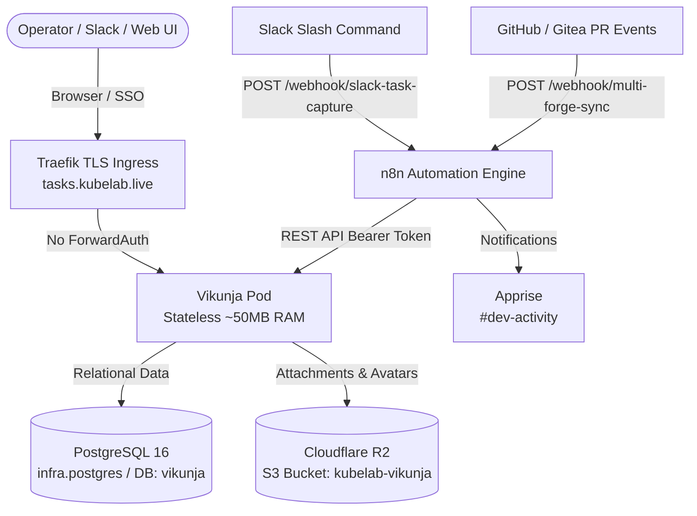

# Runbook: Self-Hosted Task Platform (Vikunja + n8n + Slack)

> **Audience**: Platform Operator / AI Agents  
> **Status**: Production  
> **Related Architecture**: [ADR-066](../adr/adr-066-self-hosted-task-platform.md), [ADR-050](../adr/adr-050-cross-context-command-center.md), [ADR-051](../adr/adr-051-postgres-data-service.md)

---

## 1. Overview & Architecture

Vikunja is KubeLab's self-hosted, forge-agnostic task management platform. It replaces GitHub Projects v2 with a lightweight (~50MB RAM), 100% stateless deployment that unifies tasks across public GitHub repositories and private Gitea repositories.



---

## 2. Day-to-Day Operations

### Web Access & Authentication
- **Production URL**: `https://tasks.kubelab.live`
- **Staging URL**: `https://tasks.staging.kubelab.live`
- **Authentication**: Single Sign-On via Authelia OIDC. Click "Login with Authelia".

### Slack ChatOps Syntax
From any authorized Slack channel:
```text
/task create [title] #[project] [P0|P1|P2|P3]
```
**Examples**:
- `/task create Refactor auth layer #kubelab P1`
- `/task create Update CV experience #personal P2`
- `/task create Deploy firmware pipeline #teledyne P0`

Slack receives an acknowledgment within <500ms, and n8n asynchronously creates the task in Vikunja.

### Platform Reconciliation (Idempotent SSOT Sync)
To reconcile namespaces (`kubelab`, `personal`, `teledyne`), standard labels, and webhooks:
```bash
# Sync staging
make sync-vikunja ENV=staging

# Sync prod
make sync-vikunja ENV=prod
```
*Note: Running `make sync-vikunja` is strictly idempotent (`changed=0` on re-run).*

---

## 3. Multi-Forge Lifecycle Automation

Both GitHub and Gitea trigger webhooks into n8n when PRs are created, updated, or merged.

### Lifecycle Conventions
1. Branch name or PR title carries the task/spec key (e.g. `feat/idp-035-vikunja-task-platform` or `feat: IDP-035 add sync`).
2. **PR Opened / Synchronized**: n8n moves the corresponding Vikunja task to `In Review` and comments with the PR URL.
3. **PR Merged**: n8n moves the task to `Done` (terminal state; monotonic and ignores stale out-of-order events).

---

## 4. Autonomous Agent Delegation

To delegate a task to an autonomous coding agent (Orca ADE / CLI agent in an isolated worktree):
1. Attach the label `agent:delegable` to the task in Vikunja.
2. The `agent-dispatcher` n8n workflow emits a normalized execution payload containing:
   - Target repository and branch (`feat/<feature-id>-task`)
   - Spec ID and requirements
3. On-demand dev nodes (`ace2` / Beelink) pull pending tasks upon boot via `tk task sync`.

---

## 5. Troubleshooting & Health Probes

### Check Vikunja Pod Status
```bash
kubectl -n kubelab get pods -l app.kubernetes.io/name=vikunja
kubectl -n kubelab logs -l app.kubernetes.io/name=vikunja --tail=50
```

### Direct Health Check
```bash
curl -s -f https://tasks.kubelab.live/api/v1/info | jq .
```

### PostgreSQL Tenant Verification
```bash
# Check if vikunja database exists
kubectl -n kubelab exec -it deployment/postgres -- psql -U kubelab -d kubelab -c "\l"
```

---

## 6. One-Time Setup: Registering Forge & Slack Webhooks

Sections 1-4 describe automation that is already live: both n8n environments
have the four workflows imported and active (`make import-n8n ENV=prod`,
wired into `make deploy-k8s`). What is **not** automated, and has no API a
toolkit could drive, is the forge/Slack side of the connection — each
service's webhook config has to be entered by hand, once, through its own UI.

Target **prod** n8n (`https://n8n.kubelab.live`) for real usage. It is
always-on (ADR-028); staging's `n8n.staging.kubelab.live` only receives
events while `ace1` is powered, so pointing a real GitHub/Slack integration
at staging silently drops events whenever the homelab is off.

Both `multi-forge-sync` and `slack-task-capture` verify their signature
inside the workflow itself (a Code node reading `$env.FORGE_WEBHOOK_SECRET`
/ `$env.SLACK_SIGNING_SECRET`, not n8n's built-in Header Auth credential) —
see `Parse Forge Event` / `Parse Slack Command` in
`infra/n8n/workflows/{multi-forge-sync,slack-task-capture}.json`. The value
you paste into GitHub/Gitea/Slack must be the exact SOPS value; never
generate a fresh one on the forge side.

### 6.1 Retrieve the secret you'll need

Run this yourself, in your own terminal — do not paste the output back into
chat or a session transcript (secrets-never-in-output).

```bash
# GitHub + Gitea webhooks (multi-forge-sync) share one secret:
make secrets-show KEY=apps.services.automation.n8n.forge_webhook_secret SECRETS_ENV=prod

# Slack signing secret — only to CONFIRM it matches Slack's Basic Information
# page, never to paste into Slack (Slack generates and owns its own):
make secrets-show KEY=apps.services.automation.n8n.slack_signing_secret SECRETS_ENV=prod
```

### 6.2 GitHub — `mlorentedev/kubelab`

1. Open `https://github.com/mlorentedev/kubelab/settings/hooks` → **Add webhook**.
2. **Payload URL**: `https://n8n.kubelab.live/webhook/multi-forge-sync`
3. **Content type**: `application/json`
4. **Secret**: paste the `forge_webhook_secret` value from 6.1.
5. **Which events**: choose *Let me select individual events*, check only
   **Pushes** and **Pull requests** — the workflow only reads `push` and
   `pull_request` payloads (see `action = body.action || 'push'` in
   `Parse Forge Event`); anything else is dead weight n8n discards.
6. Leave **Active** checked → **Add webhook**.
7. GitHub sends a `ping` immediately. Open the webhook's **Recent
   Deliveries** tab and confirm `200` — but note n8n's `Respond 200` node
   fires regardless of signature validity, so a `200` here only proves
   connectivity. Confirm the signature separately in 6.5.

### 6.3 Gitea — blocked on TOOL-035 (#1076), not actionable yet

Gitea currently has **zero repositories** (#1389), and `gitea-reconcile`
itself cannot run yet — verified this session:
`make gitea-reconcile ENV=prod` fails with `missing Gitea credential(s) in
prod SOPS: admin_token` (AUTH-004-gated). There is nothing to attach a
webhook to. Once TOOL-035 lands and an org (`teledyne`, `personal`, or
`kubelab` — see `gitea.organizations` in `common.yaml`) has real
repositories, register at the **organization** level so new repos inherit
it, rather than per-repo:

1. `https://gitea.kubelab.live/org/<org>/settings/hooks` → **Add Webhook** → **Gitea**.
2. **Target URL**: `https://n8n.kubelab.live/webhook/multi-forge-sync`
3. **HTTP Method**: `POST`, **POST Content Type**: `application/json`.
4. **Secret**: the same `forge_webhook_secret` value used in 6.2 — the
   workflow falls back to one shared secret when there's no Gitea-specific
   one (`$env.GITEA_WEBHOOK_SECRET || $env.FORGE_WEBHOOK_SECRET`, and only
   `FORGE_WEBHOOK_SECRET` is actually wired into the n8n Deployment today).
5. **Trigger On**: Custom Events → check **Push** and **Pull Request** only.
6. **Branch filter**: leave default (all branches).

### 6.4 Slack — `/task` slash command

The existing Slack integrations (Apprise notification tiers, Argo CD
notifications) are all **incoming webhooks** — outbound-only, posting into
channels. None of them implies a Slack App with interactive components
exists yet. Check first before assuming one does.

If no App exists yet:

1. `https://api.slack.com/apps` → **Create New App** → *From scratch* →
   name it, pick the workspace.
2. **Basic Information** → **App Credentials** → copy **Signing Secret**.
3. Compare it to the `slack_signing_secret` value from 6.1. If they differ
   (or this is a brand-new app), write the real value into SOPS and roll it
   out:
   ```bash
   poetry run toolkit secrets set apps.services.automation.n8n.slack_signing_secret --env prod
   make apply-secrets ENV=prod
   kubectl -n kubelab --context <prod-context> rollout restart deploy/n8n
   ```
4. **Slash Commands** → **Create New Command**:
   - **Command**: `/task`
   - **Request URL**: `https://n8n.kubelab.live/webhook/slack-task-capture`
   - **Short description**: `Create a Vikunja task`
   - **Usage hint**: `create [title] #[project] [P0|P1|P2|P3]`
5. **Install App to Workspace** (or **Reinstall** if scopes changed).
6. Invite the app's bot user to whichever channel(s) should run `/task`.

### 6.5 Verify end-to-end

- **GitHub**: open (or push to) a branch/PR whose title or branch name
  contains an existing Vikunja task key (e.g. `AREA-NNN`) and confirm the
  task moves to `In Review` / `Done` in Vikunja, with a PR-URL comment
  appended.
- **Slack**: run `/task create smoke test #kubelab P3` and confirm the task
  appears in Vikunja's `kubelab` namespace and `#dev-activity` receives the
  notification.
- If a webhook's *Recent Deliveries* shows `200` but nothing changes in
  Vikunja, the payload reached n8n but failed signature validation
  (`isValidSig` / `isValidSlack` stayed `false` inside the workflow) — recheck
  the secret value, not the URL.
